# 一般

## 早逃げ

(1)

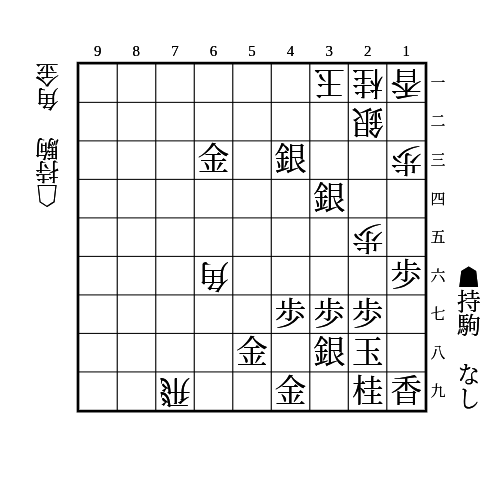

    
解答

    
▲18玉

    
詰めろをかけるために攻めてきたら駒が手に入るので先に詰ませられる

    
詰めろがかからなければ52金で先に詰めろをかけられる

---

(2)

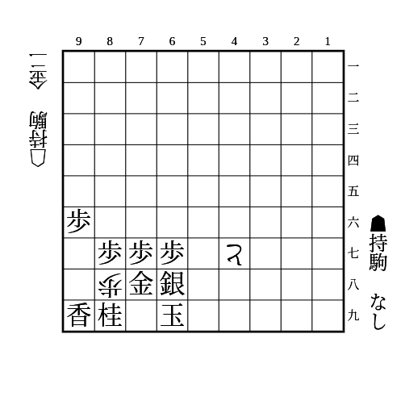

    
解答

    
▲79玉

    
▲88金は△58金から詰む

## 敵の打ちたいところに打て

(1)

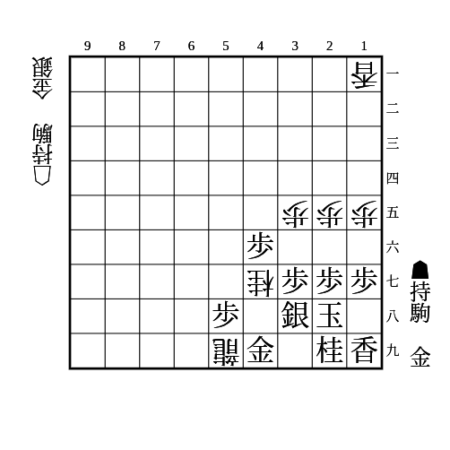

    
解答

    
▲39金打△同桂▲59金

## 大駒は近づけて受けよ

(1)

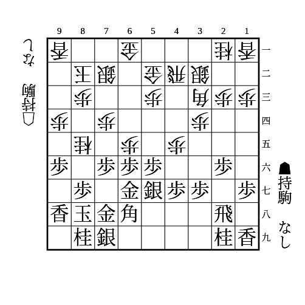

    
解答

    
▲55歩△同角▲86歩

    
▲66歩△同銀が角に当たるようにする

    
後手の銀が54にいるときは成立しない

## 大駒の利き

(1)

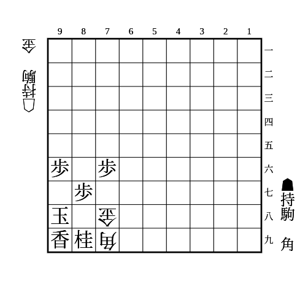

    
解答

    
▲66角

    
△88金打は▲97玉

---

(2)

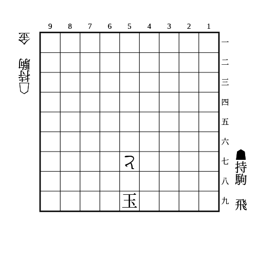

    
解答

    
8段目に飛車打ち

## 利き止め

(1)

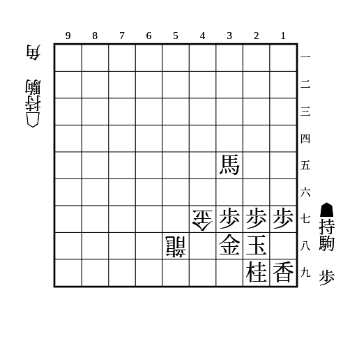

    
解答

    
▲48歩△同金▲17歩

    
初手▲17歩は△39角で詰む

## 利きずらし

(1)

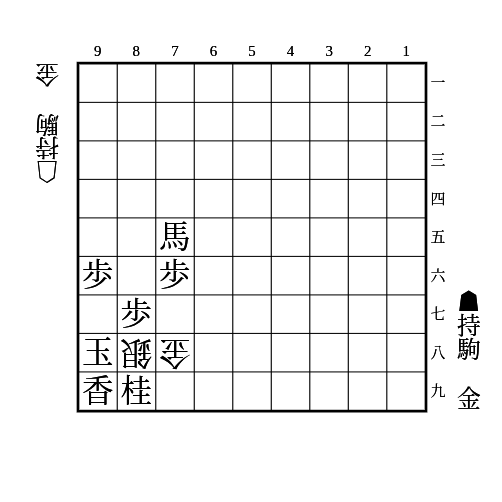

    
解答

    
▲79金

    
△同銀なら▲97玉

    
△同金なら▲88玉

    
△97金や△99銀成からの詰み筋も防いでいる

## 退路作りの捨て駒

(1)

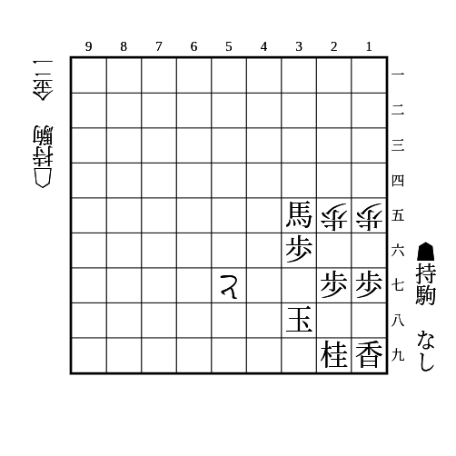

    
解答

    
▲26歩△同歩▲37玉

## 移動合い

(1)

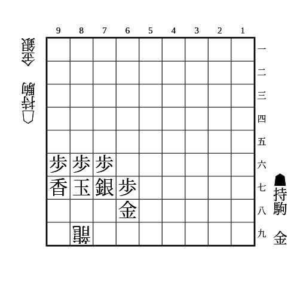

    
解答

    
▲88銀△98銀▲77玉

---

(2)

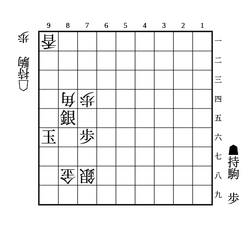

    
解答

    
▲94銀△同香▲85玉

    
▲86玉は△87銀成

    
▲95歩は△同香▲86玉△87銀成

    
▲94歩は△95歩▲86玉△87銀成

## 中合い

(1)

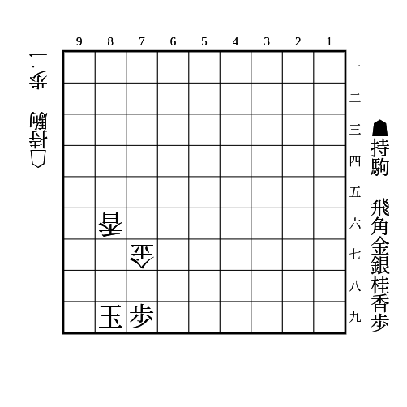

    
解答

    
▲87銀

    
△88歩▲99玉△98歩▲同銀△89歩成▲同銀で逃れ

    
▲87角は最後の△89歩成▲同角に△88金で詰む

    
それ以外は△98歩に▲同玉△87金▲99玉△89歩成▲同玉△88金で詰む

## 犠打

(1)

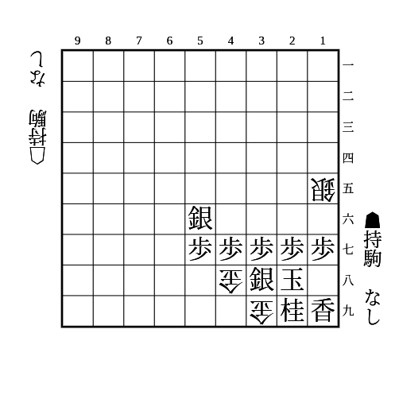

    
解答

    
▲49銀△同金寄▲36歩

