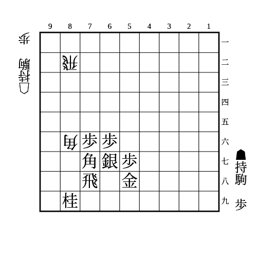
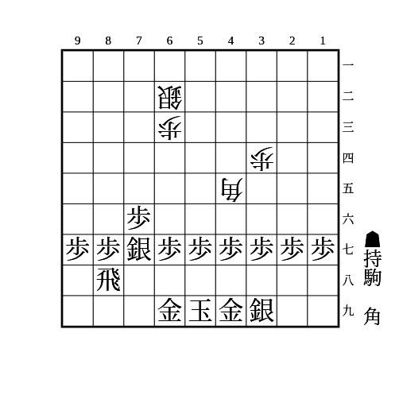
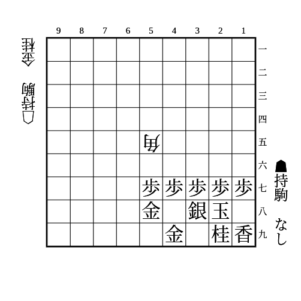

# 振り飛車

(1)

    
解答

    
▲78飛

    
△76歩▲同銀△72飛なら▲65歩で良い

---

(2)

    
解答

    
▲88飛

    
△77角成は▲82飛成で良い

    
△85歩に▲65歩〜▲66角〜▲84歩や▲75歩〜▲76銀を狙う △77角成〜△86歩は▲同桂〜▲85歩があるので問題ない

    
銀に紐がついていないと△77角成▲82飛成△67馬となり銀損なので注意

    
玉のコビンが開いていると△87歩▲同飛△64角があるので注意

---

(3)

    
解答

    
▲36角

    
△67角成は▲68金や▲58金で馬が詰む 相手の飛車先が伸びている場合、▲58金左は△86歩▲同歩△87歩や△86歩▲同銀△76馬があるので▲68金か▲58金右とする

---

(4)

    
解答

    
▲46歩△同角▲47金

    
それでも△36桂で▲同金に△57角成とする手順はある

