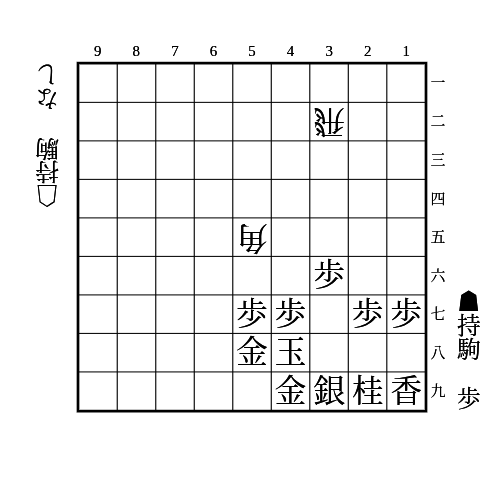
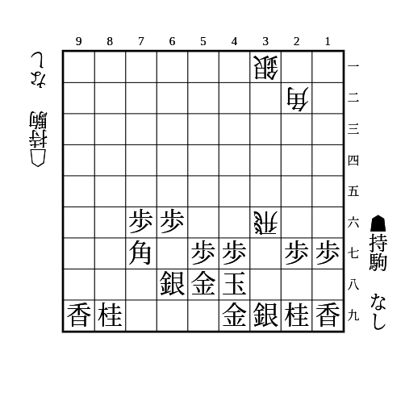
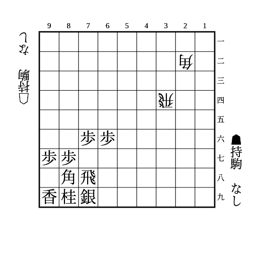
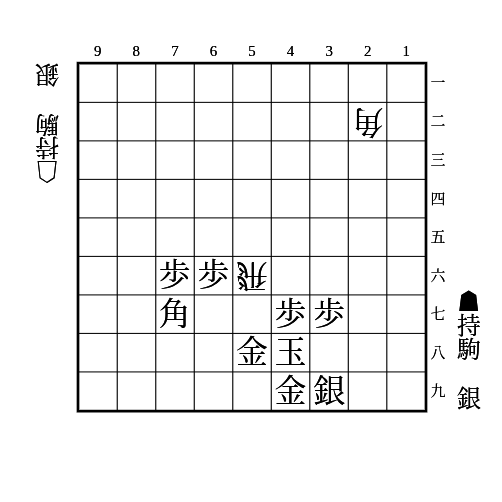
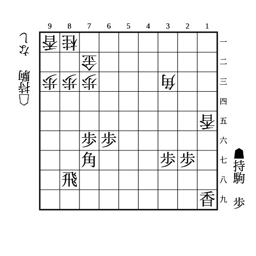
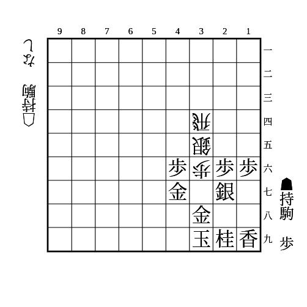

# 相振り飛車

(1)

    
解答

    
▲46歩△同角▲37桂

    
△36飛に▲47金で両取り

---

(2)

    
解答

    
▲67銀

    
▲37歩は△66飛▲同角△同角で歩損かつ香取りが残る

---

(3)

    
解答

    
▲86歩または▲77角

    
次の△84飛を受けられるようにする

---

(4)

    
解答

    
▲67金

    
▲57歩は△66角

    
▲57銀や△67銀はもったいない

---

(5)

    
解答

    
▲16歩△同香▲同香△15歩▲86香

    
▲15香△同角▲86香だと△82香で受けられる

---

(6)

    
解答

    
▲37歩△同歩成▲同金上

