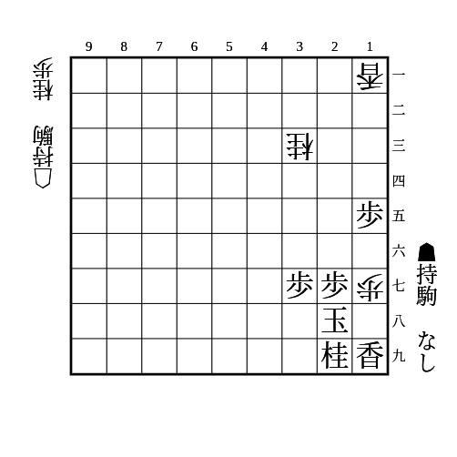
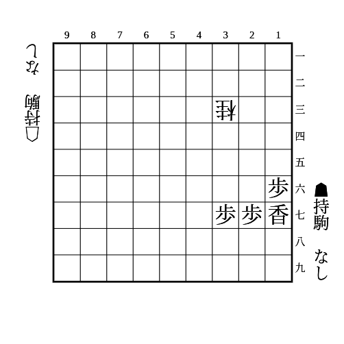
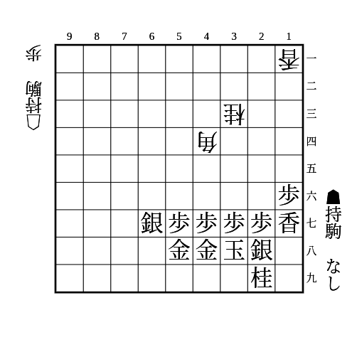

# 端

(1)

    
解答

    
▲26歩

    
△15香は▲17桂△16歩▲18歩で良い

    
17の歩を桂で取ると△16歩、香で取ると△24桂〜△16歩があって厳しい

---

(2)

    
解答

    
▲15歩

    
△25桂に▲16香と逃げる

---

(3)

    
解答

    
▲56銀

    
▲15歩△25桂▲16香は△17歩▲19銀△15香▲同香△18歩成▲同銀△17歩で端を突破される

    
端を攻めさせている間に角を攻めに行くのが良い

