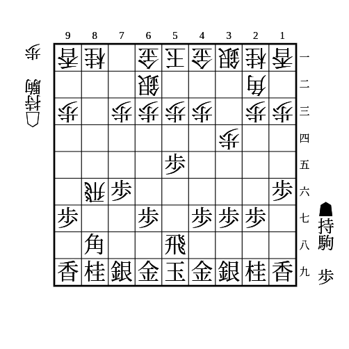
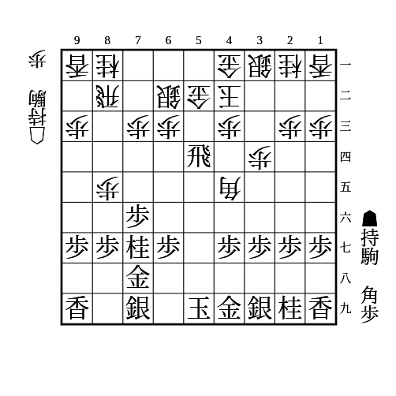
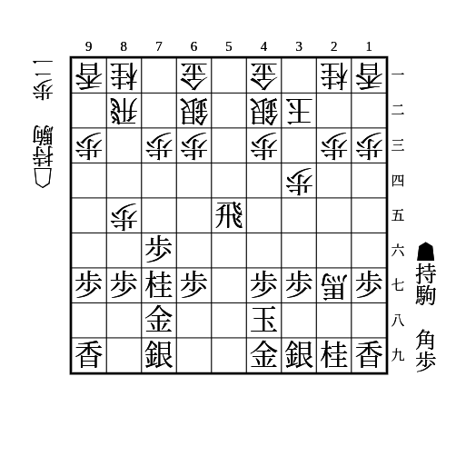
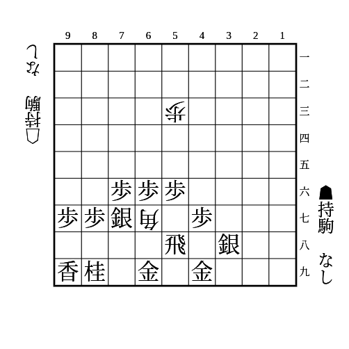

# 中飛車

(1)

    
解答

    
▲54歩

    
角交換して▲77角

---

(2)

    
解答

    
▲55飛△27角成▲25飛

    
67に駒が利いていないときはできず、不利

---

(3)

    
解答

    
▲25飛△54馬▲24歩

    
△同歩▲同飛△23歩▲34飛と王手馬取りが決まれば優勢

    
△同歩▲同飛△33銀も▲23角で優勢

---

(4)

    
解答

    
▲59飛△89角成▲68金で馬が詰む

    
53の歩が54だと、▲59飛に△55歩で角が詰まないので注意

