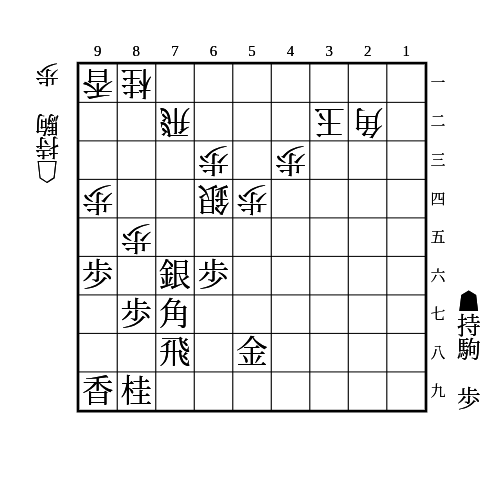
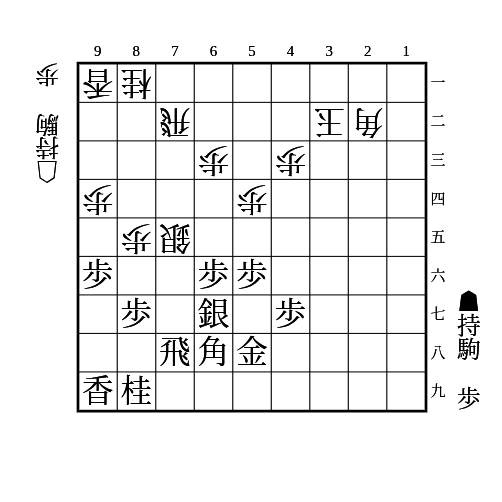

# 振り飛車

(1)

    
解答

    
▲65歩

    
△同桂なら▲22角成△同玉▲66角

    
△同銀なら▲22角成△同玉▲65飛△同桂▲66角

    
△77角成▲同桂も銀取りと▲66角が残る

---

(2)

    
解答

    
▲65歩△77角成▲同飛

    
続けて△53銀や△22角などで互角

    
▲65歩に△76飛は▲22角成△同玉▲76飛で抜ける

    
▲67金は△75歩▲85銀△93桂がある

---

(3)

    
解答

    
▲46角

    
△64歩なら▲同角で良い △同銀とすると飛車が抜ける

