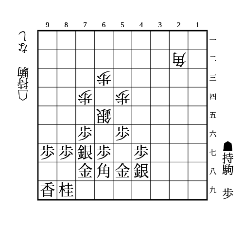

# 相居飛車

(1)

    
解答

    
▲74歩△64銀▲65歩

    
48の銀が37だと▲65歩に△45歩があり、角が引いたら△65銀があるので注意 その場合は▲65歩ではなく▲76銀として角を詰ます 84の歩が83や85だと成立しないので注意

---

(2)

    
解答

    
▲85歩△同飛▲77桂△82飛▲85歩

    
▲77桂に△75飛は▲82歩

    
79の銀が68にあるなどで78の金が浮いている場合、▲77桂に△87歩成▲85桂△78とがあるので注意

---

(3)

    
解答

    
▲66歩△同銀▲88銀

    
次に▲67歩で銀が取れる

    
△56銀も▲46歩で同様

    
▲57銀で56の歩を支えるのは△76銀▲同銀△99角成

    
58に金が上がっておらず、67に1枚しか利いていない場合、▲88銀に△67銀成があるので注意 ▲同金なら△88角成

