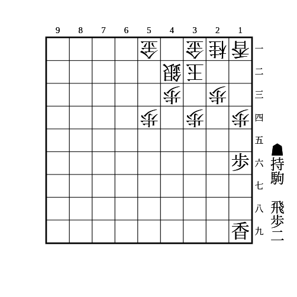
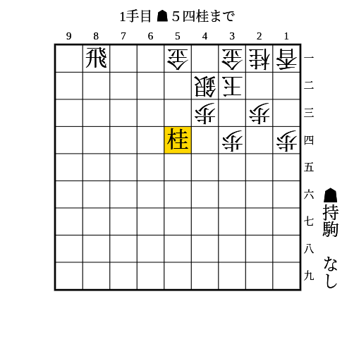
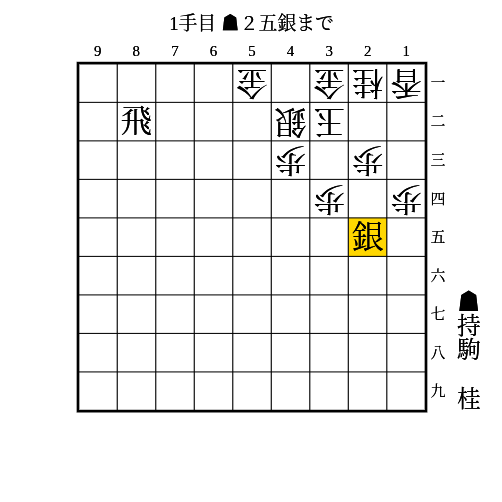
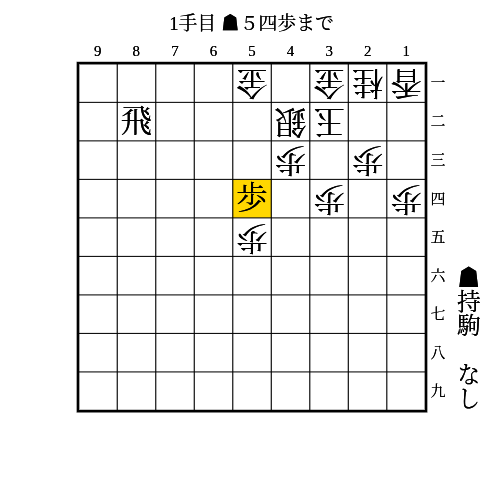

# エルモ囲い

(1)

条件: 持ち駒に歩2枚+飛 AND 端を突き合っている

- △同歩なら▲13歩
    - △同香なら▲14歩△同香▲12飛〜▲14飛成
    - △同桂なら▲14歩
    - 放置なら▲15香〜▲12歩成
    - 歩がもう1枚あれば▲12歩から連打で良い

---

(2)

条件: 持ち駒に桂

- 次に▲34桂が受けにくい
- 角が22にいなくても厳しい

▲35歩△同歩▲34桂を狙う順もあるが、35の歩を拠点に反撃されやすいので、控えて打てるときは控えて打ったほうが良い。

---

(3)

条件: 持ち駒に桂 AND 1段目に飛車がいる

- 少なくとも銀桂交換できる

---

(4)

条件: 持ち駒に銀+桂 AND 1段目か2段目に飛車がいる

- 次に▲34銀〜▲35桂で23と43を同時に受けにくい
    - ▲34銀自体も受けにくい

銀は持ち駒からでなくても67〜56〜45〜34を狙う方法もある。  
31に金があることで△31桂と受けられないのを突いた攻め。

---

(5)

条件: 持ち駒に歩 AND 1段目か2段目に飛車がいる AND 相手が5筋に歩を打てない

- 次に▲53歩成が厳しい

6筋に駒を打って飛車の利きを止めてきたり、53に利く駒を増やしてきたりした場合はこちらも53に利く駒を増やしていけば良い。  
飛車が2段目のときは▲53歩でも良い。こちらは相手が5筋に歩を打てる場合でも使える。
