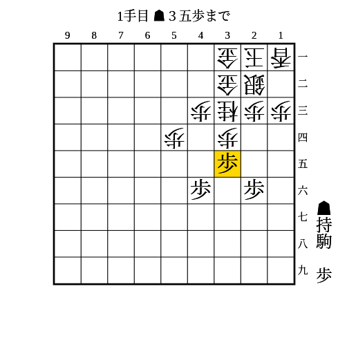
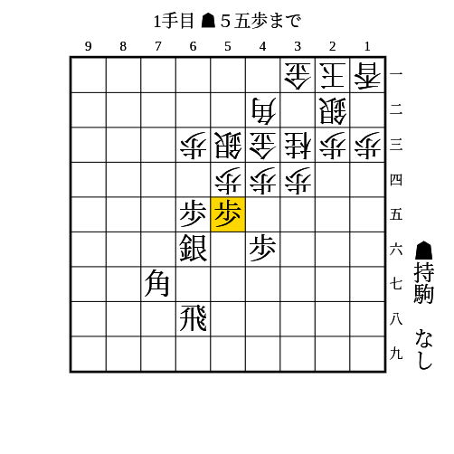
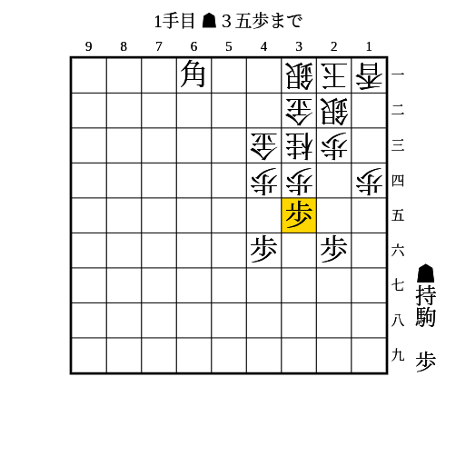
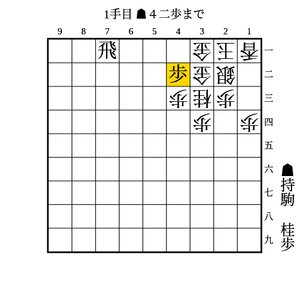

# ミレニアム

(1)

桂頭が守られていないミレニアムに有効

条件: 持ち駒に歩

- △同歩でも放置でも▲34歩

---

(2)

53銀43金33桂型のミレニアムに有効

- △同歩なら▲45歩
    - △同歩なら▲55銀〜▲44歩
    - △同桂なら▲55銀△54歩▲66銀〜▲46歩
        - 37に桂を跳んでいるとこの順で歩を取られて桂交換にしかならないので、▲45歩ではなく▲55銀△54歩▲46銀と歩交換に留めるほうが良い
- 放置なら▲54歩
    - △同銀や△同金なら▲55歩
    - △42銀なら▲64歩〜▲55銀

---

(3)

条件: 持ち駒に歩 AND 34に駒が利いている

- △同歩や放置なら▲34歩

---

(4)

31金32金型のミレニアムに有効

条件: 持ち駒に歩2枚+桂 AND 1段目に飛車がいる

- △同金寄なら▲54桂
    - △32金寄なら▲42歩
        - と金を作りにいくのが受からない
    - △52金も▲42歩
        - △51歩なら53に安い駒を打ち込んで▲51飛成か、▲62桂成
            - ▲62桂成に△同金なら▲51飛成で62の金に当てながら▲41歩成を狙う
            - ▲62桂成に△42金寄なら▲51飛成△32金寄▲52成桂〜▲41成桂
    - △53金なら▲42桂成
- 52や53に垂らすより1手早く、42に桂の利きも残せる
