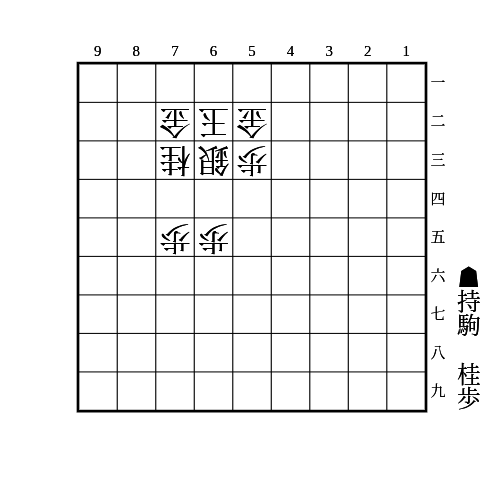

# 右玉

(1)

    
解答

    
▲64歩

    <ul>
        <li>△同銀なら▲74歩</li>
        <li>△74銀や△54銀なら拠点が残る</li>
    </ul>
    
銀が63にいて53にいない型に有効

---

(2)

    
解答

    
▲74歩

    <ul>
        <li>△同銀なら▲64桂</li>
    </ul>
    
銀が63にいて53にいない型に有効

