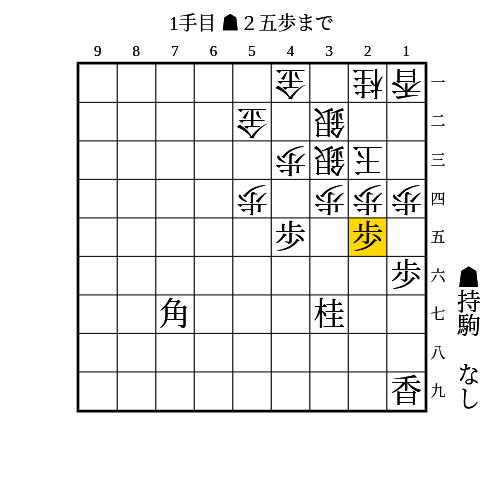
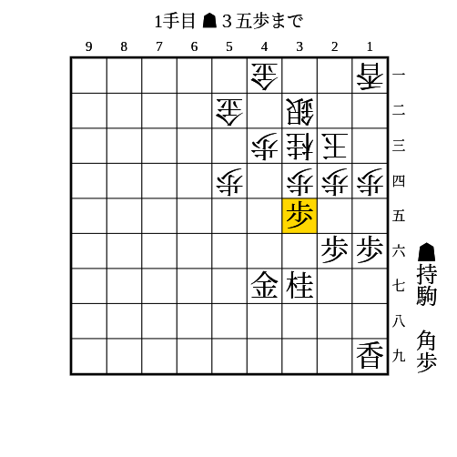
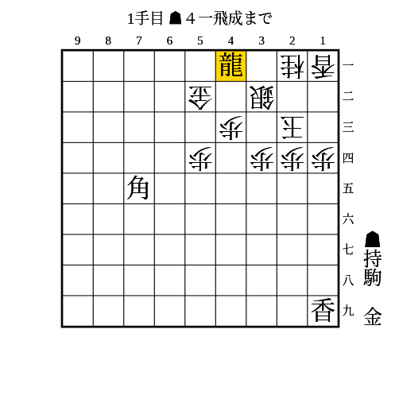
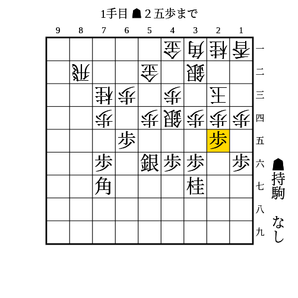

# 天守閣美濃

(1)

条件: 持ち駒に飛車+角

- △同銀なら▲21飛△32玉▲23角△21玉▲41角成
    - 次に▲32銀からの詰めろがあり、受けても▲23銀や金があったり、52の金が質駒になっていたりして厳しい

---

(2)

条件: 角が11を睨んでいる AND 45に歩がある AND 37に桂が跳ねている AND 33に相手の銀がある AND 25に歩が打てるか突ける

- △同歩なら▲同桂
    - △22銀以外なら▲11角成
    - △22銀なら▲24歩
        - △同玉なら▲22角成
        - △12玉なら▲15歩から端攻めが厳しい
- 放置なら▲24歩△同玉▲25歩で拠点が作れる

---

(3)

条件: 持ち駒に角+歩 AND 45に駒が利いている AND 35に歩が打てるか突ける

- △同歩や放置なら▲34歩
    - △同玉なら▲22角

---

(4)

条件: 41金に飛車が利いている AND 31に角が利いている

- △同銀なら▲31角成
    - 次に▲41馬や▲22金や▲21馬が受けにくい

---

(5)

条件: 角が11を睨んでいる AND 37に桂が跳ねている AND 25に歩が打てるか突ける AND 44に相手の銀がいる AND 46歩56銀型

- △同歩なら▲同桂
    - 次に▲45歩
        - 銀が避けたら▲11角成
        - △55銀なら▲同銀△同歩▲同角で11香と73桂の両取り
