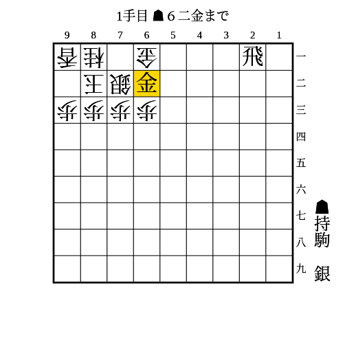
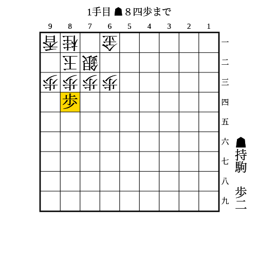
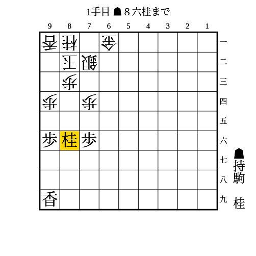
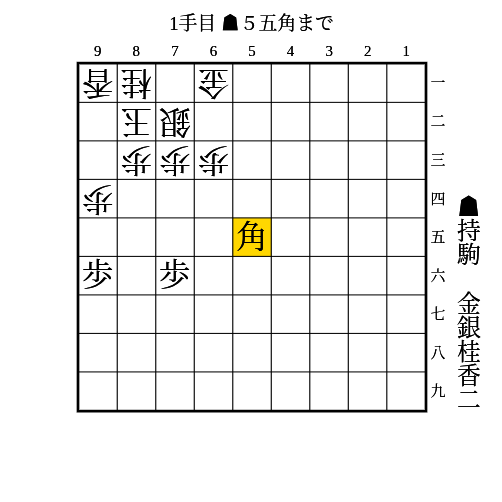

# 片美濃

(1)

条件: 1段目に飛車 AND 相手が飛車または金を持っていない AND 持ち駒に香+角

- △同金なら▲71角
- △71金なら▲53角
    - 次に▲71飛成△同玉▲61香成
        - △同玉なら頭金
        - △82玉なら▲71角成
    - 相手が飛車または金を持っている場合、52に打たれて受けられる

---

(2)

条件: 1段目に飛車 AND 持ち駒に香+角

- △同銀なら▲61飛成
    - それから△72金と受けても▲62金△同金▲71角
- △71金なら▲同飛成△同玉▲62金△82玉▲71角△92玉▲72金
- △52金なら▲62香成△同金▲71角

---

(3)

条件: 1段目に飛車 AND 持ち駒に（銀または角）+（金または銀）

- △同金なら▲71銀
- 放置なら▲61飛成△同銀▲71銀

---

(4)

高美濃にも有効

条件: 1段目に飛車 AND 持ち駒に銀+歩 AND 端を突ける

- △同歩なら▲92歩△同香▲91銀△同玉▲71飛成
- △61香などで横を受けてきたら▲53馬で71の金を狙い続ければ良い

---

(5)

本美濃や高美濃にも有効

条件: （持ち駒に歩3枚 AND 84に歩が打てる） OR （持ち駒に歩2枚 AND 84に歩が突ける）

- △同歩なら▲85歩△同歩▲84歩

---

(6)

本美濃にも有効

条件: 持ち駒に桂2枚 AND 端を突き合っている AND 74の歩が浮いている AND 75に歩を打てるか突ける

- 74の歩を銀以上の駒で受けてきたら▲75歩△同歩▲74桂打
- 74の歩を桂や香で受けてきたら▲94桂△同香▲95歩

---

(7)

本美濃にも有効

条件: 持ち駒に桂+金+銀+角+前に利く駒2枚 AND 95と75に駒が利いている AND 玉の斜めのラインに角が打てる

- 次に▲74桂△92玉▲93香△同玉▲82銀△92玉▲93香△同桂▲91銀成△同玉▲82金で詰み

