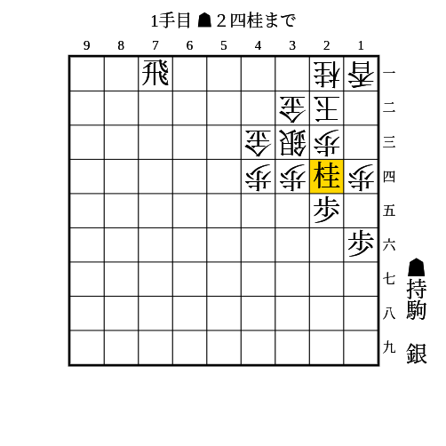
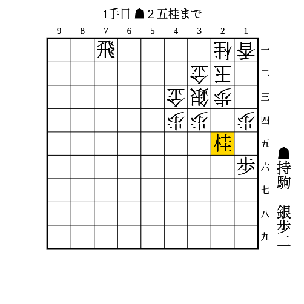
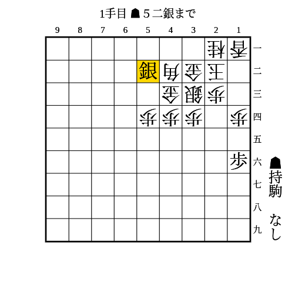

# 矢倉

(1)

金矢倉、銀矢倉、菱矢倉に有効

条件: 2段目に飛車がいる AND 持ち駒に角がある

- 次に▲43角成が厳しい
- 金が避けたら43に駒を打ち込んでいく

2段飛車で43の金を攻めるのが厳しいので、▲55桂でも同様。

---

(2)

金矢倉、片矢倉、総矢倉、菱矢倉に有効

条件: 5筋やその左側に浮いている駒がある AND 持ち駒に銀+飛

- △同玉なら▲51飛
- △同金や△12玉なら▲52飛

---

(3)

金矢倉、総矢倉、菱矢倉に有効

条件: 1段目に飛車がいる AND 持ち駒に桂+（銀 OR 角）

- △同歩なら▲同歩
    - △同銀なら▲23歩
        - △同玉や△13玉や△33玉なら▲21飛成
        - △同金なら▲41飛成で次の▲43竜や▲32銀や▲31銀が受けにくい
        - △12玉なら▲22銀
    - △23歩なら▲同歩成
        - △同玉なら▲21飛成
        - △同金なら▲41飛成で次の▲43竜や▲32銀や▲31銀が受けにくい
    - 放置なら▲23銀△同金▲同歩成△同玉▲21飛成
- △42金寄は▲31銀△13玉▲42銀成△同金▲21飛成
- △31金は▲同飛成△同玉▲32金の詰みがある

---

(4)

金矢倉、菱矢倉に有効

条件: 1段目に飛車がいる AND 持ち駒に桂+歩2枚+銀 AND 3筋に歩が打てる

- △24銀なら▲33歩
    - △31金なら▲同飛成△同玉▲32金で詰み
    - △42金寄なら▲31銀△12玉▲42銀成△同金▲31飛成
    - △同桂なら▲同桂成△同銀▲25桂から同様
- △42銀なら▲33歩
    - △31金なら▲52銀△53金▲41銀成
    - △同桂なら▲同桂成△同銀▲25桂から同様

---

(5)

金矢倉、菱矢倉に有効

条件: 持ち駒に銀2枚 AND 42に相手の角がいる

- △金が寄って逃げたら▲41銀成で角が詰む
