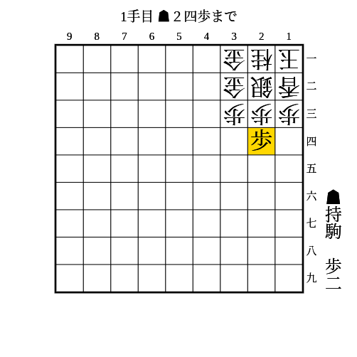
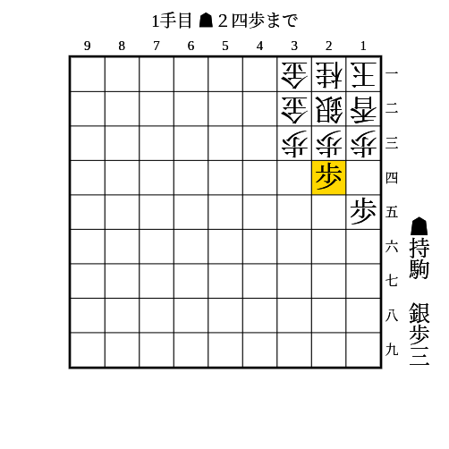
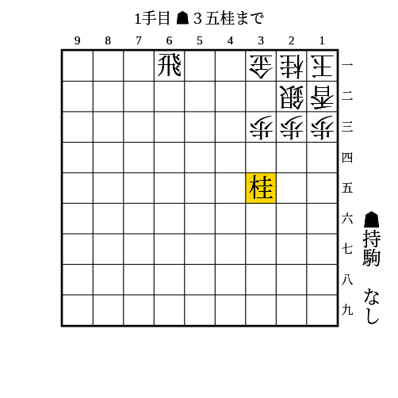
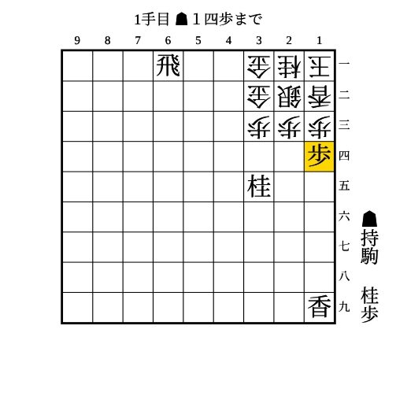
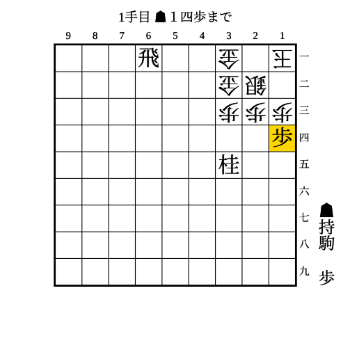
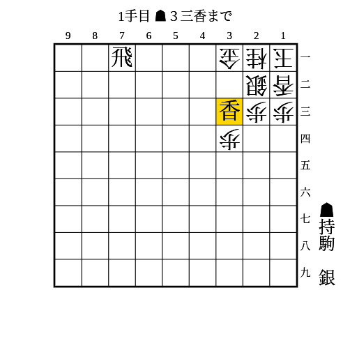
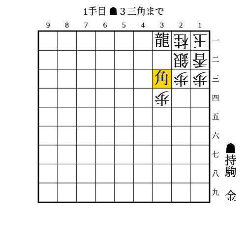

# 穴熊

(1)

2枚穴熊、3枚穴熊、松尾流穴熊に有効

条件: （持ち駒に歩3枚 AND 24に歩が打てる） OR （持ち駒に歩2枚 AND 24に歩が突ける）

- △同歩なら▲25歩で取っても放置でも▲24歩で次に23に駒を打ち込んでいく
- 放置なら▲23歩成で陣形が乱れる

---

(2)

2枚穴熊、3枚穴熊に有効

条件: （持ち駒に歩4枚+銀 AND 24に歩が打てる） OR （持ち駒に歩3枚+銀 AND 24に歩が突ける）

- △同歩なら▲35銀
    - 次に▲23歩
        - △同銀でも△同金でも▲25歩
            - 取っても放置でも▲24歩で銀か金が死ぬ
            - △34銀なら▲同銀△同歩▲24歩で拠点ができ、△22歩と受けられても端攻めに移行できる
        - 端を突き合っている場合は▲23歩のときに銀が13に避けれるが、22に駒を打ち込めば良い

---

(3)

2枚穴熊に有効

条件: 持ち駒に桂 AND 1段目に飛車がいる

- 次に▲23桂不成△同銀▲31飛成が厳しい

桂の代わりに香があるときは2筋に香を打って同じ狙いができる。  
居飛車穴熊は34に歩があることが多いので、桂は基本的に振り飛車穴熊相手に打つことが多い。

---

(4)

2枚穴熊、3枚穴熊に有効

条件: 持ち駒に桂 AND 23に駒が利いている AND （（持ち駒に歩2枚 AND 14に歩が打てる） OR （持ち駒に歩1枚 AND 14に歩が突ける））

- 取っても取らなくても次に▲13歩△同香▲25桂で、次に▲13桂成が厳しい
    - 端を精算したあとは2筋に香を打ったり▲44桂で金を狙ったりなどがある

---

(5)

上から端を精算した状態

条件: 持ち駒に歩2枚 AND 23に駒が利いている AND 14に歩が打てる

- △同歩なら▲13歩
    - ▲31飛成〜▲12金の詰めろ
    - △同銀なら▲23桂成
- 放置は▲13歩成△同銀▲23桂成
- △12香は▲13歩成△同香▲14歩△同香▲13歩で変わらない
    - ただ香が自陣に利いてくるので、(4)でとったはずの香を先に1筋に打っておいたほうが安全ではある
- △21桂は▲13歩成△同桂▲14歩
    - さらに△12歩と受けられても(4)で取ったはずの香を1筋に打てば数で勝てる

---

(6)

2枚穴熊に有効

条件: 持ち駒に香+銀 AND 1段目に飛車がいる

- △同銀なら▲31飛成
- △同桂なら▲32銀
    - 次に▲31飛成△同銀▲21金の詰めろ

---

(7)

2枚穴熊に有効

条件: 持ち駒に角+金

- △同銀なら▲32金
    - 次に▲21竜の詰めろ
    - △22金なら▲33金
        - △同金なら▲22銀
