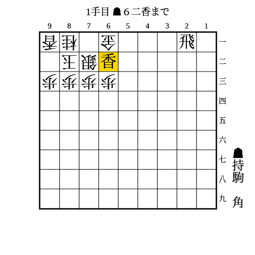
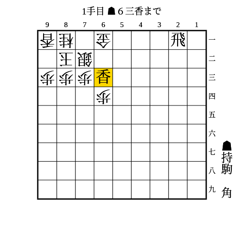
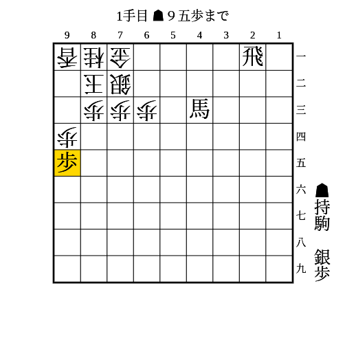
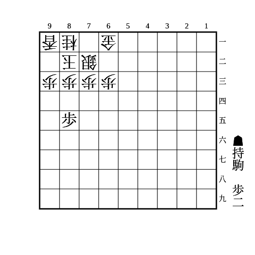
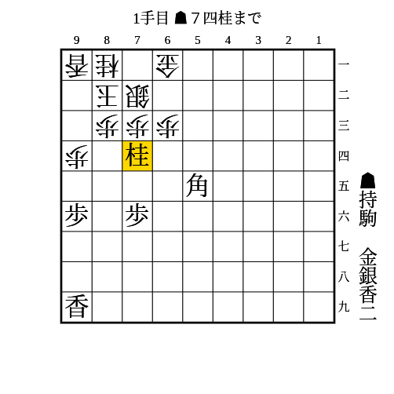
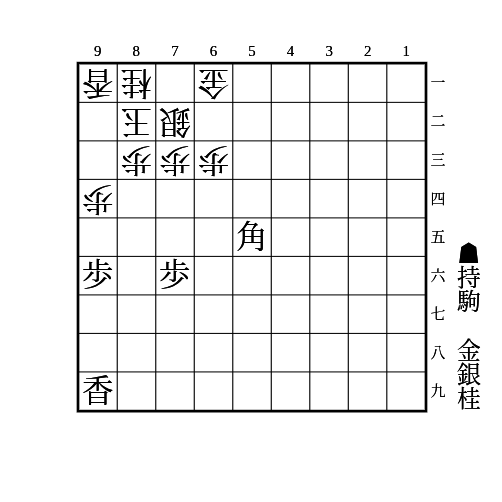
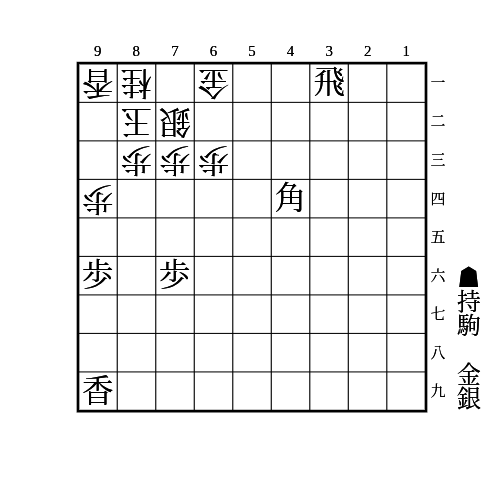
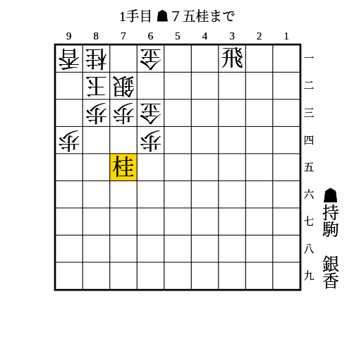
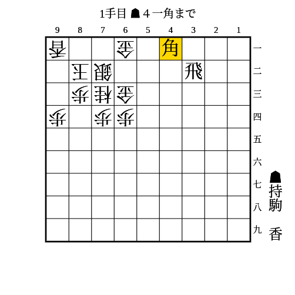
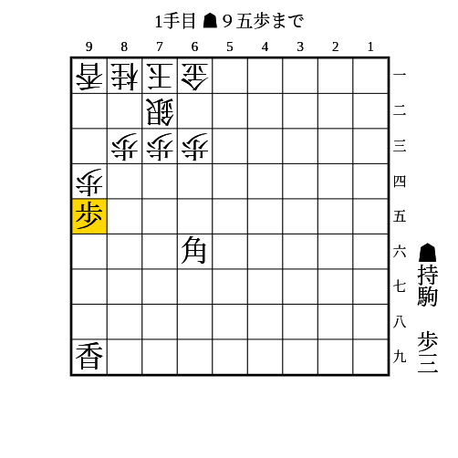

# 美濃

(1)

片美濃、銀美濃に有効

条件: 1段目に飛車 AND 相手が飛車または金を持っていない AND 持ち駒に香+角

- △同金なら▲71角
- △71金なら▲53角
    - 次に▲71飛成△同玉▲61香成
        - △同玉なら頭金
        - △82玉なら▲71角成
    - 相手が飛車または金を持っている場合、52に打たれて受けられる

---

(2)

片美濃に有効

条件: 1段目に飛車 AND 持ち駒に香+角

- △同銀なら▲61飛成
    - それから△72金と受けても▲62金△同金▲71角
- △71金なら▲同飛成△同玉▲62金△82玉▲71角△92玉▲72金
- △52金なら▲62香成△同金▲71角

---

(3)

片美濃、銀美濃に有効

条件: 1段目に飛車 AND 持ち駒に（銀または角）+（金または銀）

- △同金なら▲71銀
- 放置なら▲61飛成△同銀▲71銀

---

(4)

片美濃、高美濃に有効

条件: 1段目に飛車 AND 持ち駒に銀+歩 AND 端を突ける

- △同歩なら▲92歩△同香▲91銀△同玉▲71飛成
- △61香などで横を受けてきたら▲53馬で71の金を狙い続ければ良い

---

(5)

どの美濃にも有効

条件: （持ち駒に歩3枚 AND 84に歩が打てる） OR （持ち駒に歩2枚 AND 84に歩が突ける）

- △同歩なら▲85歩△同歩▲84歩

---

(6)

片美濃、本美濃、銀美濃に有効

条件: 持ち駒に桂2枚 AND 端を突き合っている AND 74の歩が浮いている AND 75に歩を打てるか突ける

- 74の歩を銀以上の駒で受けてきたら▲75歩△同歩▲74桂打
- 74の歩を桂や香で受けてきたら▲94桂△同香▲95歩

---

(7)

片美濃、本美濃、銀美濃に有効

条件: 持ち駒に桂+金+銀+前に利く駒2枚 AND 95と75に駒が利いている

- △92玉▲93香△同玉▲82銀△92玉▲93香△同桂▲91銀成△同玉▲82金で詰み

---

(8)

片美濃、本美濃、銀美濃に有効

条件: 持ち駒に桂+金+銀 AND 75に駒が利いている AND （95に歩が打てる OR 突ける）

- △92玉なら▲95歩
    - 次に▲93銀からの詰めろ
        - △同玉なら▲94歩
            - △84玉なら▲75金
            - △92玉なら▲82金
        - △同桂なら▲82金
    - △84歩なら▲82金△93玉▲94歩
- △93玉なら▲82銀
    - △92玉なら▲95歩
        - 次に▲91銀成からの詰めろ
            - △93玉なら▲94歩△84玉▲75金
            - △同玉なら▲82金
        - 94の地点を守るのは▲94歩〜▲94香〜▲91銀成△同玉▲82金
        - △84歩なら▲73銀成で必至

金がない場合でも桂を打ってから▲62銀〜▲61銀不成で攻めが続く。

---

(9)

片美濃、本美濃、銀美濃に有効

条件: 持ち駒に桂2枚+銀

- 次に▲74桂打△同歩▲74桂
    - △73玉なら▲82銀
        - △74玉なら質駒の金を取って詰めろをかけるのが厳しい
    - 玉が端に逃げたら端歩
        - 良きタイミングで質駒の金を取って詰めろをかけるのが厳しい
- ▲74桂打を防いできても端攻めにつなげられる

---

(10)

片美濃、本美濃、銀美濃に有効

条件: 持ち駒に金+銀 AND 1段目に飛車がいる AND 71に角が利いている

- △92玉なら▲61飛成△同銀▲95歩
    - 次に▲82金△93玉▲94歩△84玉▲75金
    - 82を埋めたり94を受けられたりしても▲94歩で良い
- △93玉なら▲95歩
    - 次に▲94歩
        - △92玉なら▲82金
        - △84玉なら▲75金
    - 82を埋めたり94を受けられたりしても▲94歩で良い

---

(11)

高美濃に有効

条件: 持ち駒に桂+香+（銀 OR 角） AND 35に相手の駒が利いていない AND 1段目に飛車がいる

- △74金なら▲63桂成△同銀▲61飛成
- △53金なら▲63香
    - △同金や△同銀なら精算して▲61飛成
    - △71金なら▲62香成△同金▲71銀
- △62金引なら▲63香
    - △同金や△同銀なら精算して▲61飛成
    - 放置なら▲62香成△同金▲71銀

---

(12)

高美濃に有効

条件: 持ち駒に香+角 AND 2段目に飛車がいる

- △53金なら▲63香
    - △同金なら▲同角成
    - △71金なら▲62香成
- △62金引なら▲63香
    - △同金や△同銀なら▲同角成
- 放置なら▲63角成

---

(13)

どの美濃にも有効

条件: 持ち駒に歩3枚 AND 角が93に利いている AND 相手玉が71にいる

- △同歩なら▲93歩
    - △同桂なら▲94歩
    - △同香なら▲92歩
        - △82玉なら▲91歩成△同玉▲93角成△同桂▲94歩
            - 受けられても取った香を足していけば突破できる
        - 放置なら▲91歩成
    - 放置なら▲92歩成
- 放置なら△94歩
