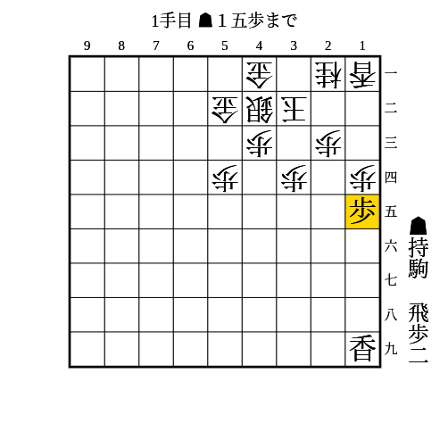
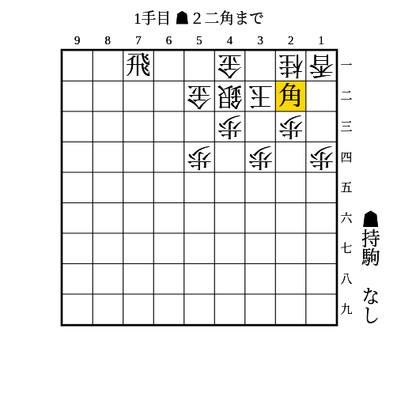

# 舟囲い

(1)

条件: 持ち駒に歩2枚+飛 AND 端を突き合っている

- △同歩なら▲13歩
    - △同香なら▲14歩△同香▲12飛〜▲14飛成
    - △同桂なら▲14歩
    - 放置なら▲15香〜▲12歩成
    - 歩がもう1枚あれば▲12歩から連打で良い

---

(2)

条件: 桂以外の任意の持ち駒（歩は2筋に打てるときのみ、角は相手が角を持っていないときのみ） AND 1段目に飛車がいる AND 相手の銀が31にいない

- △同玉なら▲41飛成
- 放置なら▲11角成〜▲21馬△同玉▲41飛成
