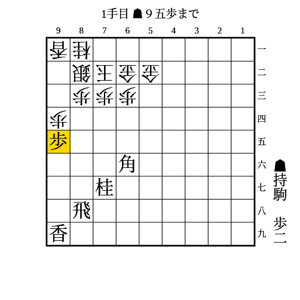
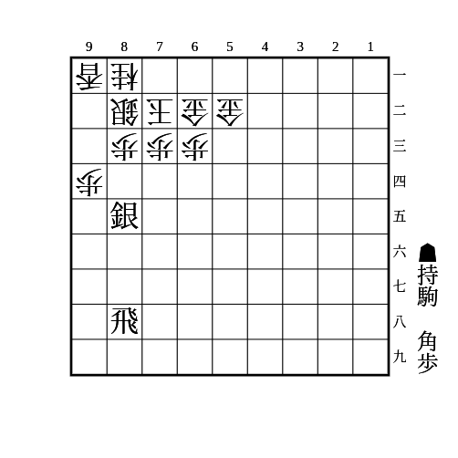
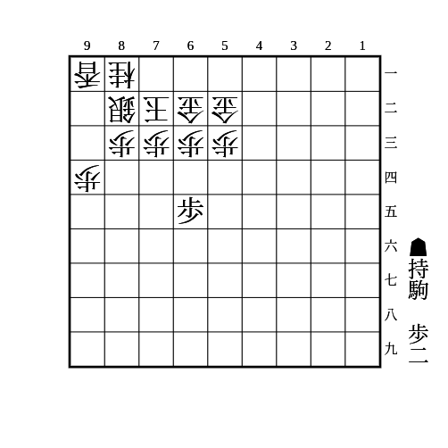
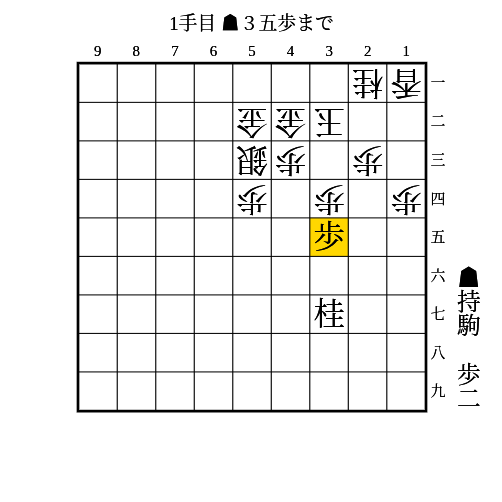
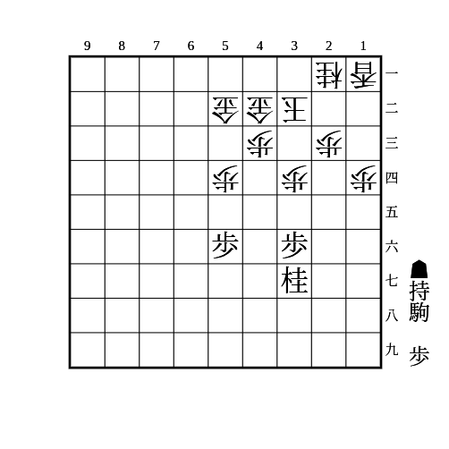
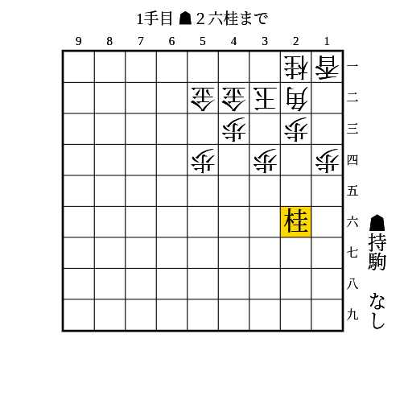
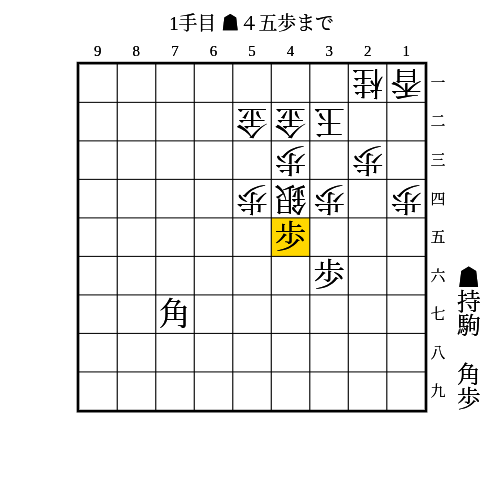
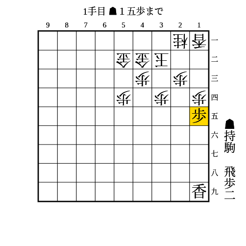
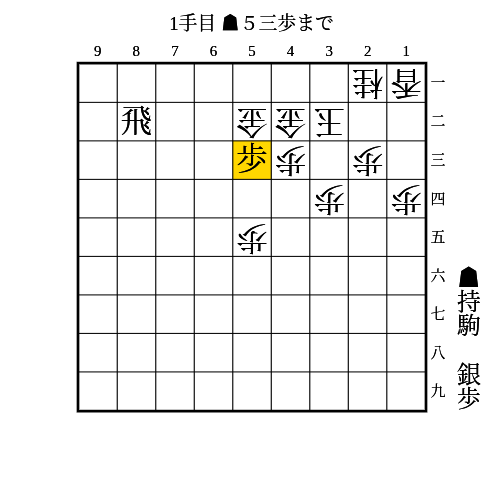

# 金無双

(1)

条件: 持ち駒に歩2枚 AND 角が93に利いている AND 77か持ち駒に桂がある AND 8筋に飛車が利いている

- △同歩なら▲93歩
    - △同銀なら▲同角成
        - △同香なら▲92銀
            - 次の▲83飛成が受けにくい
        - △同桂なら▲94歩
    - △同桂なら▲94歩
        - 歩がもう1枚あれば▲92歩△同香▲94歩〜▲95香が厳しい
    - △同香なら▲85桂
        - △94香なら▲93歩
            - △91銀なら▲92歩成△同銀▲95香△同香▲93歩
            - 放置なら▲92歩成
        - 放置なら▲93桂成

---

(2)

条件: 持ち駒に歩+角 AND 銀が84に利いている AND 8筋に飛車が利いている

- 次の▲84歩からの棒銀が受けにくい

---

(3)

条件: （持ち駒に歩3枚 AND 64に歩が打てる） OR （持ち駒に歩2枚 AND 64に歩が突ける）

- △同歩なら▲65歩△同歩▲64歩

---

(4)

条件: 持ち駒に歩2枚 AND 37に桂がある AND 53に相手の銀以上の駒がある

- △同歩なら▲33歩
    - △同桂なら▲34歩
    - △同金や△同玉なら▲45桂
    - 放置なら拠点になる
- 放置なら▲34歩〜▲45桂で33に駒を打ち込むのが厳しい

---

(5)

条件: 持ち駒に歩 AND 37か持ち駒に桂がある AND 54に相手の駒が利いていない

- △同歩でも放置でも▲54歩
    - 次に▲45桂〜▲53歩成

---

(6)

条件: 持ち駒に桂

- 次の▲34桂が受けにくい
    - 角がいなくても金に当てるだけで有効

▲35歩△同歩▲34桂を狙う順もあるが、35の歩を拠点に反撃されやすいので、控えて打てるときは控えて打ったほうが良い。

---

(7)

条件: 持ち駒に歩+角

- △33銀なら▲35歩
    - △同歩でも放置でも▲34歩△22銀▲66角
        - ▲22角成が受けにくい
- 銀が逸れたら▲11角成

---

(8)

条件: 持ち駒に歩2枚+飛 AND 端を突き合っている

- △同歩なら▲13歩
    - △同香なら▲14歩△同香▲12飛〜▲14飛成
    - △同桂なら▲14歩
    - 放置なら▲15香〜▲12歩成
    - 歩がもう1枚あれば▲12歩から連打で良い

---

(9)

条件: 持ち駒に歩2枚+銀 AND 2段目に飛車がいる AND 5筋に歩が打てる

- △同金右なら▲54歩
    - △同金なら▲51銀
    - △52金引なら▲53銀
- △同金左なら▲54歩
    - どう指されても次に金が取れる
