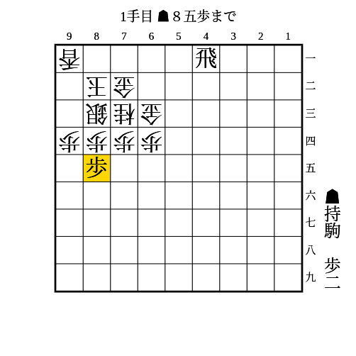

# 銀冠

(1)

条件: 1段目に飛車がいる AND （（持ち駒に歩3枚 AND 85に歩が打てる） OR （持ち駒に歩2枚 AND 85に歩が突ける））

- △同桂なら▲86歩
- △同銀や放置なら▲84歩
    - △同銀なら▲83歩
        - △同玉なら▲91飛成
        - △同金なら持ち駒を裏から打ったり2段目に飛車を移動させたりするのが受けにくい
    - △92銀なら83に持ち駒を打つのが厳しい
