# 詰み筋

駒余りあり

## 頭金

(1)

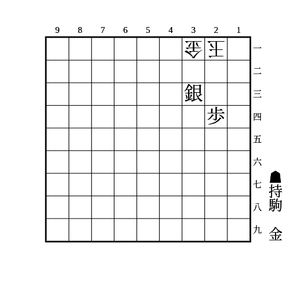

    
解答

    
▲22金△同金▲同銀成△同玉▲23金△31玉▲32金

---

(2)

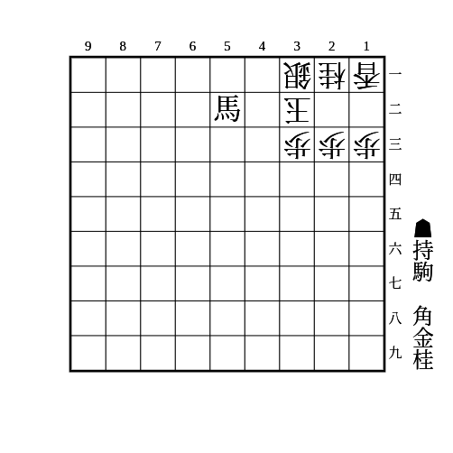

    
解答

    
▲41角△22玉▲23角成△同玉▲15桂△24玉▲25金

## 腹金

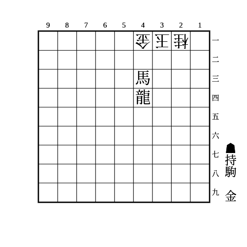

    
解答

    
▲33竜△同桂▲21金

    
▲33竜に△32合駒は▲22金の一間竜

## 尻金

(1)

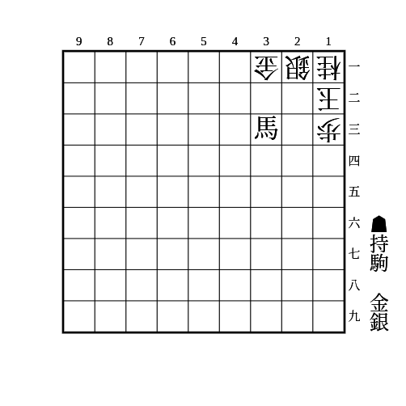

    
解答

    
▲23銀△同桂▲11金

---

(2)

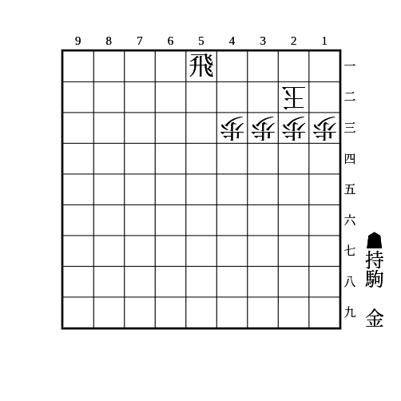

    
解答

    
▲21金△12玉▲11金△22玉▲21飛成

## 吊るし桂

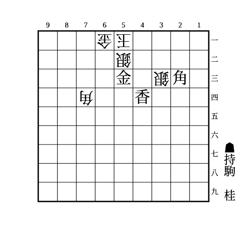

    
解答

    
▲41香成△同銀▲43桂

## 腹飛車

(1)

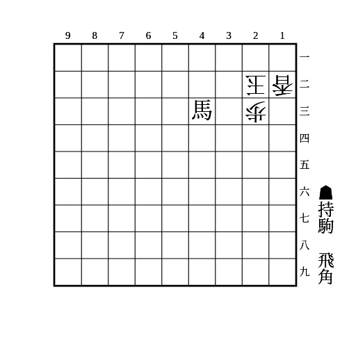

    
解答

    
▲31角△同玉▲21飛車

---

(2)

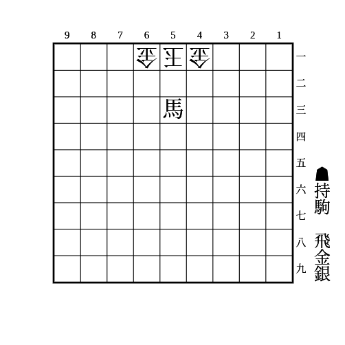

    
解答

    
▲52銀△同金右▲61金△同玉▲71飛

    
▲52銀△同金左▲41金△同玉▲31飛

## 一間竜

(1)

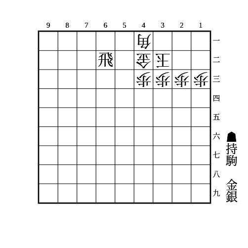

    
解答

    
▲22金△同玉▲42飛成△32金▲31銀△11玉▲22金△同金▲同竜

---

(2)

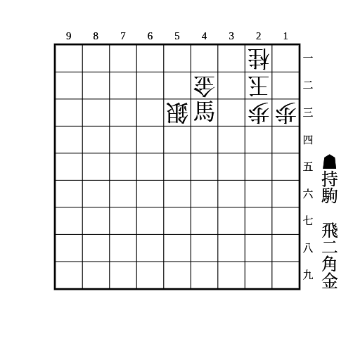

    
解答

    
▲33角△同金▲21馬△同玉▲41飛△31歩▲11飛△同玉▲31竜△21香▲22金

    
飛車で挟んでから一間竜にするパターンは頻出

    
拠点なしから詰むことがあり強力

## 一間飛車

(1)

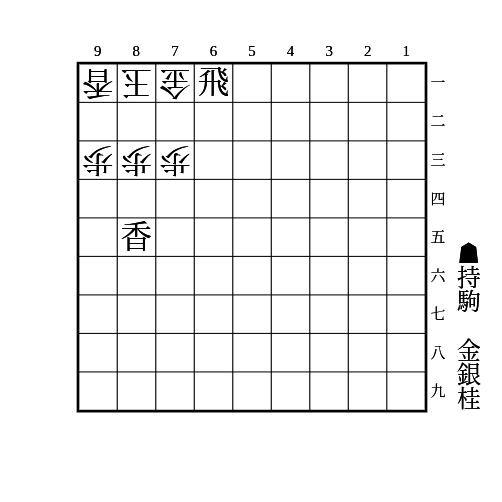

    
解答

    
▲72銀△同玉▲64桂△82玉▲71飛成△同玉▲72金

    
▲64桂に△61玉は▲52金

---

(2)

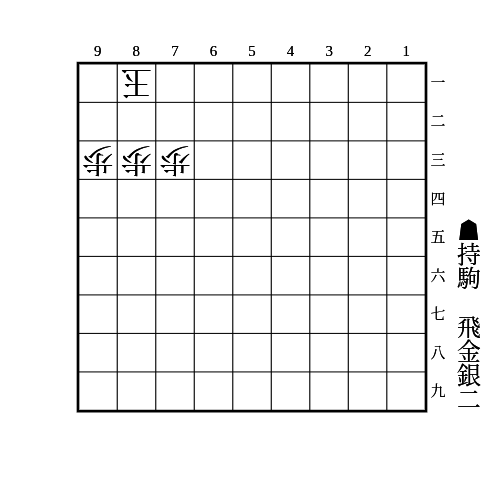

    
解答

    
▲61飛△71桂▲72銀△同玉▲62金△82玉▲71飛成△92玉▲81銀△91玉▲72銀成△92玉▲81竜

    
▲61飛に△71桂以外の合駒はすべて下の手順

    
例: ▲61飛△71角▲72銀△同玉▲63銀△82玉▲71飛成△同玉▲72金

    
▲63銀に△61玉は▲52金

---

(3)

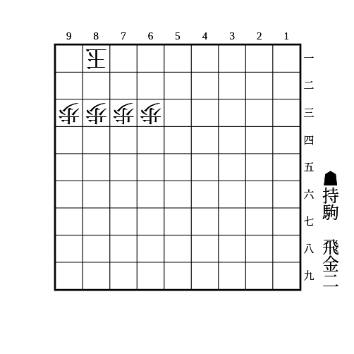

    
解答

    
▲61飛△71金▲91金△72玉▲62金△同金▲81飛成

    
▲91金に△同玉は▲71飛成△81金▲82金（一間竜）

## 退路封鎖

(1)

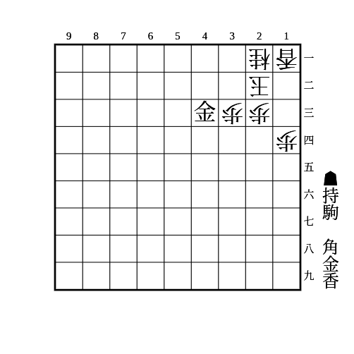

    
解答

    
▲31金△12玉▲13香△同桂▲22金

---

(2)

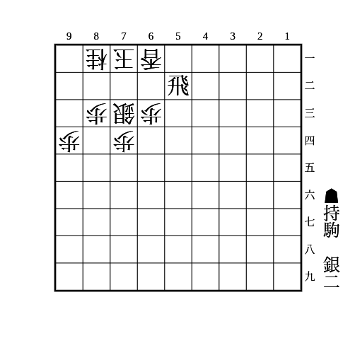

    
解答

    
▲82銀△同銀▲72銀

---

(3)

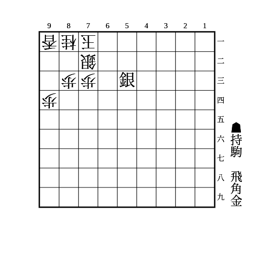

    
解答

    
▲93角△同香▲62金△82玉▲72金△同玉▲62飛△71玉▲82銀

## 開き王手

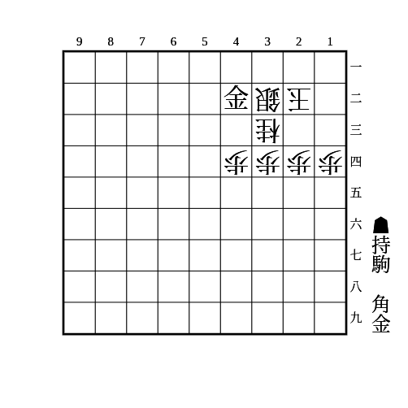

    
解答

    
▲31角△23玉▲22金△13玉▲21金△23玉▲22角成

## 歩頭桂

(1)

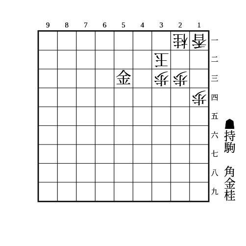

    
解答

    
▲24桂△同歩▲41角△22玉▲23金△31玉▲32金

    
▲24桂に△22玉は▲31角△同玉▲32金

---

(2)

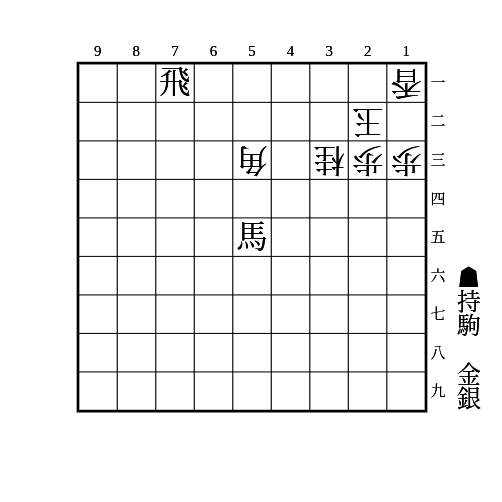

    
解答

    
▲11飛成△同玉▲33馬△22金▲12香△21玉▲32銀△同金▲11香成△31玉▲43桂△41玉▲51金

    
最長手順は歩頭桂でないが、▲12香に△同玉だと▲24桂と歩頭桂から詰む

## 邪魔駒消去

(1)

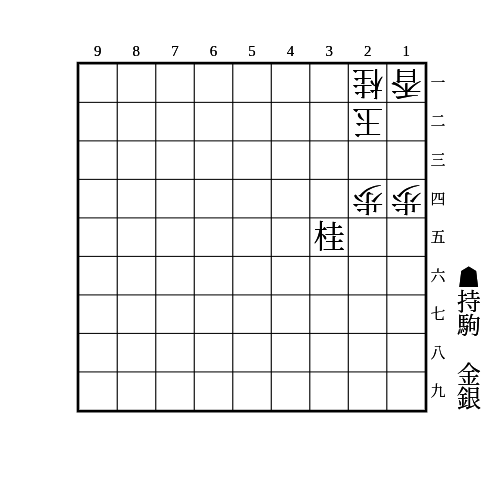

    
解答

    
▲23銀△13玉▲12銀成△同玉▲23金

---

(2)

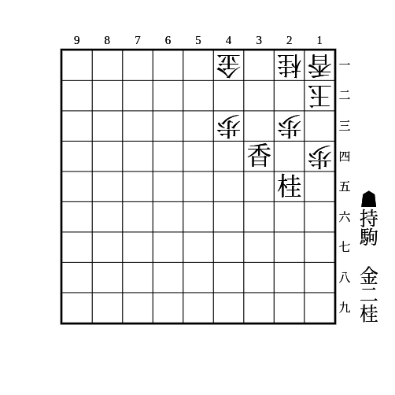

    
解答

    
▲22金△同玉▲33香成△同桂▲34桂△31玉▲22金

---

(3)

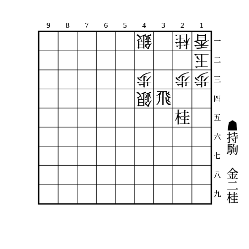

    
解答

    
▲32飛成△同銀▲22金△同玉▲34桂△31玉▲22金

## クリップ詰め（腹銀頭金）

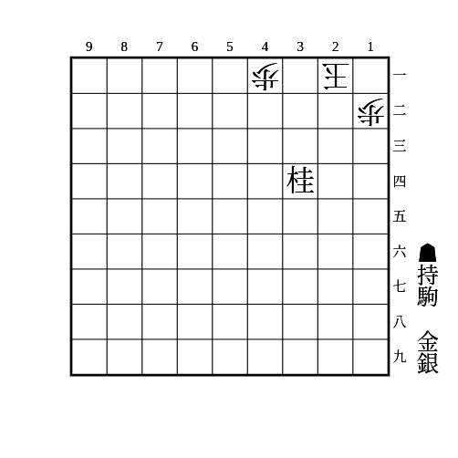

    
解答

    
▲22銀△32玉▲33金

## 金頭桂

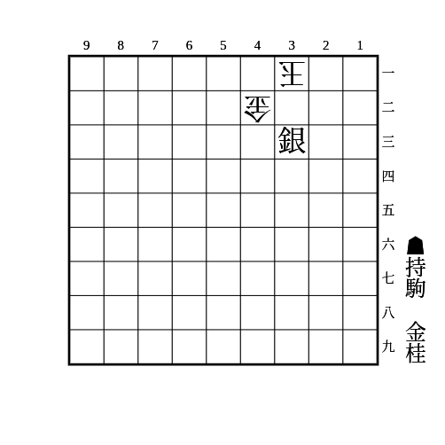

    
解答

    
▲43桂△41玉▲51金

    
▲43桂に△41玉以外は頭金

## 飛車をずらす角

(1)

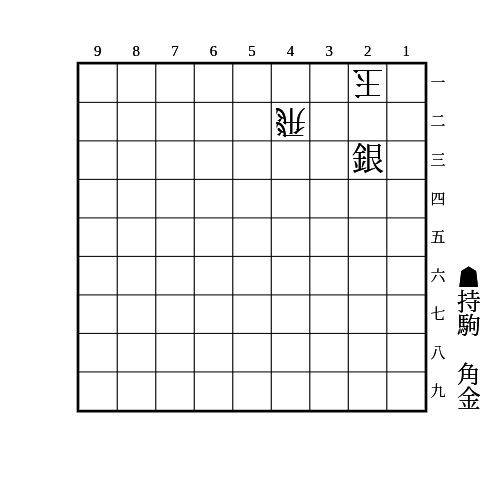

    
解答

    
▲43角△31玉▲32金△同飛▲同銀成

    
▲43角に△同飛は▲22金

    
▲43角に△11玉は▲21金

---

(2)

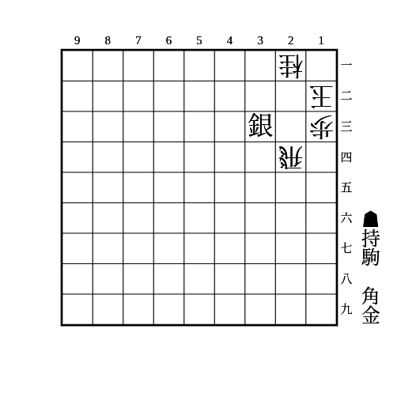

    
解答

    
▲34角△同飛▲22金

    
▲34角に△23合駒は▲22金

    
▲34角に△11玉は▲12金

## 馬をずらす飛車

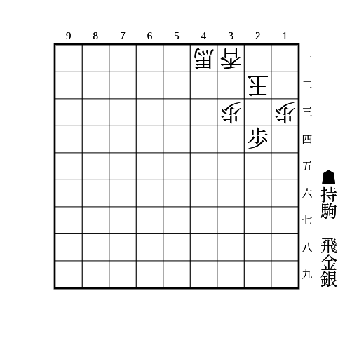

    
解答

    
▲42飛△32飛▲23銀△21玉▲22金△同飛▲同飛成

    
▲42飛に△同馬は▲23銀△21玉▲22金

## 離して打つ大駒

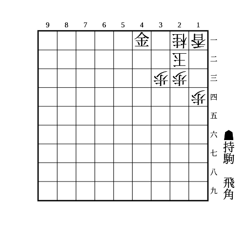

    
解答

    
▲31角△12玉▲32飛△22合駒▲22同飛成

## 逃げ道に捨て駒

(1)

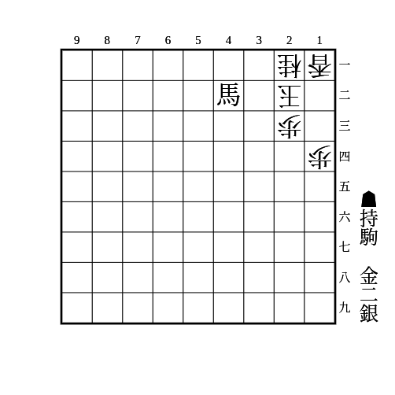

    
解答

    
▲32金△12玉▲13金△同玉▲22銀△12玉▲21銀不成△13玉▲25桂

---

(2)

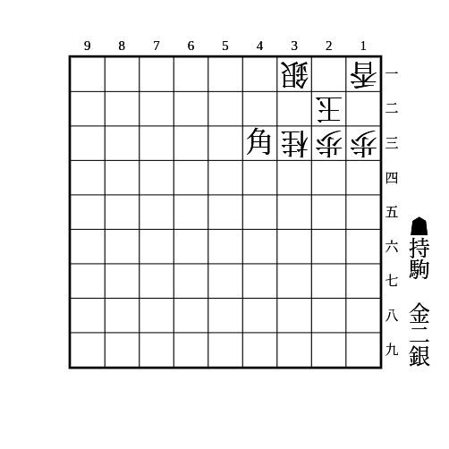

    
解答

    
▲12金△同玉▲21銀△22玉▲32金△同銀▲同角成

    
▲12金に△同香は▲11銀△同玉▲21金

---

(3)

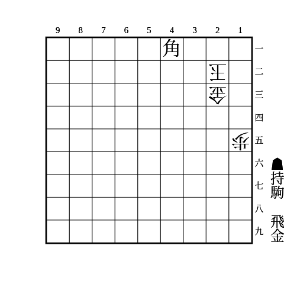

    
解答

    
▲32飛△13玉▲14金△同金▲33飛成△12玉▲23角成△11玉▲31飛成△21歩▲22馬

    
▲14金に△同玉は▲34飛成△24歩▲23角成

---

(4)

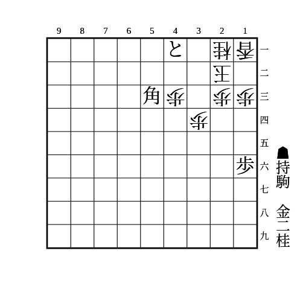

    
解答

    
▲33金△同玉▲25桂△22玉▲31角成△12玉▲22金

