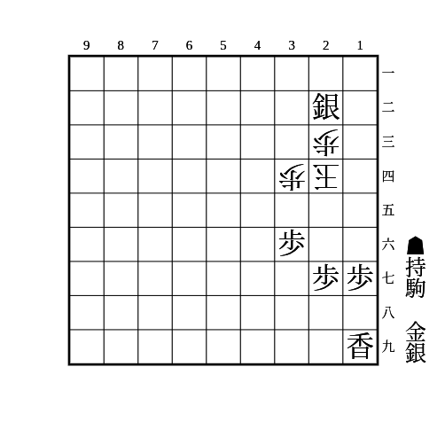
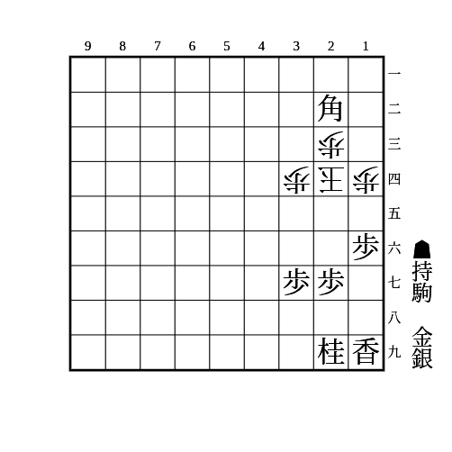
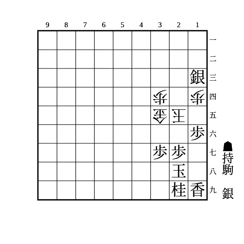
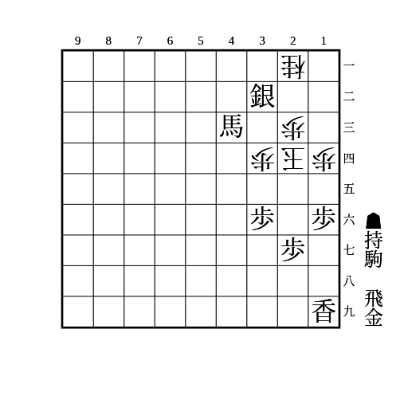
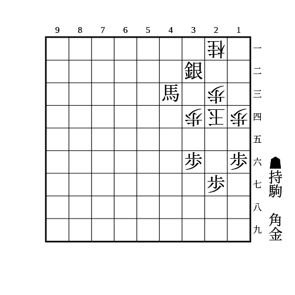
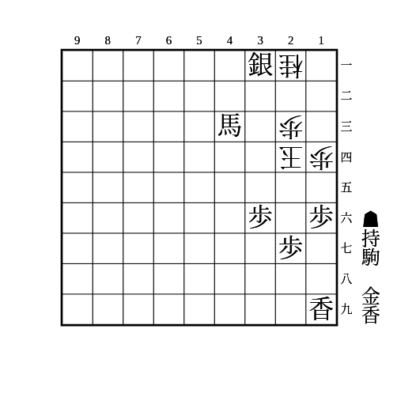
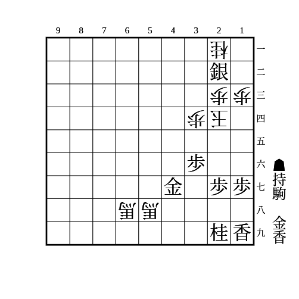
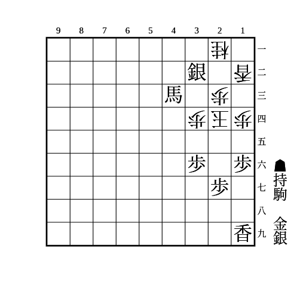

# 中段玉

(1)

    
解答

    
▲15銀△同玉▲16歩△25玉▲26金△24玉▲15金

---

(2)

    
解答

    
▲25銀△同玉▲17桂△35玉▲36金△24玉▲25金

---

(3)

    
解答

    
▲17桂△16玉▲25桂△同玉▲16銀

---

(4)

    
解答

    
▲25飛△同玉▲35金

---

(5)

    
解答

    
▲35角△同歩▲34金△25玉▲35金

---

(6)

    
解答

    
▲25馬△13玉▲14馬△同玉▲15金△13玉▲14香

---

(7)

    
解答

    
▲26香△25桂▲同香△14玉▲26桂△25玉▲37桂△14玉▲25金

    
▲26香に△25桂以外は▲同香△14玉で15に取った駒を打ち、△同玉なら▲16歩△25玉▲15金、△25玉なら▲37桂△15玉▲25金

    
角を合い駒できる場合は詰まない

---

(8)

    
解答

    
▲33銀△同桂▲34馬△同玉▲35金

