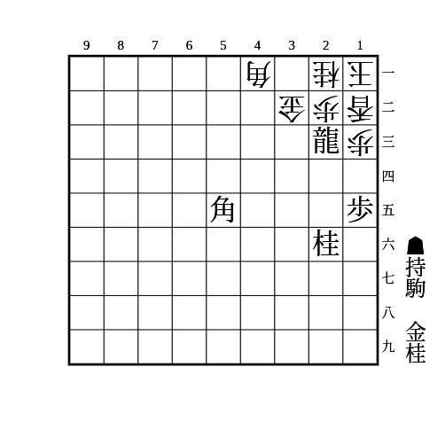
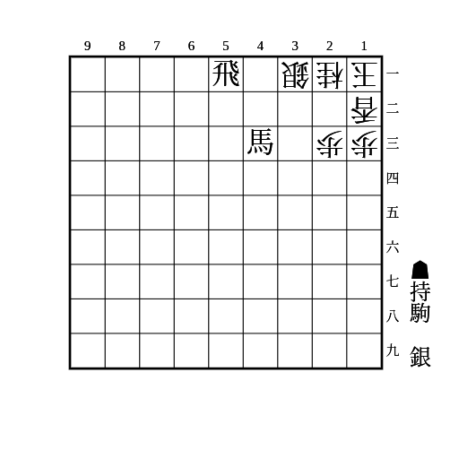
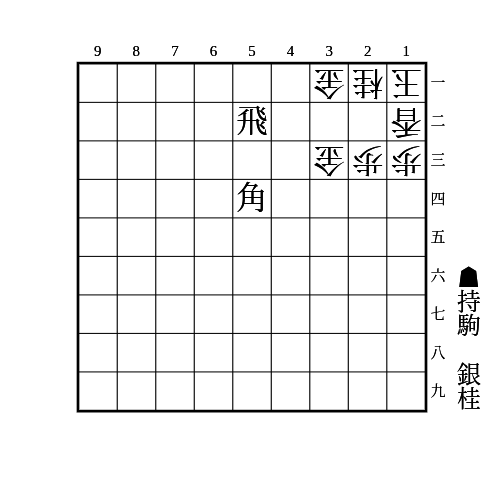
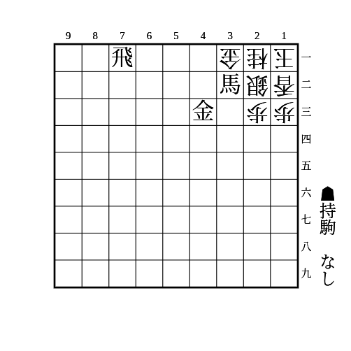
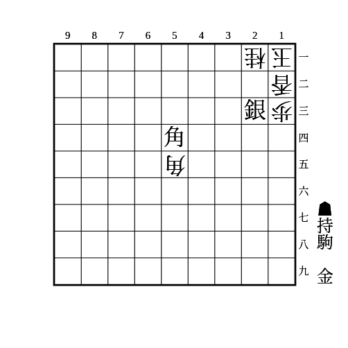
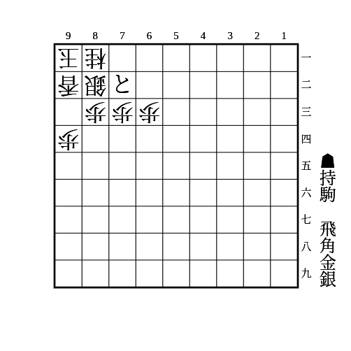

# 穴熊

(1)

    
解答

    
▲12竜△同玉▲24桂△23玉▲34金

---

(2)

    
解答

    
▲22銀△同玉▲31飛成△同玉▲32銀△22玉▲21銀成

---

(3)

    
解答

    
▲22銀△同金▲同飛成△同玉▲34桂△同金▲32金△11玉▲21金

---

(4)

    
解答

    
▲21馬△同金▲同飛成△同玉▲32金打△11玉▲22金△同玉▲34桂△31玉▲32銀

---

(5)

    
解答

    
▲21角成△同玉▲32金△11玉▲22銀成△同角▲23桂

---

(6)

    
解答

    
▲81と△同玉▲61飛△71銀▲72銀△同玉▲64桂△同歩▲63角△82玉▲71竜△93玉▲82銀△84玉▲85金

    
▲63角に△61玉は▲52金

    
▲61飛に△71桂は▲72銀△同玉▲64桂△同歩▲63角△同桂▲62金

