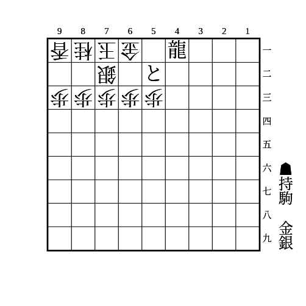
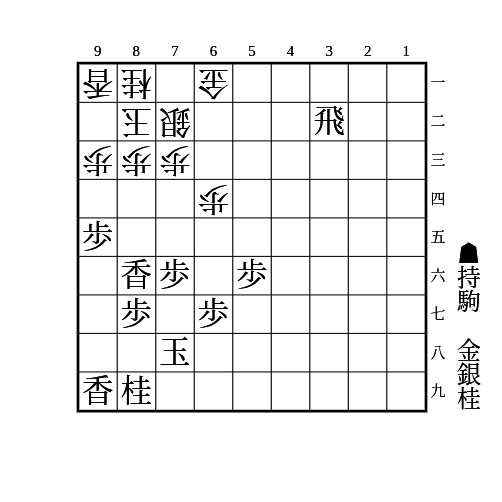
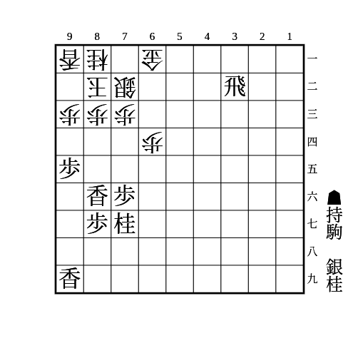
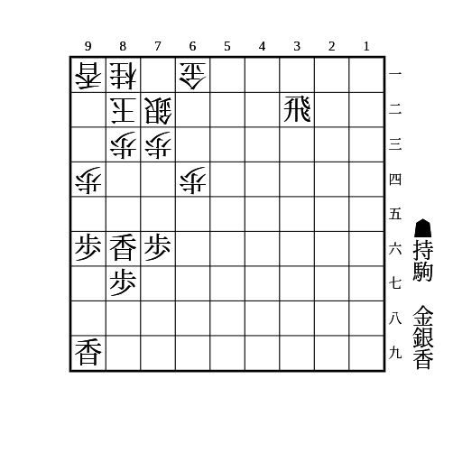
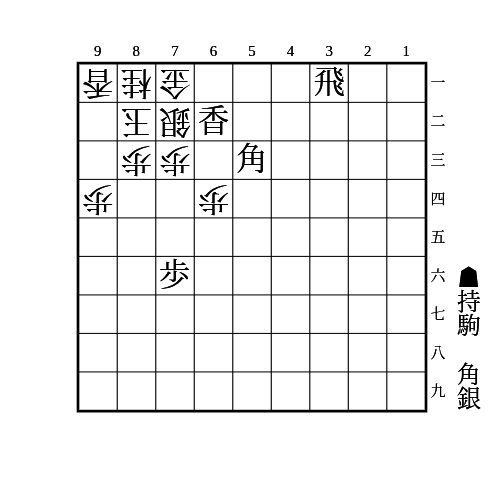

# 美濃

(1)

    
解答

    
▲61と△同銀▲62金△同玉▲52金△同銀▲71銀△72玉▲52竜△71玉▲82銀

---

(2)

    
解答

    
▲83香成△同玉▲75桂△84玉▲85銀△同玉▲77桂△76玉▲66金

---

(3)

    
解答

    
▲83香成△同玉▲75桂△82玉▲83銀△71玉▲63桂△同銀▲82銀成

---

(4)

    
解答

    
▲83香成△同玉▲84銀△同玉▲85香△93玉▲84金△82玉▲83金△71玉▲82金

---

(5)

    
解答

    
▲71飛成△93玉▲82竜△同玉▲71角△同玉▲61香成△82玉▲71角成△92玉▲93銀△同桂▲82金

