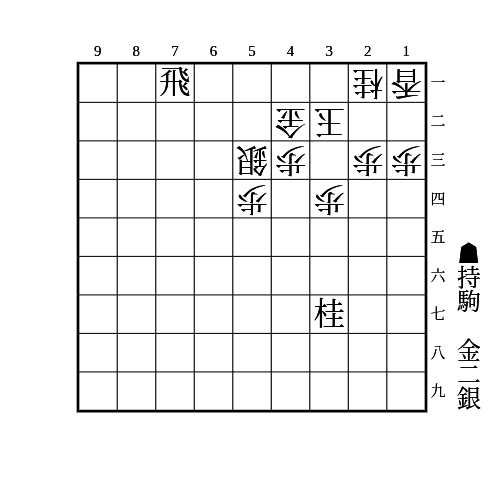
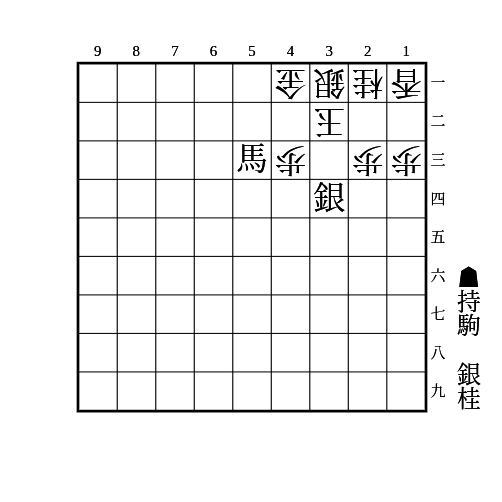
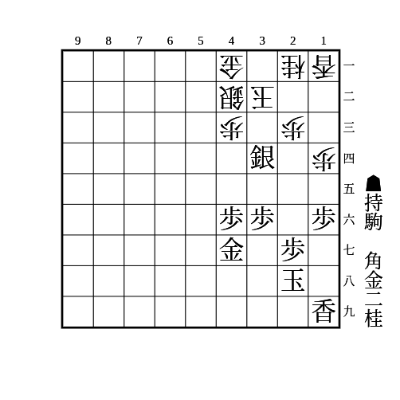

# 舟囲い

(1)

    
解答

    
▲33金△同桂▲31金△22玉▲21金△12玉▲11金△22玉▲21飛成

---

(2)

    
解答

    
▲43馬△22玉▲33銀成△同桂▲34桂△12玉▲21銀

    
▲43馬△22玉▲33銀成△12玉▲24桂△同歩▲23銀

---

(3)

    
解答

    
▲23銀成△同玉▲35桂△33玉▲22角△34玉▲25金△同玉▲26歩△同玉▲37金△25玉▲26歩△34玉▲25金

    
▲35桂に△33玉以外は並べ詰み

