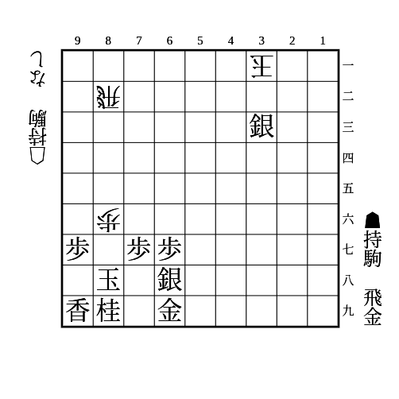
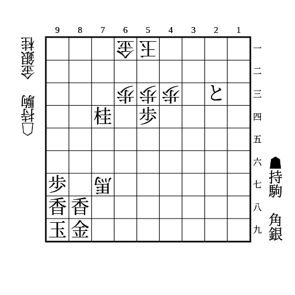
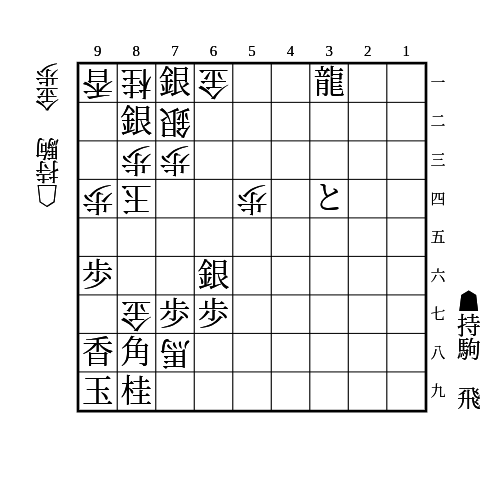

# 犠打

(1)

    
解答

    
▲21飛

    
△同飛成なら▲72とで速度勝ち

    
合駒も飛車を抜いて勝ち

---

(2)

    
解答

    
▲81飛

    
△同飛なら▲32金で詰み

    
合駒なら▲82飛成で勝ち

---

(3)

    
解答

    
▲95角

    
△同馬なら▲53歩成で速度勝ち

    
それ以外なら馬を抜いて勝ち

---

(4)

    
解答

    
▲86飛

    
△同金なら▲61竜で勝ち

    
△85金なら▲同飛で詰み

    
△74玉も▲76飛で詰み

