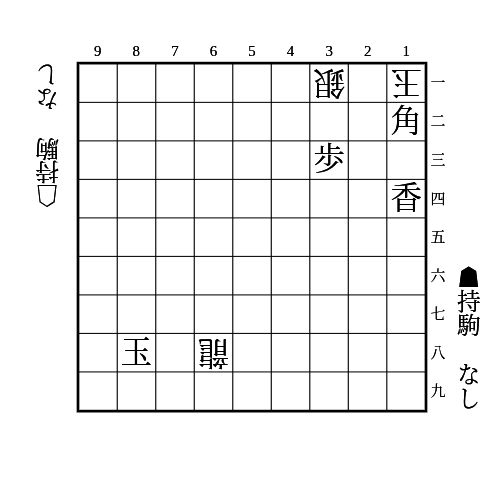
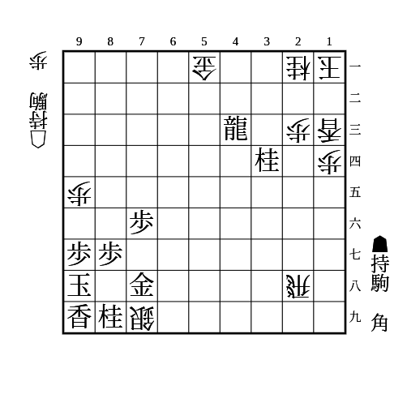

# 逆王手

互いの玉が同じ筋にいるとかけやすい。対角線にいるときも角でかけられることがある。

(1)

    
解答

    
▲78角成

---

(2)

    
解答

    
▲22角△12玉▲32竜

    
△78飛成に▲88角成の逆王手を用意する

    
34の桂がないと△41金があるので注意 ▲同竜なら△78飛成に▲88角成が逆王手にならない 竜が横に逃げたら△42歩で止められる

