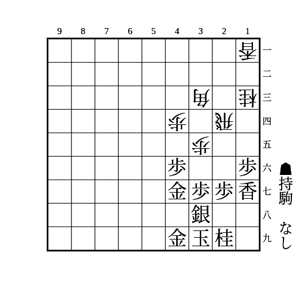
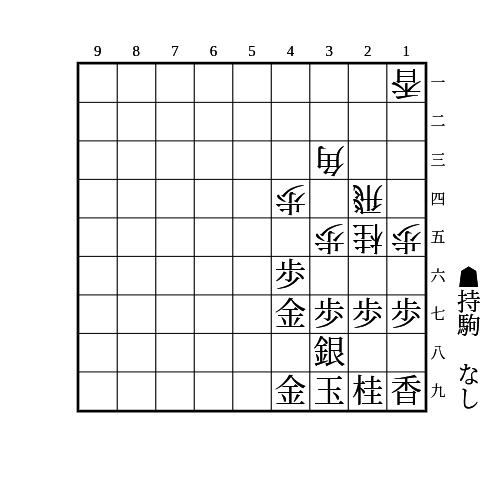

# 美濃

(1)

    
解答

    
▲26歩△同角▲27銀△44角▲26歩

    
△18歩は▲同玉でさらに△17歩は▲28玉で良い

---

(2)

    
解答

    
▲同銀

    
▲同桂は△15香で端を突破される

---

(3)

    
解答

    
▲15歩△25桂▲16香

    
以降は▲28玉〜▲26歩 すぐに▲26歩は△17桂成▲同桂△26飛があるので注意

    
本美濃だと△37桂成があるので注意 ▲同銀は△27飛成〜△16竜 ▲同桂は△36歩

---

(4)

    
解答

    
▲28玉

    
△17桂成なら▲同玉△16歩▲28玉△17歩成▲同香△同香成▲同玉 △同香成に▲同桂△16歩▲18歩でも良い △17桂成に▲同桂△16歩▲18歩でも良い

