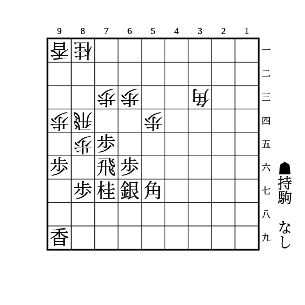
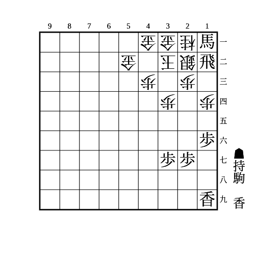

# 振り飛車

## ▲46歩のタイミング

遅くとも相手が△33角としたときに突けば対穴熊でも間に合う。  
早すぎると対急戦で無駄になる。  
玉が囲えていれば△33角としていなくても突いて良い。

## ▲78銀か▲67銀か

どちらも一長一短あるが、▲78銀のほうが無難なことが多い。  
対急戦でも自ら角交換しにいけて、対持久戦でもあとから▲67銀としたり、相手玉が角のラインにいれば▲25歩△同歩▲同桂〜▲65歩などがあったりして困らない。

## 四間飛車対△44角型ミレニアム

46歩56銀から玉を囲い、ミレニアム側の7筋の状況によって分岐する。

- 73歩型
    - ダイヤモンド美濃を作って56歩を突き、36銀から45歩で角を追って65歩から55歩で歩を交換する
    - その後54歩と打たれても64歩55歩63歩成で5筋にもと金を作ったりして良い
- 74歩型
    - 45歩53角を入れてから65銀と出て74か54の歩を取る
        - 75歩同歩同角としてきたら88飛としておいて、相手の銀が浮いたタイミングで78飛と寄り、88角から54銀や、銀が動いて飛車が成り込めるようになったら59角などがある
            - 銀が浮いたタイミングで寄れば86歩と来ても同歩同角88飛で飛車角交換になったら銀にあたり、85歩なら76銀から8筋の逆襲がある
    - 銀を繰り替えるために引いたタイミングで突いてきたら56歩〜67金〜88飛〜65歩で角交換を挑む
        - 角交換後は互角だが71角の筋があって居飛車が気を使う
        - 桂を跳ねたら68角から45歩で角を追って78飛で桂頭を狙う筋や46銀〜55歩を狙う筋がある
- 73桂型
    - 56歩〜36歩〜37桂から45歩53角55歩同歩65歩で次に55角〜64歩がある

## 四間飛車対天守閣美濃

▲39玉▲46歩▲36歩▲37桂▲26歩型を作る。

- △44銀なら▲45歩△33銀▲65歩
    - 相手の角が22に利かなくなったら▲25歩△同歩▲同桂△22銀▲24歩△12玉▲15歩△同歩▲35歩
        - ▲25同桂のときに銀を逃げなければ取って▲46銀と打ち、将来的に飛車を3筋に回って攻める筋がある
    - △12玉型には角が22に利いていても▲25歩△同歩▲15歩△同歩▲25桂△24銀▲13歩の筋がある
        - 相手が銀冠にしていても成立する
    - △31角のまま玉をさらに囲ってきたらこちらも銀冠を作ってから▲56歩▲67飛▲68角▲46角と展開するルートがある
- △44歩なら玉を銀冠に囲ってから▲65歩▲66銀▲56歩型を作って6筋の棒銀や▲55歩の仕掛けなどがある
    - 形勢自体は互角
    - 相手が高美濃にせずに△42銀と引いたら、相手玉の位置によって異なる攻め方がある
        - △23玉型なら▲56銀△33銀▲65歩△31角▲45歩△同歩▲25歩で△44銀と同じようなルートになる
            - 相手の角が22に利いていても成立する
                - △22銀▲24歩△同玉で、こちらの右金が上がっていなければ▲45銀△25玉▲47金で飛車を2筋に展開する筋を狙う
                    - 右金が上がっていれば▲26銀〜▲45銀
        - △12玉型なら▲56銀△33銀▲65歩△31角▲45歩△同歩▲15歩△同歩▲35歩△同歩▲45銀
            - 次に▲25歩で取られたら桂が跳ねて端攻め、取られなければ▲34歩〜▲24歩〜▲25桂
    - 高美濃から△42銀と引いたら▲56銀△33銀▲65歩△31角で、自玉の銀冠を完成させてから相手玉の位置によって異なる攻め方がある
        - △23玉型なら▲45歩△同歩▲25歩△同歩▲同桂△22銀▲45銀で銀と金を交換しにいく
            - △24歩で桂を取りに来たら▲44歩△53金▲35歩△同歩▲33歩がある
        - △12玉型なら▲45歩△同歩▲25歩△同歩▲15歩△同歩▲35歩△同歩▲25桂△24銀▲13歩△同桂▲同桂成〜▲45銀

△23玉型には2筋のみ、△12玉型には1筋も突き捨ててから桂が跳ねることを覚えておけば良い。

## 四間飛車対右四間飛車

△85歩が突かれていない状態で77に角を上がらないようにする。  
桂で責められる筋、▲56銀型だと袖飛車で角頭を責められる筋、穴熊に組まれる筋などがあり難しくなる。  
なお、相手が△94歩を突いておらず、桂を跳ねたときは状況によって▲95角がある。  
また、角が77に上がるのであれば▲58金よりも▲98香のほうが価値が高い。

基本は▲88角▲67銀のまま玉を囲う。  
▲88角型であれば▲98香は不要。  
△65歩への対応は相手の組み方によって以下のように分岐する。

- △73歩△61金△41金△31銀型
    - ▲77角△66歩▲同銀△65歩▲75銀で角交換後左桂を捌いていく
        - 受けられても▲86角〜▲64銀と足していく手がある
    - △73歩△52金△41金△31銀型も同様だが、▲53桂成が金にすぐ当たるので▲86角は不要
    - △73歩△61金△42金△31銀型も同様
- △73歩△61金△41金△31銀型（△94歩△93桂あり）
    - △93桂のときに▲56銀
        - △65歩なら▲同歩
            - △88角成▲同飛△33角なら▲77角
                - △65銀なら▲33角成△同桂▲68飛
                    - △56銀なら▲62飛成〜▲56歩
                    - △66歩なら▲65銀△同飛▲77桂△62飛▲64歩△同飛▲55角
                        - 飛車が横に逃げたら▲66角
                        - △63飛なら▲64銀〜▲53銀成
                        - △62飛なら▲73角成
        - それ以外は▲75歩
    - △73歩△52金△41金△31銀型も同様
    - △73歩△61金△42金△31銀型も同様
- △73歩△61金△41金△42銀型
    - ▲77角△66歩▲同銀△65歩に▲同銀がある
        - △同飛は▲同飛で飛車が捌けて有利
        - △同銀は▲22角成△同玉▲63歩から王手飛車の筋があり飛車の働きが良くなる
- △74歩△61金△41金△31銀型
    - ▲56歩と突く
        - △66歩なら▲同銀
            - △65歩なら▲55銀△同銀▲同角△同角▲同歩
                - △45角なら▲54歩
                    - △同角は▲55角
                    - △同歩は▲64歩
                        - △同飛は▲86角〜▲53銀や▲64銀などで飛車がいなくなったら▲65飛
                        - △89角成は▲63角〜▲54角成
                        - △52金右は▲63銀△同金▲同歩成△同飛▲72角
                        - △52金左は▲77桂で飛車と桂を捌いていく
                            - 展開によって▲53歩△同金▲26角の筋もある
                        - △73桂は▲77桂で、そのままなら▲53銀や▲95角〜▲65桂、飛車が縦に動いたら▲82角などがある
                - △66歩なら▲64歩
                    - △同飛は▲86角〜▲53角成や▲64銀や▲77桂
                - △44歩なら▲64歩
                    - △同飛は▲86角〜▲53角成や▲64銀
                    - 取らなければ▲65飛や▲63銀や▲63角などがある
                - それ以外は▲45角
                    - △72金は▲同角成△同飛▲65飛
                    - △72銀は▲77桂で角が入ったら▲82角などがある
            - △65銀なら▲同銀△88角成▲同飛△65飛▲55角
        - △73桂なら▲77角
            - △66歩なら▲同銀
                - △85桂なら▲88角
                    - △65歩なら▲55銀△同銀▲同角△同角▲同歩
                        - △45角なら▲73銀で飛車が横に逃げたら▲65飛、△63飛なら▲81角
                        - それ以外は▲73角
                            - △63飛なら▲91角成
                            - 横に逃げたら▲65飛
                            - そのままでも▲62角成△同金▲65飛
                    - △65銀なら▲57銀△88角成▲同飛
                        - △33角は▲55角から角交換して▲73角
                        - △76銀は▲73角
                - △65歩なら▲57銀△77角成▲同桂△33角▲75歩
                    - △同歩なら▲74歩△77角成▲73歩成△64飛▲46角△84飛▲55歩△68馬▲同銀△45銀▲57角△66桂▲48金寄のように進み、45の銀を狙いにいく
                        - ▲46歩を突いていて角が打てないときは△64飛に▲82角で良い
                    - △77角成なら▲74歩
                        - △72金なら▲86角
                            - △68馬なら▲同銀で次に▲53角成と▲73歩成△同金▲46桂△45銀▲55角がある
                            - △同馬なら▲同歩で次に▲46角や▲78飛から73を攻める筋がある
                            - △85桂なら▲53角成△52飛▲75馬△95馬▲55歩
                                - 銀が動いたら▲65飛
                                - △77桂成なら▲69飛
                                    - △78成桂は▲54歩〜▲53歩成
                                    - △63桂は▲31馬△同金から▲61銀や▲54歩などがある
                        - △85桂なら▲73歩成
                            - 飛車が横に逃げたら▲64歩からと金を作る
                            - △64飛なら▲46角△84飛▲63歩からと金を作る
                                - ▲46歩を突いていて角が打てないときは▲75角△84飛▲同角△同歩▲81飛で良い
                        - △66歩なら▲73歩成△65飛▲86角
                            - △68馬は同銀
                                - 53を受けてきたら▲74と〜▲64とが厳しい
                                - △75桂は▲74角
                                    - △67歩成は▲同金△同桂成▲53角成が厳しい
                            - △同馬は▲同歩で次に▲66銀や▲74角や▲62歩などがある
                            - △76馬とかわすのは▲77歩
                                - △87馬なら▲53角成
                                - △85馬や△94馬なら▲66銀
                                - △58馬▲同金△67金なら▲53角成
                                    - △68金▲同銀△52飛は▲86馬と引いて▲49金や▲76馬など受けに回れば潰せる
                                    - △58金は▲54馬△57金▲65馬△68金▲43馬△同玉▲63飛△53銀▲76角△54桂▲61飛成△52角▲72竜のように進む
                                    - △42桂は▲49銀と受けに回る
                                        - △68金は同銀で切れる
                                        - △58金▲同銀△67金は▲76角△58金▲同飛△67歩成▲98飛△57と▲54馬△同桂▲65角
                - それ以外は▲57銀
                    - △68飛成は▲同銀
                    - △77角成▲同桂△33角は▲62飛成△同金▲66歩
                    - △65桂は▲22角成△同銀▲66銀で次に▲55歩で銀をどかしてから▲65銀と桂を取る
                    - △67歩は▲同金△77角成▲同桂△79角▲66歩△68角成▲同金で桂頭を攻めていけば良い
            - △85桂なら▲88角
                - △66歩なら上記の△66歩〜△85桂と合流
                - それ以外なら▲86歩
            - △75歩なら▲同歩
                - △85桂▲88角△66歩なら▲76銀
                    - △65銀は▲85銀
                        - △84歩は▲74銀△同銀▲同歩で△67銀は▲73歩成で良い
                    - それ以外は▲74歩
                        - △72飛なら▲75銀で▲64歩〜▲55歩△同銀▲63歩成などを狙う
                        - △63飛なら▲64歩△同飛▲73歩成
                - △66歩なら▲同角
                    - △同飛▲同銀△65歩なら▲55銀から精算して▲74歩〜▲65飛
                    - △同角▲同銀△33角なら▲67歩
                        - △65銀なら▲74歩
                            - △同銀なら▲78飛△75歩▲55歩
                                - △65歩なら▲75銀
                                - △65銀なら▲同銀
                                    - △同飛なら▲56銀打から▲75飛や桂頭責め
                                    - △同桂なら▲75飛でも▲66銀でも▲73角でも良い
        - それ以外は▲77角
            - △66歩▲同銀△65歩は▲57銀
                - △77角成▲同桂△33角は▲65桂△同銀▲63歩△同飛▲82角
                - 角交換後▲55歩から▲45角や▲65桂や▲65飛の筋がある
    - △65歩の前に△73桂と跳ねてきたらその瞬間に▲75歩が成立する
        - △63銀なら▲74歩△同銀▲78飛△75歩▲76歩で有利
        - △同歩なら▲78飛
            - △63銀や△63金には▲75飛△74歩▲76飛と石田流を組んで指しやすい
            - △65歩は▲75飛△66歩▲56銀で桂頭を責めていけば有利
- △74歩△61金△41金△31銀型（△94歩△93桂あり）
    - △93桂のときに▲78飛
        - △65歩なら▲同歩
            - △65銀なら▲22角成△同銀▲73角
            - △88角成▲同飛△33角なら▲98飛で次に▲73角や▲64角
        - それ以外なら▲75歩
- △74歩△61金△42金△31銀型
    - △74歩△61金△41金△31銀型と基本的に同じ
    - △66歩▲同銀△65歩▲55銀△同銀▲同角△同角▲同歩△45角には▲54歩ではなく▲64歩とする
        - △同飛は▲82角
        - △89角成は▲63銀△92飛▲74銀不成〜▲63歩成
        - △52金右は▲77桂と逃げてから▲63銀△同金▲同歩成△同飛▲72角か、▲65飛〜▲63銀
        - △45角以外も53が守られているので▲86角のところを▲82角とする
    - △73桂▲77角△66歩▲同銀△65歩▲57銀△77角成▲同桂△33角▲75歩△77角成▲74歩△72金には▲86角ではなく▲51角とする
    - △73桂▲77角△66歩▲同銀△65歩▲57銀△77角成▲同桂△33角▲75歩△77角成▲74歩△66歩▲73歩成△65飛には▲86角で良い
        - △76馬には53のあたりが強くなっているので▲77歩ではなく▲55歩△同銀▲77桂がある
        - △68馬▲同銀△75桂は▲74角で良い
            - △67歩成▲同金△同桂成▲53角成の代わりに▲65角から精算する
- △74歩△61金△41金△42銀型
    - △74歩△61金△42金△31銀型と基本的に同じ
    - △73桂▲77角△66歩▲同銀△65歩▲57銀△77角成▲同桂△33角▲75歩△77角成▲74歩△72金には▲51角ではなく▲46角とする
        - △64桂や△61桂などでしか受からないが▲73歩成△同金から桂頭を責めていけば良い
        - ▲46歩と突いているとこの筋がないので有利にならない
- △74歩△52金△41金△31銀型
    - ▲同歩と取れる
        - △88角成なら▲同飛
            - △65銀なら▲66歩
                - △同銀なら▲同銀△同飛▲55角
                - △33角なら▲68飛
                    - △66銀なら▲同銀
                        - △同角なら▲71角〜▲82角成
                        - △同飛なら▲同飛△同角▲61飛
                - 銀が戻ったら攻めが切れるので7筋から攻めれば良い
            - △33角なら▲98飛△65銀▲46角△64歩▲56銀
                - △同銀なら▲同歩で次に▲65歩から角のラインで攻める筋があり、銀を打たれて角を責められても▲55角で交換すれば良い
                    - 再度角交換後は▲36角の筋などがある
                - ▲46歩を突いていて▲46角を打てないときは△33角に▲77角と合わせる
                    - △同角成▲同桂△33角と再度打ってくるのは▲78飛で問題ない
                    - △65銀なら▲33角成△同桂▲66歩で△88角成▲同飛△65銀の展開とほぼ同じになる
    - △65歩の前に△73桂と跳ねてきたらその瞬間に▲75歩が成立する
        - △63銀なら▲74歩△同銀▲78飛△75歩▲76歩で有利
        - △同歩なら▲78飛
            - △63銀や△63金には▲75歩△74歩▲76飛と石田流を組んで指しやすい
            - △65歩は▲75飛△66歩▲56銀で桂頭を責めていけば有利

端歩を突いた本美濃ができても△65歩を突いてこない場合は相手の組み方によって対応を変える。

- 相手の囲いが確定していないとき
    - △74歩△52金型なら▲78飛で打診
        - △72飛なら▲46歩や▲26歩などで相手の囲いが確定するのを待つ
        - 無視してきたら7筋の歩を交換して▲77角型の石田流から▲86飛△82飛▲72歩などがある
    - それ以外は▲46歩
        - その後△74歩△52金型を作られたら▲56歩としないと△65歩で開戦されたときにやや不利になるので注意
- △24歩で天守閣美濃が確定
    - △73歩△52金型なら▲75歩〜▲78飛〜▲74歩
    - △74歩△52金型なら▲78飛で打診してから▲46歩〜▲26歩〜▲36金〜▲45歩〜▲17桂〜▲27銀〜▲38金の形を作る
        - ▲25歩からいつでも歩が手に入るので相手は桂を跳ねにくい
        - その後は飛車を6筋に戻して▲25歩△同歩▲65歩などがある
    - △61金型なら▲56銀▲46歩▲36歩▲26歩▲37桂▲27銀
- 天守閣美濃から端玉銀冠
    - △74歩△52金型なら▲46歩〜▲26歩〜▲36金から▲15歩△同歩▲25歩△同歩▲同金〜▲15金がある
        - その後相手が△24歩と打たなければ▲25歩▲26金型を作る
        - 相手が歩切れなら△14歩に▲同金△同銀▲同香が厳しい
    - 対天守閣美濃で▲17桂としたあとに△12玉としてきたらその瞬間に▲25歩△同歩▲同金とする
        - 次に▲24歩としてから▲15歩△同歩▲同金〜▲25桂〜▲13歩を狙う筋や▲34金の筋がある
    - こちらが▲36歩を突いてから△52金としてきた場合は銀冠を組んでから▲45銀や▲65歩で銀と角を交換していく
- △33角△22玉△12香で穴熊が確定
    - △74歩型なら△33角には▲36歩、△22玉には▲37桂として、△12香に▲78飛
        - △72飛なら▲55歩
            - △同銀なら▲25桂で角を逸らしてから▲65歩
                - △54歩なら▲56銀
                - △46角なら▲37銀△同角成▲同玉で▲56銀や▲64歩などがある
        - 無視して玉を囲ったら▲75歩
        - △65歩なら▲57金
    - △73歩型なら△33角には▲56銀、△22玉には▲75歩、△12香には▲78飛として7筋の歩を交換する
        - その後は▲27銀から交換した1歩で端攻めする
- △42銀でエルモ囲いが確定
    - ▲56歩〜▲47銀〜▲38金で木村美濃を作る
        - その後▲36歩〜▲26歩〜▲37桂〜▲45歩〜▲48金左〜▲58銀左など振り飛車側は固めながら待つ
        - 相手が△85歩を突かずに桂を跳ねたら▲35歩△同歩▲75歩△同歩▲78飛で桂頭を責める
            - △85歩を突いたら▲77角と上がる
    - △33角に穴熊対策の▲56銀と上がったあとに△42銀としてきたら▲67銀と戻ってから▲56歩で上に合流する
- △42金で金無双が確定
    - 対エルモと同様

## 対急戦

(1)

    
解答

    
▲65歩

    
△同桂なら▲22角成△同玉▲66角

    
△同銀なら▲22角成△同玉▲65飛△同桂▲66角

    
△77角成▲同桂も銀取りと▲66角が残る

---

(2)

    
解答

    
▲78飛

    
△76歩▲同銀△72飛なら(3)

---

(3)

    
解答

    
▲65歩△77角成▲同飛

    
続けて△53銀や△22角などで互角

    
▲65歩に△76飛は▲22角成△同玉▲76飛で抜ける

    
▲67金は△75歩▲85銀△93桂がある

---

(4)

    
解答

    
▲46角

    
△64歩なら▲同角で良い △同銀とすると飛車が抜ける

## 石田流

(1)

    
解答

    
▲86歩△同歩▲85歩△82飛▲86飛

---

(2)

    
解答

    
▲72歩△53角▲65桂△62角▲71歩成△同角▲73桂成

    
角が利いているので(1)の筋は使えない

---

(3)

    
解答

    
▲74歩

    
△同歩なら▲65歩△82飛▲74飛△73歩▲76飛

    
△同飛なら▲同飛で交換できて、先に▲65歩から▲74歩とするより相手の角道が通っておらず、桂が跳ねる余地もある分だけ得

---

(4)

    
解答

    
▲86歩△同歩▲74歩△同飛▲86飛

    
△84歩なら▲75歩で飛車が詰む

    
桂に紐がついていて▲86飛と回れるのがポイント

## その他

(1)

    
解答

    
▲15歩

    
△同歩なら▲同香で、△13歩なら▲19香、△33玉なら▲22飛成△同金▲12香成、放置なら▲14歩

    
△33玉なら▲22飛成△同金▲14歩△12歩▲13香

---

(2)

    
解答

    
▲15歩△同歩▲14歩△31金▲26香

    
次に▲13歩成△同桂▲15香△11歩▲13馬△同銀▲同香成がある

    
△15同歩とせずに△31金とする手もあり、▲14歩には△11歩▲21馬△同金▲13歩成△33銀のように進む ▲14歩と取ると角を渡す流れになるので、タイミングを見て取る

    
銀を持っている場合、▲26香〜▲11銀がある △同銀なら▲23香成〜▲11馬 △31金打なら▲15歩から似た流れになり、△11歩がなくなっている分だけ得で、1筋の香車も参加できる △31金を打たずに寄るのは▲22銀成△同金▲41銀があり、△同玉は▲22馬、△31玉は▲23香成、△33玉は▲23香成△同金▲21馬がある

---

(3)

    
解答

    
▲13歩

    
△同玉なら▲18香打△23玉▲15香△13歩▲同香成△同桂▲14歩△12歩▲13歩成△同歩▲15桂△14玉▲22馬が詰めろ

    
△同桂なら▲15香△14歩▲同香△同玉▲22馬で、次に▲15歩や▲19香がある

