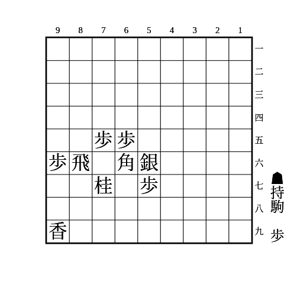
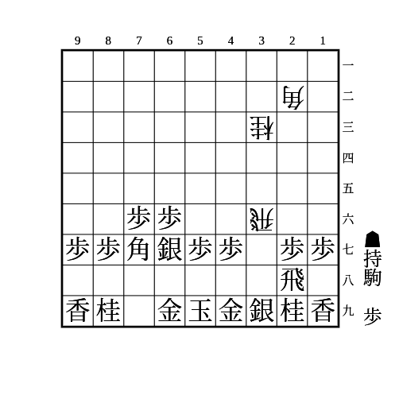

# 相振り飛車

## 理想形

相手がどの陣形でもここからの端攻めで崩せる。  
銀は角頭や玉頭を守る役割。

主な手順は以下。

- 基本は▲74歩△同歩▲95歩△同歩▲93歩
    - △同香なら▲85桂
    - △同桂なら▲95香
        - 桂を取って右辺で使う
    - △同銀なら▲同角成
        - △同桂なら▲95香で上と似た展開
        - △同香なら▲92銀△84角▲85桂△94香▲81銀不成△同玉▲93桂成△同角▲83飛成
            - 以降は▲94竜〜▲95香で角を取ったら▲61角などがある
    - 相手が浮き飛車の横利きで受けようとしている場合は▲74歩△同飛から矢倉に組み替えて飛車を圧迫しにいく
        - もしくは▲64歩△同飛▲65銀△34飛▲74歩△同歩で止める方法もある
- 歩を手に入れたら▲73歩と▲85桂を組み合わせる手がある
- 展開によっては▲55角と覗く筋がある
    - 相手が美濃の場合、73の地点で受けたら▲85桂がある
- △94香のとき、対金無双なら▲76飛から十字飛車を狙う筋がある
- 相手が△71玉型の美濃の場合、▲92歩△同香としてから▲85桂で▲93歩と▲73歩△同桂▲同桂成△同銀▲83飛成△72金▲92竜の筋がある

1歩では右辺と絡める必要があるが、2歩あれば部分定跡で突破できる。

△44銀〜△54歩〜△55銀と角を目標にされる展開に注意する。  
その場合は角を77に置いたまま桂を97に跳ねる手がある。

## 角交換の有利不利

三間飛車かつ浮き飛車の相手には角を打ち込む隙があるので積極的に交換を挑んで良い。

なお、相手の角が浮いているときに挑むと、取らせて桂馬を跳ねられるので1手得する。

## 飛車交換の有利不利

玉の固さで勝っているときや自陣に打ち込みの隙が少ない場合は飛車交換を挑んで良い。  
相浮き飛車のときに挑みやすい。  
拒否されても歩を打たせたら得。  
手順に銀を進めて拒否される場合は手損になるだけなので注意。

## 玉側の端歩

玉側の端歩は金無双以外は突かないほうが良い。  
端が弱く、相手の攻めが加速するため。  
相手に突かせている間に攻めの準備をする。

## 対矢倉

特に5筋の位を取った矢倉が完成すると作戦負けになりやすいので、完成するまでに攻めるのが重要。

相手玉側の端を突いてきたら角を使って香交換するのが良い。  
右辺に隙があればそのまま角を△73銀と交換して銀と香を打っていく選択肢もある。

基本は四間飛車にして▲65歩から角交換と桂跳ねをしながら6筋を攻めていくのが良い。

△55歩には▲56歩と突く。  
△同歩に▲65歩とする手や、△54銀がいて▲46歩が突いてあれば▲同銀△55歩▲45銀と出る手がある。

6筋の争点を作らないようにへこみ矢倉にしてきた場合は、▲86角〜▲77桂の形を作ってからこちらも矢倉にする。

## 対中飛車

三間飛車が有利。  
中飛車がすぐ仕掛けても三間飛車に反撃の手段がある。  
持久戦になると中飛車は本美濃や金無双が組めず、三間飛車は▲76飛▲77角から端攻めの筋がある。

## 対四間飛車

△44銀〜△35銀はその瞬間に▲84歩△同歩▲同飛〜▲34飛がある。  
囲いは基本的に4筋に強い美濃だが、2筋を突いてきたら▲36歩から矢倉にする。一方的に角道を開けられた状態で遅れると棒銀されるので注意。

## 対三間飛車

向かい飛車にして矢倉を組み、角交換を挑みにいく。  
石田流は角を打つ隙が多いので交換したら向かい飛車側が良くなりやすい。  
また、矢倉も浮き飛車に対して圧迫しにいきやすい。  
そのためには3筋を交換されたときに▲37歩を保留するのが重要。

歩交換後、4筋に振り直して△24角△33桂△34銀などの矢倉崩しで来た場合は、8筋の歩交換後に▲85飛として▲35歩〜▲36銀を狙う。  
飛車を追われてから△45歩と来ても▲同歩△同銀▲46歩△56銀▲同歩△45歩▲35銀△46歩▲同銀上△15角▲26歩△45歩▲37銀△46銀▲16歩△47銀成▲同金△46金▲48金△37金▲同桂などで受かる。

なお、向かい飛車に振る前に△36歩▲同歩△55角なら▲18飛〜▲48銀〜▲56歩〜▲37銀、△36歩▲同歩△同飛〜△55角なら▲37歩で受かる。

## 対向かい飛車

相向かい飛車にしようとすると後手のほうが先に振れて最速で2筋を攻められる筋がある。  
先手側は▲36歩▲37銀▲46歩▲47金の形を作ってから振ると防げる。  
先手側は向かい飛車にすると陣形整備に手がかかりすぎるので三間飛車にすることが多く、互角。

## その他

(1)

    
解答

    
▲75歩

    
△同飛なら▲86角〜▲53角成

---

(2) 後手番

(1)で8筋の歩が伸びているとき

    
解答

    
△75飛

    
▲86角なら△85飛

---

(3)

    
解答

    
▲83歩△同銀▲84銀△同銀▲83歩△同玉▲84飛

---

(4)

    
解答

    
▲56銀

    
すぐ飛車を振ると△45桂▲42玉△55角から潰れる

