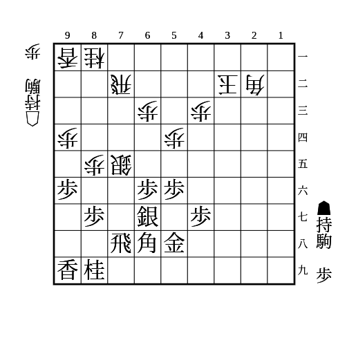
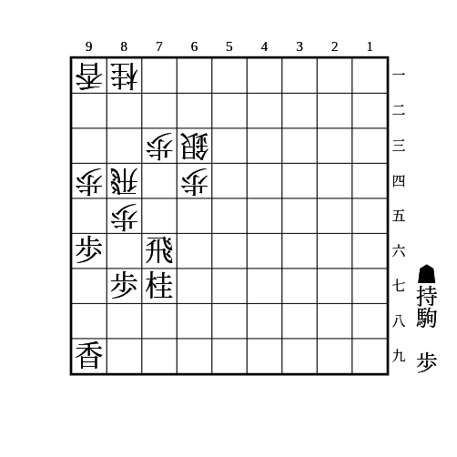
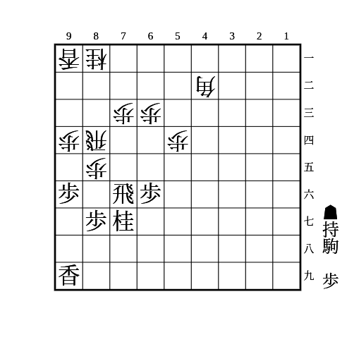
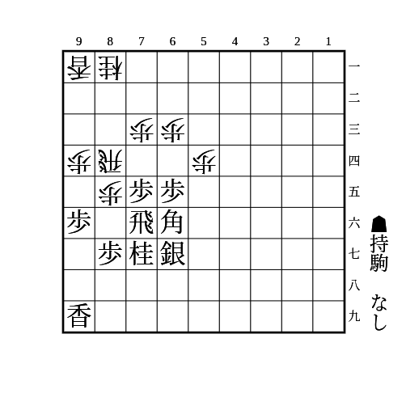
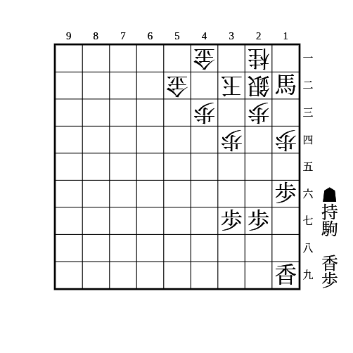
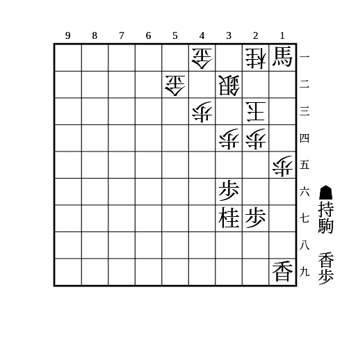

# 振り飛車

## ▲46歩のタイミング

遅くとも相手が△33角としたときに突けば対穴熊でも間に合う。  
早すぎると対急戦で無駄になる。  
玉が囲えていれば△33角としていなくても突いて良い。

## ▲78銀か▲67銀か

どちらも一長一短あるが、▲78銀のほうが無難なことが多い。  
対急戦でも自ら角交換しにいけて、対持久戦でもあとから▲67銀としたり、相手玉が角のラインにいれば▲25歩△同歩▲同桂〜▲65歩などがあったりして困らない。

## 藤井システムから対急戦

居玉で▲67銀▲46歩▲36歩の形を作っていて▲58金左と上がっていないときに△74歩で急戦を見せてきたら▲47銀の手がある。  
7筋を攻めてきたら▲38飛があり、△72飛に▲35歩△同歩▲同飛〜▲85飛を見せる。受けてきたら▲78飛と戻して良い。  
持久戦に戻してきたら▲37桂▲48飛▲46銀の形を作りにいく。

▲58金左と上がっていたら▲48玉で囲う。

角のラインに相手玉が入っていたらそのまま藤井システムの攻めを継続して良い。

## 四間飛車対ミレニアム

46歩56銀から玉を囲い、ミレニアム側の7筋の状況によって分岐する。

- 73歩型
    - ダイヤモンド美濃を作って56歩を突き、36銀から45歩で角を追って65歩から55歩で歩を交換する
    - その後54歩と打たれても64歩55歩63歩成で5筋にもと金を作ったりして良い
- 74歩型
    - 45歩53角を入れてから65銀と出て74か54の歩を取る
        - 75歩同歩同角としてきたら88飛としておいて、相手の銀が浮いたタイミングで78飛と寄り、88角から54銀や、銀が動いて飛車が成り込めるようになったら59角などがある
            - 銀が浮いたタイミングで寄れば86歩と来ても同歩同角88飛で飛車角交換になったら銀にあたり、85歩なら76銀から8筋の逆襲がある
    - 銀を繰り替えるために引いたタイミングで突いてきたら56歩〜67金〜88飛〜65歩で角交換を挑む
        - 角交換後は互角だが71角の筋があって居飛車が気を使う
        - 桂を跳ねたら68角から45歩で角を追って78飛で桂頭を狙う筋や46銀〜55歩を狙う筋がある
- 73桂型
    - 56歩〜36歩〜37桂から45歩53角55歩同歩65歩で次に55角〜64歩がある

## 対急戦

(1)

    
解答

    
▲65歩

    
△同桂なら▲22角成△同玉▲66角

    
△同銀なら▲22角成△同玉▲65飛△同桂▲66角

    
△77角成▲同桂も銀取りと▲66角が残る

---

(2)

    
解答

    
▲78飛

    
△76歩▲同銀△72飛なら(3)

---

(3)

    
解答

    
▲65歩△77角成▲同飛

    
続けて△53銀や△22角などで互角

    
▲65歩に△76飛は▲22角成△同玉▲76飛で抜ける

    
▲67金は△75歩▲85銀△93桂がある

---

(4)

    
解答

    
▲46角

    
△64歩なら▲同角で良い △同銀とすると飛車が抜ける

## 石田流

(1)

    
解答

    
▲86歩△同歩▲85歩△82飛▲86飛

---

(2)

    
解答

    
▲72歩△53角▲65桂△62角▲71歩成△同角▲73桂成

    
角が利いているので(1)の筋は使えない

---

(3)

    
解答

    
▲74歩

    
△同歩なら▲65歩△82飛▲74飛△73歩▲76飛

    
△同飛なら▲同飛で交換できて、先に▲65歩から▲74歩とするより相手の角道が通っておらず、桂が跳ねる余地もある分だけ得

---

(4)

    
解答

    
▲86歩△同歩▲74歩△同飛▲86飛

    
△84歩なら▲75歩で飛車が詰む

    
桂に紐がついていて▲86飛と回れるのがポイント

## その他

(1)

    
解答

    
▲15歩

    
△同歩なら▲同香で、△13歩なら▲19香、△33玉なら▲22飛成△同金▲12香成、放置なら▲14歩

    
△33玉なら▲22飛成△同金▲14歩△12歩▲13香

---

(2)

    
解答

    
▲15歩△同歩▲14歩△31金▲26香

    
次に▲13歩成△同桂▲15香△11歩▲13馬△同銀▲同香成がある

    
△15同歩とせずに△31金とする手もあり、▲14歩には△11歩▲21馬△同金▲13歩成△33銀のように進む ▲14歩と取ると角を渡す流れになるので、タイミングを見て取る

    
銀を持っている場合、▲26香〜▲11銀がある △同銀なら▲23香成〜▲11馬 △31金打なら▲15歩から似た流れになり、△11歩がなくなっている分だけ得で、1筋の香車も参加できる △31金を打たずに寄るのは▲22銀成△同金▲41銀があり、△同玉は▲22馬、△31玉は▲23香成、△33玉は▲23香成△同金▲21馬がある

---

(3)

    
解答

    
▲13歩

    
△同玉なら▲18香打△23玉▲15香△13歩▲同香成△同桂▲14歩△12歩▲13歩成△同歩▲15桂△14玉▲22馬が詰めろ

    
△同桂なら▲15香△14歩▲同香△同玉▲22馬で、次に▲15歩や▲19香がある

