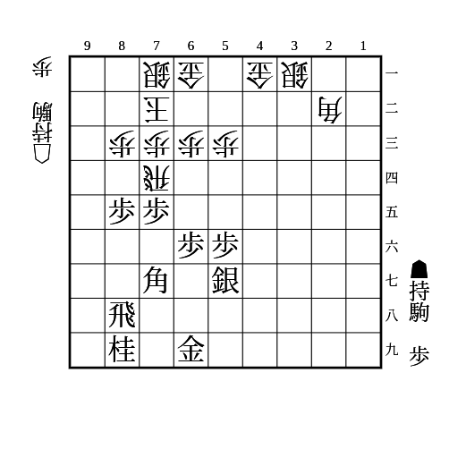
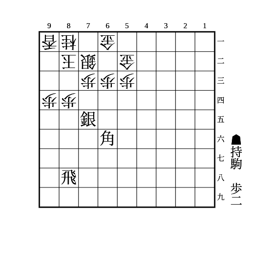

# 相振り飛車

## 理想形

相手がどの陣形でもここからの端攻めで崩せる。  
銀は角頭や玉頭を守る役割。

主な手順は以下。

- 基本は▲74歩△同歩▲95歩△同歩▲93歩
    - △同香なら▲85桂
    - △同桂なら▲95香
        - 桂を取って右辺で使う
    - △同銀なら▲同角成
        - △同桂なら▲95香で上と似た展開
        - △同香なら▲92銀△84角▲85桂△94香▲81銀不成△同玉▲93桂成△同角▲83飛成
            - 以降は▲94竜〜▲95香で角を取ったら▲61角などがある
    - 相手が浮き飛車の横利きで受けようとしている場合は▲74歩△同飛から矢倉に組み替えて飛車を圧迫しにいく
        - もしくは▲64歩△同飛▲65銀△34飛▲74歩△同歩で止める方法もある
- 歩を手に入れたら▲73歩と▲85桂を組み合わせる手がある
- 展開によっては▲55角と覗く筋がある
    - 相手が美濃の場合、73の地点で受けたら▲85桂がある
- △94香のとき、対金無双なら▲76飛から十字飛車を狙う筋がある
- 相手が△71玉型の美濃の場合、▲92歩△同香としてから▲85桂で▲93歩と▲73歩△同桂▲同桂成△同銀▲83飛成△72金▲92竜の筋がある

1歩では右辺と絡める必要があるが、2歩あれば部分定跡で突破できる。

△44銀〜△54歩〜△55銀と角を目標にされる展開に注意する。  
その場合は角を77に置いたまま桂を97に跳ねる手がある。

## 角交換の有利不利

三間飛車かつ浮き飛車の相手には角を打ち込む隙があるので積極的に交換を挑んで良い。

## 玉側の端歩

玉側の端歩は金無双以外は突かないほうが良い。  
金無双以外は端が弱く、相手の攻めが加速するため。  
相手に突かせている間に攻めの準備をする。

## その他

(1)

    
解答

    
▲75歩

    
△同飛なら▲86角〜▲53角成

---

(2) 後手番

(1)で8筋の歩が伸びているとき

    
解答

    
△75飛

    
▲86角なら△85飛

---

(3)

    
解答

    
▲83歩△同銀▲84銀△同銀▲83歩△同玉▲84飛

---

(4)

    
解答

    
▲56銀

    
すぐ飛車を振ると△45桂▲42玉△55角から潰れる

