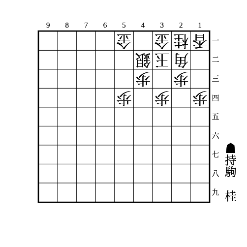
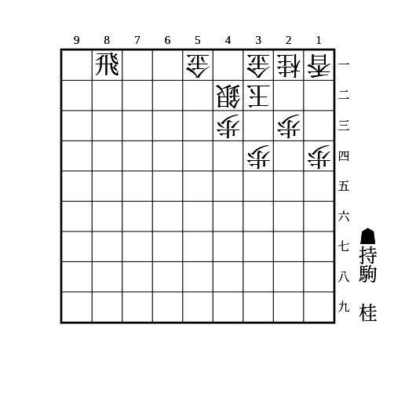
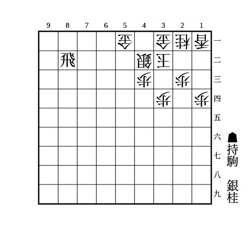

# エルモ囲い

(1)

（相手の持ち駒に桂なし）

    
解答

    
▲15歩△同歩▲12歩△同香▲13歩

    
△同香なら▲14歩△同香▲12飛 相手が桂を持っていると△22桂で受かるので注意

    
△同桂なら▲14歩

    
▲12歩の代わりに▲13歩は、△22金▲15香△14歩▲同香△13桂の受けがあるので注意

---

(2)

    
解答

    
▲26桂〜▲34桂

    
角が22にいなくても厳しい

    
▲35歩△同歩▲34桂を狙う順もあるが、35の歩を拠点に反撃されやすいので、控えて打てるときは控えて打ったほうが良い

---

(3)

    
解答

    
▲54桂

---

(4)

    
解答

    
▲25銀〜▲34銀〜▲35桂

    
23と43を同時に受けにくい ▲34銀自体も受けにくい

    
飛車は1段目でも良い

    
銀は持ち駒からでなくても67〜56〜45〜34を狙う方法もある 31に金があることで△31桂と受けられないのを突いた攻め

---

(5)

    
解答

    
▲54歩〜▲53歩成

    
相手が5筋に歩を打てるときは△52歩で受かる

    
6筋に駒を打って飛車の利きを止めてきたり、53に利く駒を増やしてきたりした場合はこちらも53に利く駒を増やしていけば良い

    

        飛車は1段目でも良いが、2段目のときは▲53歩でも良い 
        こちらは相手が5筋に歩を打てる場合でも使える
    

