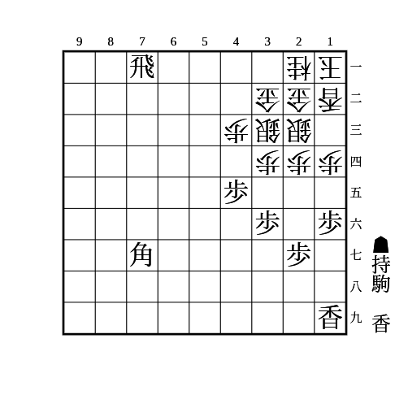

# ビッグ4

(1)

    
解答

    
▲35歩△同歩▲15歩△同歩▲18香打

    
37に桂がいるなどで3筋を逆襲されるときは単に▲18香打や、▲15歩△同歩▲18香打としてから▲35歩とする順もある

    
この後は▲15香△同香▲同香として分岐する

    <ul>
        <li>
            △14歩なら▲同香△同銀▲34歩△同銀▲33歩△同金直▲同角成△同金▲13金△12香▲22香△32角▲21香成△同角▲14金△同香▲13桂
            <ul>
                <li>▲33歩に避けるのは▲31飛成〜▲32歩成を狙えば良い</li>
            </ul>
        </li>
        <li>
            △13歩なら▲同香成△同金▲14歩△同金▲34歩△同銀左▲33角成△同金▲42銀
            <ul>
                <li>△32金なら▲31銀成</li>
                <li>△23金なら▲33香</li>
                <li>△22角なら▲33銀成△同角▲32香〜▲31香成</li>
                <li>▲14歩に△同銀は▲34歩△22銀▲33香△42金▲31香成や単に▲33角成△同金▲42銀がある</li>
            </ul>
        </li>
    </ul>

