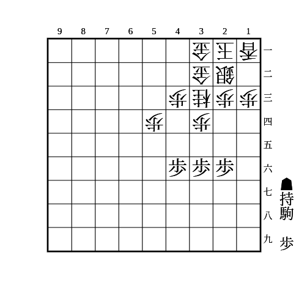
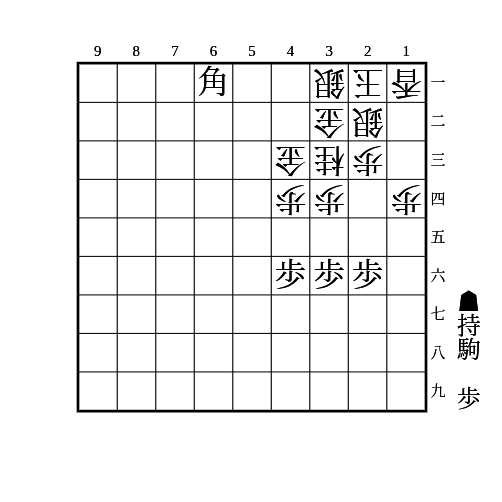
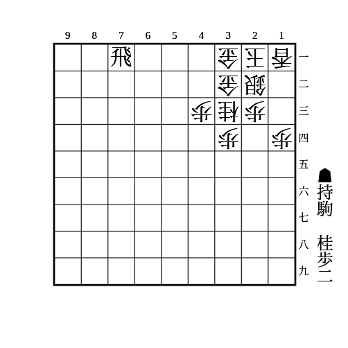
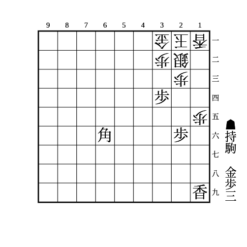

# ミレニアム

(1)

    
解答

    
▲35歩

    
△同歩でも放置でも▲34歩

    
桂頭が守られていないミレニアムに有効

---

(2)

    
解答

    
▲55歩

    <ul>
        <li>
            △同歩なら▲45歩
            <ul>
                <li>△同歩なら▲55銀〜▲44歩</li>
                <li>△同桂なら▲55銀△54歩▲66銀〜▲46歩</li>
                <li>37に桂を跳んでいるとこの順で歩を取られて桂交換にしかならないので、▲45歩ではなく▲55銀△54歩▲66銀と歩交換に留めるほうが良い</li>
            </ul>
        </li>
        <li>
            放置なら▲54歩
        <ul>
            <li>△同銀や△同金なら▲55歩</li>
            <li>△62銀なら▲64歩〜▲55銀</li>
        </ul>
        </li>
    </ul>
    
53銀43金33桂型のミレニアムに有効

---

(3)

    
解答

    
▲35歩

    
△同歩でも放置でも▲34歩

    
34に利いていれば61角でなくても良い

---

(4)

    
解答

    
▲42歩

    <ul>
        <li>
            △同金寄なら▲54桂
            <ul>
                <li>
                    △32金寄なら▲42歩
                    <ul>
                        <li>と金を作りにいくのが受からない</li>
                    </ul>
                </li>
                <li>
                    △52金も▲42歩
                    <ul>
                        <li>
                            △51歩なら53に安い駒を打ち込んで金を吊り上げてから▲51飛成か、▲62桂成
                            <ul>
                                <li>▲62桂成に△同金なら▲51飛成で62の金に当てながら▲41歩成を狙う</li>
                                <li>▲62桂成に△42金寄なら▲51飛成△32金寄▲52成桂〜▲41成桂</li>
                            </ul>
                        </li>
                    </ul>
                </li>
                <li>△53金なら▲42桂成</li>
            </ul>
        </li>
        <li>放置なら▲41歩成</li>
    </ul>
    
52や53に垂らすより1手早く、42に桂の利きも残せる

    
31金32金型のミレニアムに有効

---

(5)

    
解答

    
▲13歩

    
△同香なら▲14歩△同香▲13歩が▲12金の詰めろで、△同銀も▲11金で詰む

    
△13銀なら▲12歩で△同香は▲11金、△同玉は▲15香△14歩▲同香△同銀▲13歩△同玉▲11角成 次に▲15歩△同銀▲14歩△同玉▲25金△13玉▲14香の詰めろ

