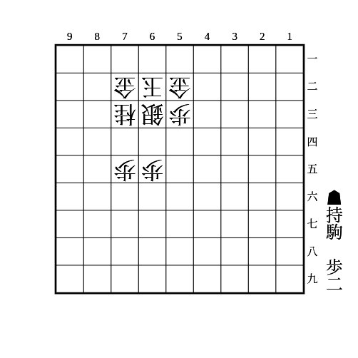
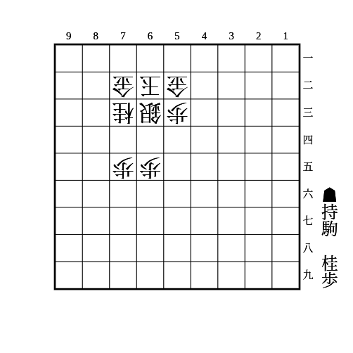
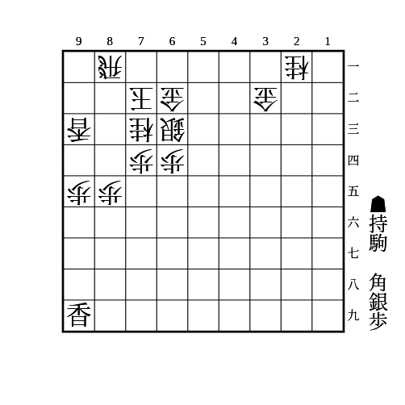

# 右玉

(1)

    
解答

    
▲64歩

    <ul>
        <li>△同銀なら▲74歩</li>
        <li>△74銀や△54銀なら拠点が残る</li>
    </ul>
    
銀が63にいて53にいない型に有効

---

(2)

    
解答

    
▲74歩

    <ul>
        <li>△同銀なら▲64桂</li>
    </ul>
    
銀が63にいて53にいない型に有効

---

(3)

    
解答

    
▲92銀

    
飛車が横に逃げたら▲94歩△同香▲83角

    
△84飛は▲94歩で、△同香なら▲93角、△同飛なら▲83角〜▲94角成

    
△82飛は▲83角で、△同飛なら▲同銀成△同玉▲81飛△72玉▲21飛成など、△71玉なら▲94歩△同香▲同角成△92飛▲83馬など

    
右玉は玉が固くないのと1段目の飛車打ちに弱いので、少し駒損しても飛車が取れれば回復できる上に寄せやすくなる

