# 矢倉

(1)

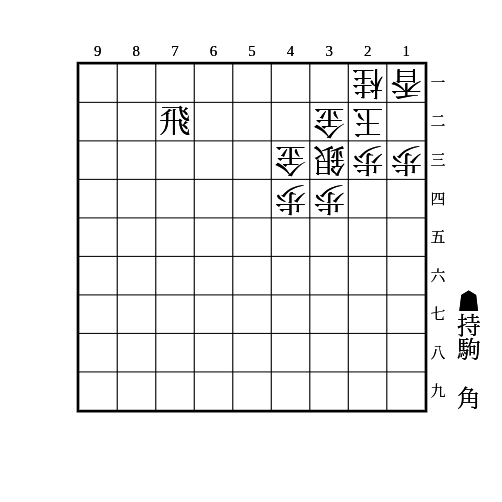

    
解答

    
▲61角

    
金が避けたら43に駒を打ち込んでいく

    
43の金を攻める手であれば他の手でも良い

---

(2)

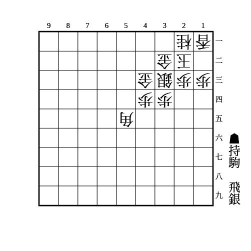

    
解答

    
▲31銀

    
△同玉なら▲51飛

    
△同金や△12玉なら▲52飛

    
十字飛車のラインであれば55角以外の駒でも同様

---

(3)

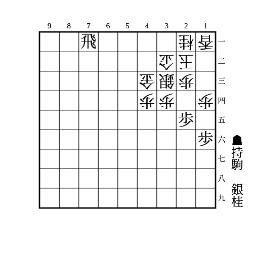

    
解答

    
▲24桂

    <ul>
        <li>
            △同歩なら▲同歩
            <ul>
                <li>
                    △同銀なら▲23歩
                    <ul>
                        <li>△同玉や△13玉や△33玉なら▲21飛成</li>
                        <li>△同金なら▲41飛成で次の▲43竜や▲32銀や▲31銀が受けにくい</li>
                        <li>△12玉なら▲22銀</li>
                    </ul>
                </li>
                <li>
                    △23歩なら▲同歩成
                    <ul>
                        <li>△同玉なら▲21飛成</li>
                        <li>△同金なら▲41飛成で次の▲43竜や▲32銀や▲31銀が受けにくい</li>
                    </ul>
                </li>
                <li>放置なら▲23銀△同金▲同歩成△同玉▲21飛成</li>
            </ul>
        </li>
        <li>△42金寄は▲31銀△13玉▲42銀成△同金▲21飛成</li>
        <li>△31金は▲同飛成△同玉▲32金の詰みがある</li>
    </ul>

---

(4)

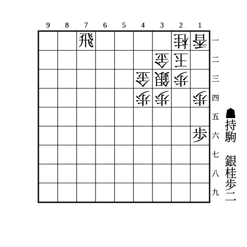

    
解答

    
▲25桂

    <ul>
        <li>
            △24銀なら▲33歩
            <ul>
                <li>△31金なら▲同飛成△同玉▲32金で詰み</li>
                <li>△42金寄なら▲31銀△12玉▲42銀成△同金▲31飛成</li>
                <li>△同桂なら▲同桂成△同銀▲25桂から同様</li>
            </ul>
        </li>
        <li>
            △42銀なら▲33歩
            <ul>
                <li>△31金なら▲52銀△53金▲41銀成</li>
                <li>△同桂なら▲同桂成△同銀▲25桂から同様</li>
            </ul>
        </li>
    </ul>

---

(5)

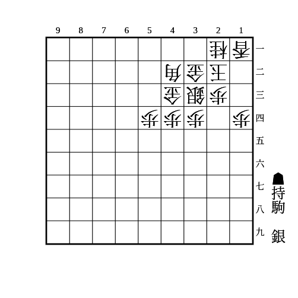

    
解答

    
▲52銀

    
金が寄って逃げたら▲41銀成で角が詰む

---

(6)

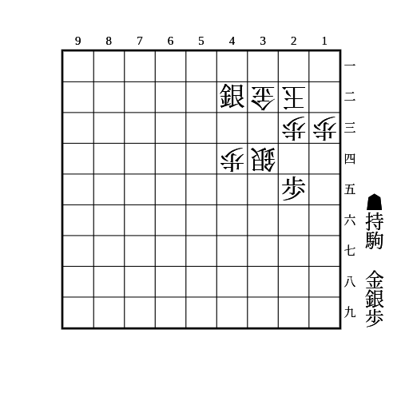

    
解答

    
▲31銀△11玉▲33歩

    
2手目△同金は▲33金△11玉▲31銀不成

---

(7)

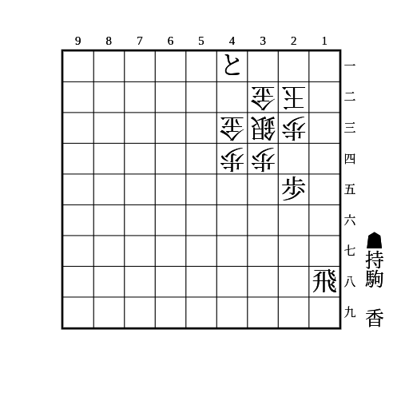

    
解答

    
▲19香

    
△42銀と△24銀以外は詰む △24銀は▲同歩で詰めろ継続

---

(8)

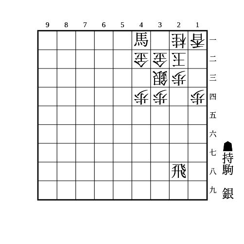

    
解答

    
▲31銀△12玉▲42銀成△22金▲32成銀

    
▲23飛成があるため銀が取れない

---

(9)

(7)の派生

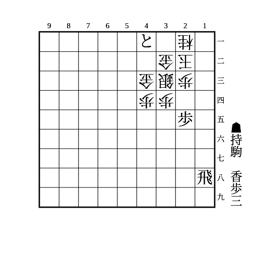

    
解答

    
▲13歩△11歩▲19香

    
2手目△同桂は▲12歩△同玉▲14歩△22銀▲19香

    
初手▲14歩は△12歩▲19香△11香で受かるので注意

---

(10)

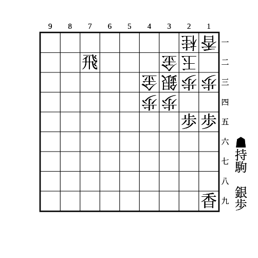

    
解答

    
▲14歩△同歩▲12歩△同香▲11銀△同玉▲32飛成

    
▲11銀に△31玉は▲71飛成から左右挟撃できる

    
相手が金を持っている場合、△42金▲31竜△41金打で竜が詰むので注意

    
歩がもう1枚あれば▲11銀の前に▲13歩△同香としておくとより厳しい ▲13歩に△同桂は▲71飛成が▲11銀の詰めろ

---

(11)

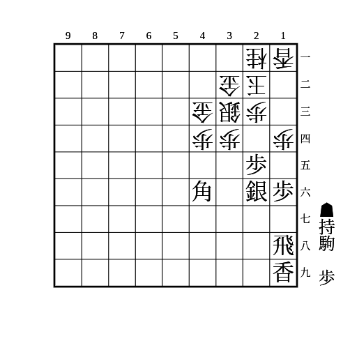

    
解答

    
▲15歩△同歩▲13歩△同香▲15銀△同香▲同飛△13歩▲12歩

    
△同玉なら▲13角成△同桂▲同飛成△21玉▲11竜で詰み

    
△14銀なら▲13角成△同桂▲14飛

    
放置なら▲11歩成△同玉▲13角成

---

(12)

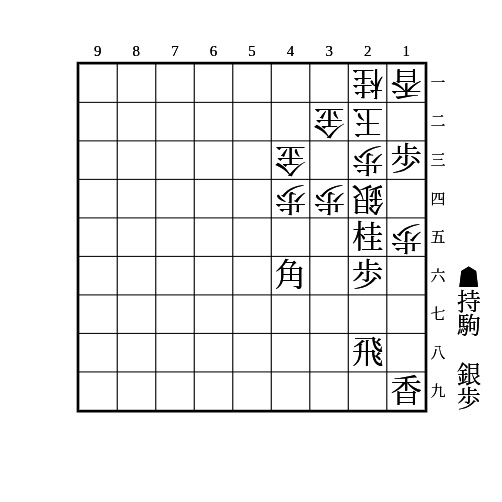

    
解答

    
▲12銀

    
13を桂や銀で取ってくるのは▲11銀不成△同玉▲13桂成

    
△同香なら▲同歩成△同玉▲17香打△14銀▲15香△同銀右▲同香△同銀▲33歩 △同桂は▲13角成から詰み △22金は▲31銀 △42金は32銀で43の金が避けたら▲21銀不成〜▲13角成がある

---

(13)

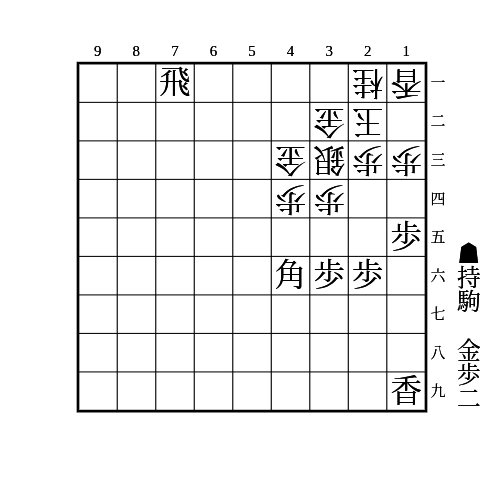

    
解答

    
▲14歩△同歩▲12歩△同香▲13歩△同香▲同角成△同玉▲21飛成

    
次に▲12金△24玉▲25香の詰み筋と▲14香△同玉▲25金△13玉▲14香の詰み筋がある

    
▲14歩△同歩▲13歩は△24銀と受ける筋があるので注意

    
受ける側はこの局面になる前に△35歩▲同角△34銀とすれば33の小部屋ができて底歩も打てるようになる

    
歩が少ない場合は▲14歩△同歩▲同香といきなり捨ててから▲13角成とする手や、持ち駒に銀があるときは角がなくても13に打ち込む手など、派生がある

---

(14)

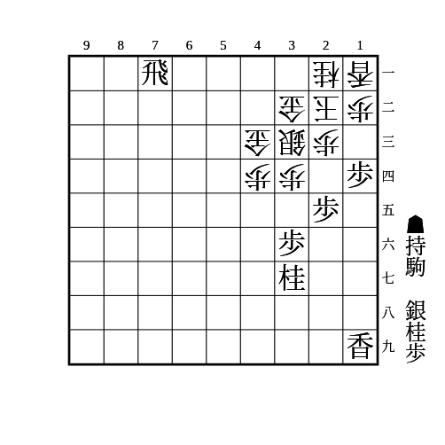

    
解答

    
▲13桂

    
△同桂なら▲同歩成△同歩▲12歩△同玉▲13香成△同玉▲11飛成

    
△同歩なら▲同歩成△同香▲同香成 △同桂は▲14歩 △同玉は▲21飛成で32の金取りと▲14歩△同玉▲16香△15歩▲26桂△13玉▲15香の詰みがある

    
△31金なら▲21桂成から▲55桂など左から攻めて良い

    
受ける側はこの局面になる前に△51歩▲同飛成△42銀▲61竜△51歩と底歩を打つと粘れる

