# 穴熊

(1)

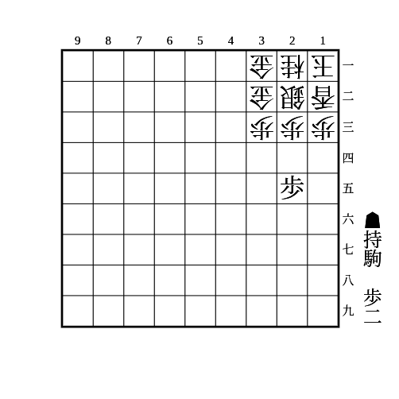

    
解答

    
▲24歩

    
△同歩なら▲25歩で、取っても放置でも▲24歩で次に23に駒を打ち込んでいく

    
放置なら▲23歩成で陣形が乱れる

---

(2)

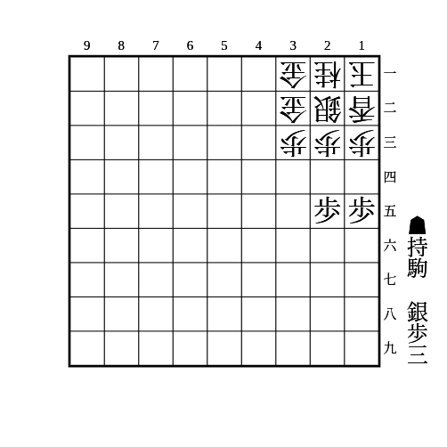

    
解答

    
▲24歩

    <ul>
        <li>
            △同歩なら▲35銀
            <ul>
                <li>
                    次に▲23歩
                    <ul>
                        <li>
                            △同銀でも△同金でも▲25歩
                            <ul>
                                <li>取っても放置でも▲24歩で銀か金が死ぬ</li>
                                <li>△34銀なら▲同銀△同歩▲24歩で拠点ができ、△22歩と受けられても端攻めに移行できる</li>
                            </ul>
                        </li>
                        <li>端を突き合っている場合は▲23歩のときに銀が13に避けれるが、22に駒を打ち込めば良い</li>
                    </ul>
                </li>
            </ul>
        </li>
    </ul>

---

(3)

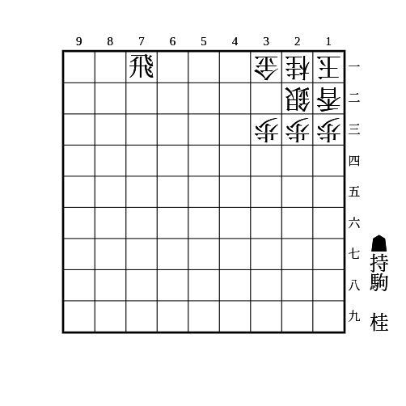

    
解答

    
▲35桂

    
次に▲23桂不成△同銀▲31飛成が厳しい

    
桂の代わりに香があるときは2筋に香を打って同じ狙いができる 居飛車穴熊は34に歩があることが多いので、桂は基本的に振り飛車穴熊相手に打つことが多い

---

(4)

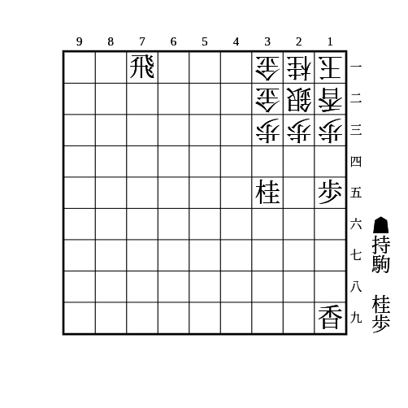

    
解答

    
▲14歩

    
△同歩は▲13歩△同香▲25桂

    
放置は▲13歩成△同香▲同香成

    
端を精算したあとは2筋に香を打ったり▲44桂で金を狙ったりなどがある

    
23に駒が利いていないと△同歩▲13歩に△同銀があるので注意 その場合は△同歩に▲25桂と先に打ってから▲13歩とする

---

(5)

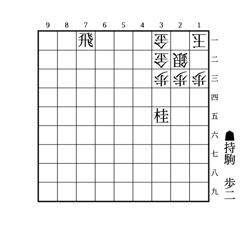

(4)から端を精算した状態

    
解答

    
▲14歩

    <ul>
        <li>
            △同歩なら▲13歩
            <ul>
                <li>▲31飛成〜▲12金の詰めろ</li>
                <li>△同銀なら▲23桂成</li>
            </ul>
        </li>
        <li>放置は▲13歩成△同銀▲23桂成</li>
        <li>
            △12香は▲13歩成△同香▲14歩△同香▲13歩で変わらない
            <ul>
                <li>ただ香が自陣に利いてくるので、(4)でとったはずの香を先に1筋に打っておいたほうが安全ではある</li>
            </ul>
        </li>
        <li>
            △21桂は▲13歩成△同桂▲14歩
            <ul>
                <li>さらに△12歩と受けられても(4)で取ったはずの香を1筋に打てば数で勝てる</li>
            </ul>
        </li>
    </ul>

---

(6)

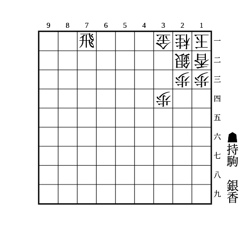

    
解答

    
▲33香

    <ul>
        <li>△同銀なら▲31飛成</li>
        <li>
            △同桂なら▲32銀
            <ul>
                <li>次に▲31飛成△同銀▲21金の詰めろ</li>
            </ul>
        </li>
    </ul>

---

(7)

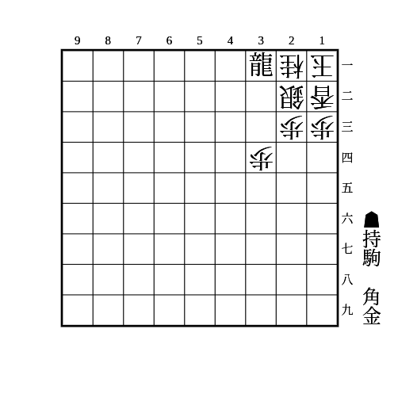

    
解答

    
▲33角

    <ul>
        <li>
            △同銀なら▲32金
            <ul>
                <li>次に▲21竜の詰めろ</li>
                <li>
                    △22金なら▲33金
                    <ul>
                        <li>△同金なら▲22銀</li>
                    </ul>
                </li>
            </ul>
        </li>
    </ul>
    
相手が金や飛を持っていない場合、持ち駒の金は銀や角でも良い

---

(8)

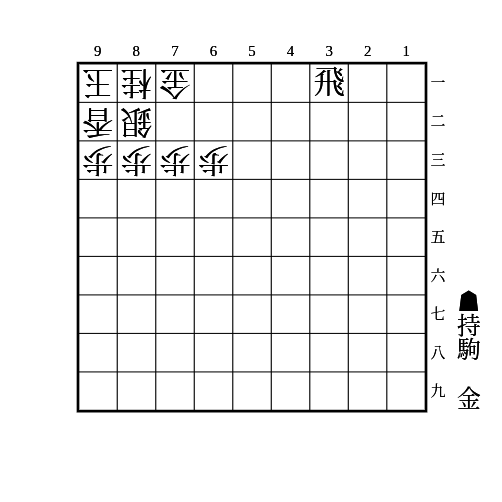

    
解答

    
▲71飛成△同銀▲61金

    
次に▲71金と取ると詰めろになる △82銀としても▲72金で金駒がもう一枚あれば詰めろ

---

(9)

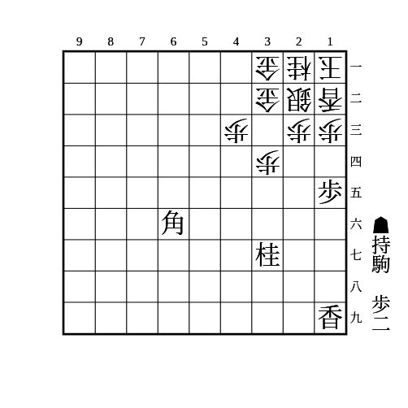

    
解答

    
▲14歩△同歩▲13歩

    
△同桂なら▲14香〜▲25桂△同桂▲13歩

    
△同香なら▲25桂〜▲13桂成△同桂▲18香打

    
単に▲25桂〜▲13桂成や、▲35歩△同歩▲25桂〜▲13桂成も有力 ▲35歩△同歩を入れておくと桂香を交換したあとに▲34香がある

---

(10)

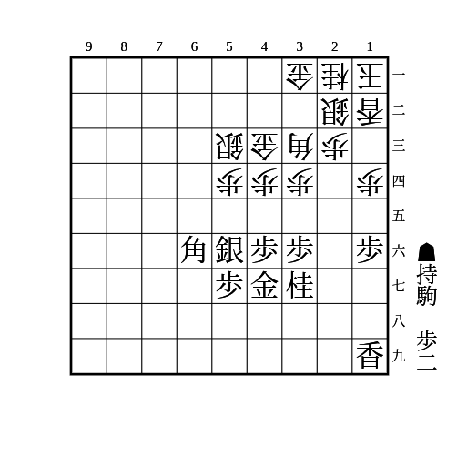

    
解答

    
▲14歩△同歩▲13歩

    <ul>
        <li>△同桂なら▲14歩</li>
        <li>△同銀なら▲25桂</li>
        <li>
            △同香なら▲25桂
            <ul>
                <li>
                    △24角なら▲13桂成
                    <ul>
                        <li>△同角なら▲15香</li>
                        <li>△同桂なら▲14歩</li>
                        <li>△同銀なら▲25香</li>
                    </ul>
                </li>
                <li>
                    △42角なら▲45歩
                    <ul>
                        <li>△同歩なら▲13桂成△同桂▲14歩</li>
                        <li>△12玉なら▲13桂成△同銀▲44香</li>
                        <li>△14香なら▲44歩△同銀▲45歩△33銀引▲13歩△同桂▲同桂成△同銀▲25桂</li>
                    </ul>
                </li>
            </ul>
        </li>
    </ul>

---

(11)

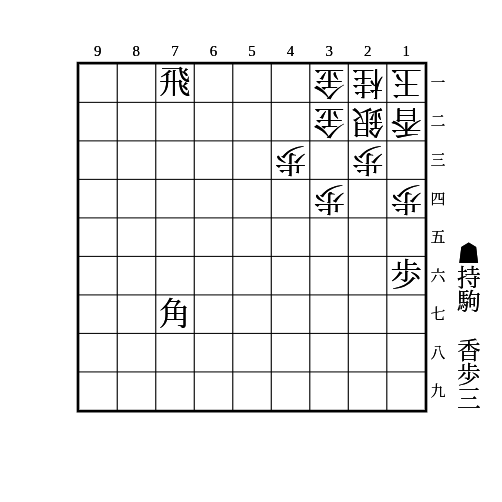

    
解答

    
▲15歩△同歩▲13歩△同香▲14歩△同香▲13歩△同桂▲33香

    
△同銀なら▲同角成△22香▲32馬

    
△同金なら▲同角成△41香▲32金で、△同金なら▲41飛成△31金▲32馬、△33銀は▲31金〜▲41飛成

---

(12)

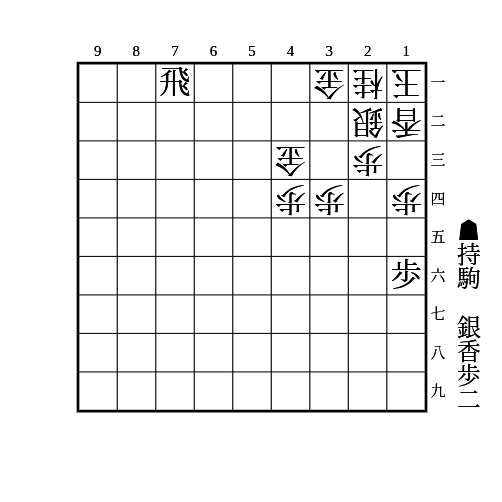

    
解答

    
▲15歩△同歩▲13歩△同香▲14歩△同香▲13香△同桂▲32銀△41香▲31銀成△同銀▲41飛成△22銀▲32香

    
余裕があるときは▲14歩△同香に▲25銀〜▲14銀〜▲26香や▲13香でも良い

---

(13)

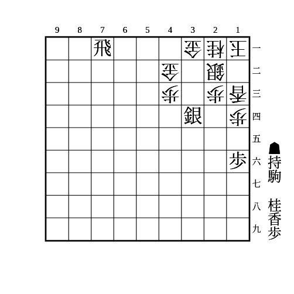

    
解答

    
▲12歩△同玉▲31飛成

    
△同銀は▲24桂から詰み

    
詰みを受けたら▲42竜

---

(14)

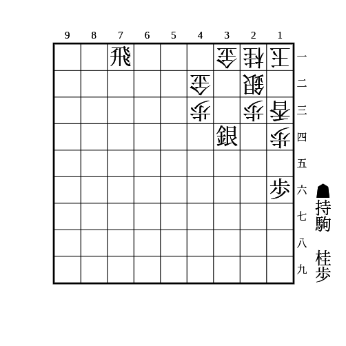

（相手の持ち駒は金1枚）

    
解答

    
▲31飛成△同銀▲23銀成

    
△22金は▲12歩△同金▲24桂△22飛▲12成銀△同飛▲23金

    
相手が金を2枚以上持っているとさらに△22金で受けられる

---

(15)

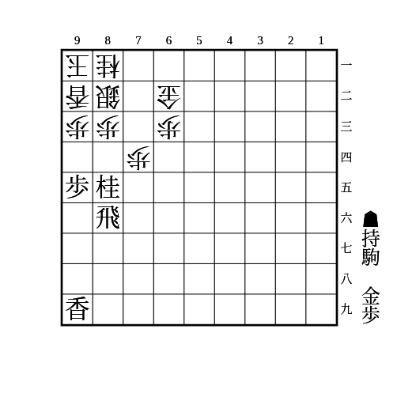

    
解答

    
▲93桂成△同香▲94歩△同香▲同香△93歩▲同香成△同桂▲94歩△92歩▲93歩成△同歩▲85香

    
△73金は▲83香成で、△同金は▲84歩、△同銀は▲85桂や▲95桂△84歩▲83桂成△同金▲85歩△同歩▲84歩△同金▲73銀△83金▲85飛

    
△92玉などは▲95桂で足せば良い

    
▲73歩〜▲72金を狙う攻め方もある ▲73歩に△同桂なら▲93桂成がより厳しい

---

(16)

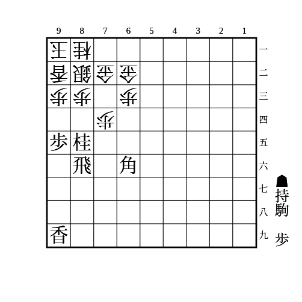

    
解答

    
▲73歩△同桂▲93桂成

    
△同香なら▲94歩

    
△同銀なら▲94歩△82銀▲93歩成△同香▲同角成△同銀▲同香成△92歩▲83飛成△同金▲同成香△82歩▲93銀で必至

    
▲73歩に△71金は▲93桂成で(15)と似た流れになる 角がいるので▲93角成や▲94歩△同歩▲93歩の筋もあり、より厳しい

---

(17)

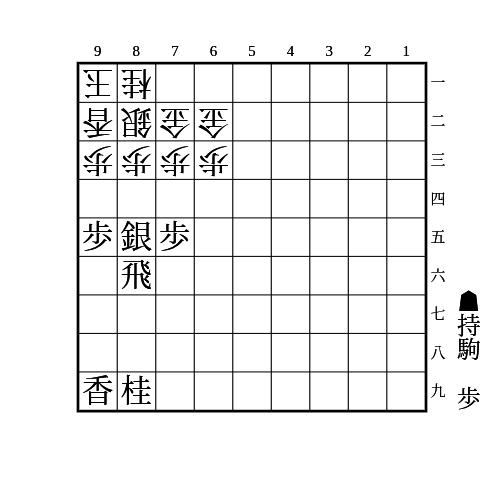

    
解答

    
▲84歩△同歩▲同銀△83歩▲同銀成△同銀▲84歩

    
銀交換後、何もしなければ端が薄くなっているので攻めやすい

    
△82金と寄るのは▲71銀がある

    
△82銀ならこちらだけ銀を手持ちにできる

---

(18)

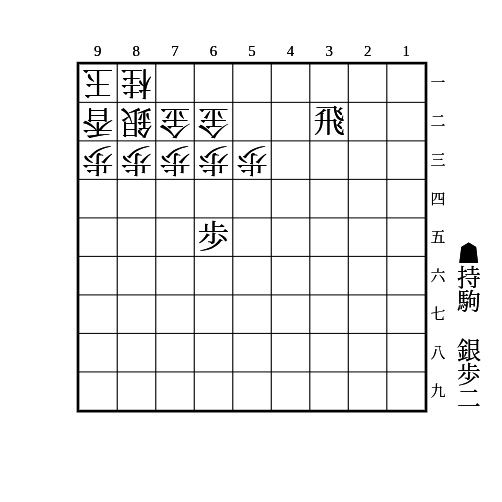

    
解答

    
▲64歩△同歩▲63歩△同金右▲72銀△同金▲同飛成△62銀▲61金

    
相手が金駒を持っている場合は最後に71に打たれるので注意

    
銀ではなく歩を持っている場合（合計3枚）のときは△同金右に▲65歩△同歩▲64歩がある

    
銀ではなく桂を持っている場合は△同金右に▲55桂がある

---

(19)

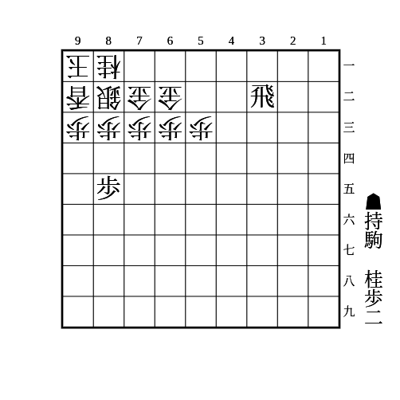

    
解答

    
▲84歩△同歩▲83歩△同銀▲75桂△74銀▲83歩

    
次に▲62飛成がある

