# 美濃

(1)

    
解答

    
▲62香

    <ul>
        <li>△同金なら▲71角</li>
        <li>
            △71金なら▲53角
            <ul>
                <li>
                    次に▲71飛成△同玉▲61香成
                    <ul>
                        <li>△同玉なら頭金</li>
                        <li>△82玉なら▲71角成</li>
                    </ul>
                </li>
                <li>相手が飛車または金を持っている場合、52に打たれて受けられる</li>
            </ul>
        </li>
    </ul>
    
香の代わりに桂を持っている場合は▲53桂でも同様

---

(2)

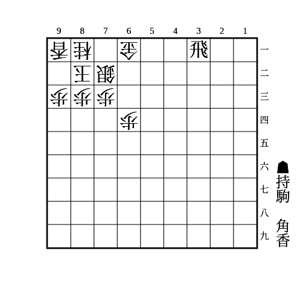

    
解答

    
▲63香

    <ul>
        <li>
            △同銀なら▲61飛成
            <ul>
                <li>それから△72金と受けても▲62金△同金▲71角</li>
            </ul>
        </li>
        <li>△71金なら▲同飛成△同玉▲62金△82玉▲71角△92玉▲72金</li>
        <li>△52金なら▲62香成△同金▲71角</li>
    </ul>

---

(3)

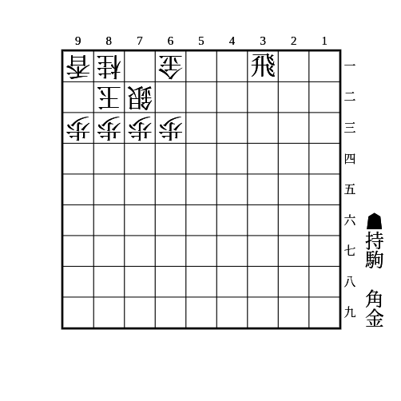

    
解答

    
▲62金

    
△同金なら▲71銀

    
放置なら▲61飛成△同銀▲71銀

---

(4)

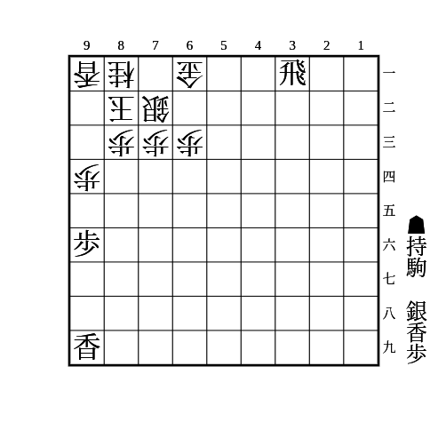

    
解答

    
▲95歩△同歩▲62香△71金▲92歩△同香▲91銀△71飛成

    
歩がないときは▲92歩の代わりに▲95香がある

---

(5)

    
解答

    
▲84歩

    
△同歩なら▲85歩△同歩▲84歩

---

(6)

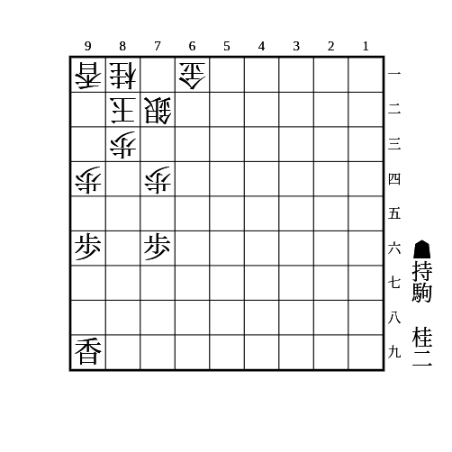

    
解答

    
▲86桂

    
74の歩を銀以上の駒で受けてきたら▲75歩△同歩▲74桂打

    
74の歩を桂や香で受けてきたら▲94桂△同香▲95歩

---

(7)

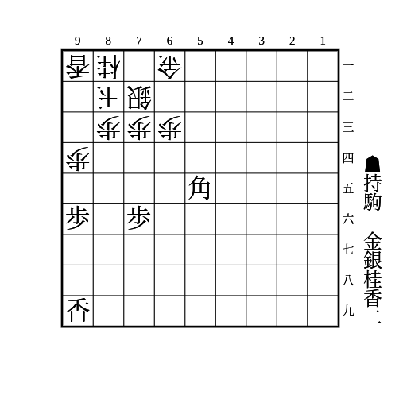

    
解答

    
▲74桂

    
△92玉▲93香△同玉▲82銀△92玉▲93香△同桂▲91銀成△同玉▲82金で詰み

---

(8)

    
解答

    
▲74桂

    <ul>
        <li>
            △92玉なら▲95歩
            <ul>
                <li>
                    次に▲93銀からの詰めろ
                    <ul>
                        <li>
                            △同玉なら▲94歩
                            <ul>
                                <li>△84玉なら▲75金</li>
                                <li>△92玉なら▲82金</li>
                            </ul>
                        </li>
                        <li>△同桂なら▲82金</li>
                    </ul>
                </li>
                <li>△84歩なら▲82金△93玉▲94歩</li>
            </ul>
        </li>
        <li>
            △93玉なら▲82銀
            <ul>
                <li>
                    △92玉なら▲95歩
                    <ul>
                        <li>
                            次に▲91銀成からの詰めろ
                            <ul>
                                <li>△93玉なら▲94歩△84玉▲75金</li>
                                <li>△同玉なら▲82金</li>
                            </ul>
                        </li>
                        <li>94の地点を守るのは▲94歩〜▲94香〜▲91銀成△同玉▲82金</li>
                        <li>△84歩なら▲73銀成で必至</li>
                    </ul>
                </li>
            </ul>
        </li>
    </ul>
    
本美濃で途中△74歩〜△64歩▲同角△63金はその瞬間に寄せられる

    
金の代わりに香の場合、△92玉▲95歩に△84歩で受けられる 逆にそれ以外は寄せられる

    
金がない場合でも桂を打ってから▲62銀〜▲61銀不成で攻めが続く

---

(9)

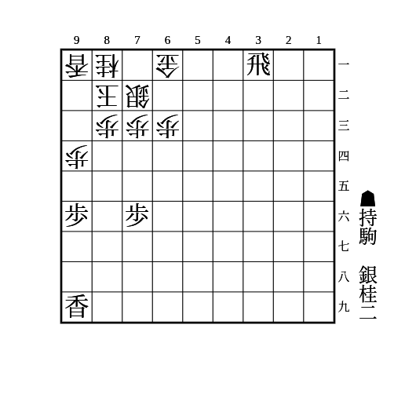

    
解答

    
▲86桂

    <ul>
        <li>
            次に▲74桂打△同歩▲74桂
            <ul>
                <li>
                    △73玉なら▲82銀
                    <ul>
                        <li>△74玉なら質駒の金を取って詰めろをかけるのが厳しい</li>
                    </ul>
                </li>
                <li>
                    玉が端に逃げたら端歩
                    <ul>
                        <li>良きタイミングで質駒の金を取って詰めろをかけるのが厳しい</li>
                    </ul>
                </li>
            </ul>
        </li>
        <li>▲74桂打を防いできても端攻めにつなげられる</li>
    </ul>

---

(10)

    
解答

    
▲71銀

    <ul>
        <li>
            △92玉なら▲95歩
            <ul>
                <li>
                    △同歩なら▲同香△93歩▲82金
                    <ul>
                        <li>金を持っていない場合は▲同香△93歩▲61飛成</li>
                    </ul>
                </li>
                <li>
                    次に▲61飛成で△同銀なら▲82金△93玉▲94歩△84玉▲75金
                    <ul>
                        <li>金を持っていない場合は▲94歩</li>
                        <li>金を持っていなくても角が53もしくは馬なら▲61飛成〜▲82金△93玉▲94歩△84玉▲75角成のような詰みがある</li>
                    </ul>
                </li>
                <li>82を埋めたり94を受けられたりしても▲94歩や▲61飛成がある</li>
            </ul>
        </li>
        <li>
            △93玉も▲95歩
            <ul>
                <li>
                    次に▲94歩
                    <ul>
                        <li>
                            △92玉なら▲82金
                            <ul>
                                <li>金を持っていない場合は▲61飛成を先に入れる</li>
                            </ul>
                        </li>
                        <li>
                            △84玉なら▲75金
                            <ul>
                                <li>金を持っていない場合は▲61飛成を先に入れる</li>
                                <li>金を持っていなくても角が53もしくは馬なら▲75角成のような詰みがある</li>
                            </ul>
                        </li>
                    </ul>
                </li>
                <li>82を埋めたり94を受けられたりしても▲94歩で良い</li>
            </ul>
        </li>
    </ul>

---

(11)

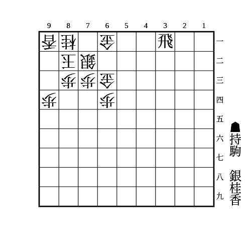

    
解答

    
▲75桂

    <ul>
        <li>△74金なら▲63桂成△同銀▲61飛成</li>
        <li>
            △53金なら▲63香
            <ul>
                <li>△同金や△同銀なら精算して▲61飛成</li>
                <li>△71金なら▲62香成△同金▲71銀</li>
            </ul>
        </li>
        <li>
            △62金引なら▲63香
            <ul>
                <li>△同金や△同銀なら精算して▲61飛成</li>
                <li>放置なら▲62香成△同金▲71銀</li>
            </ul>
        </li>
    </ul>

---

(12)

    
解答

    
▲41角

    <ul>
        <li>
            △53金なら▲63香
            <ul>
                <li>△同金なら▲同角成</li>
                <li>△71金なら▲62香成</li>
            </ul>
        </li>
        <li>
            △62金引なら▲63香
            <ul>
                <li>△同金や△同銀なら▲同角成</li>
            </ul>
        </li>
        <li>放置なら▲63角成</li>
    </ul>

---

(13)

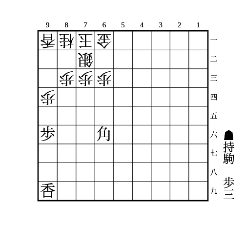

    
解答

    
▲95歩

    <ul>
        <li>
            △同歩なら▲93歩
            <ul>
                <li>△同桂なら▲94歩</li>
                <li>
                    △同香なら▲92歩
                    <ul>
                        <li>
                            △82玉なら▲91歩成△同玉▲93角成△同桂▲94歩
                            <ul>
                                <li>受けられても取った香を足していけば突破できる</li>
                            </ul>
                        </li>
                        <li>放置なら▲91歩成</li>
                    </ul>
                </li>
                <li>放置なら▲95香</li>
            </ul>
        </li>
        <li>放置なら▲94歩</li>
    </ul>

---

(14)

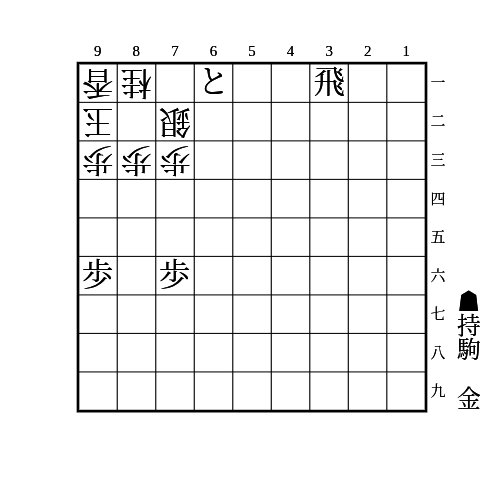

    
解答

    
▲32飛成

    
▲72竜△82合駒▲同竜△同玉▲71銀△92玉▲82金までの詰めろ

    
△82金は▲71とで良い

---

(15)

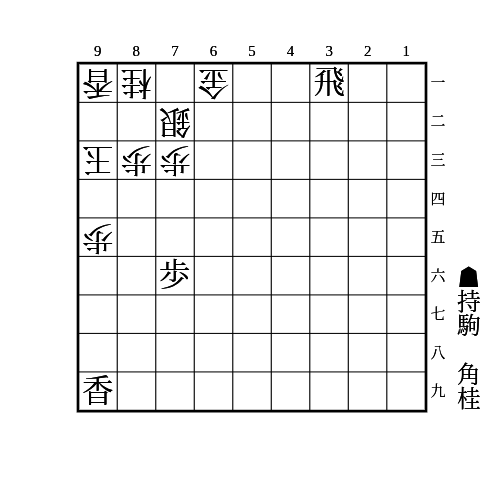

    
解答

    
▲61飛成△同銀▲71角△82合駒▲95香△94歩▲同香△同玉▲82角成

    
桂がなくても玉を中段に出すことはできるが、あったほうが詰みまで見やすい

---

(16)

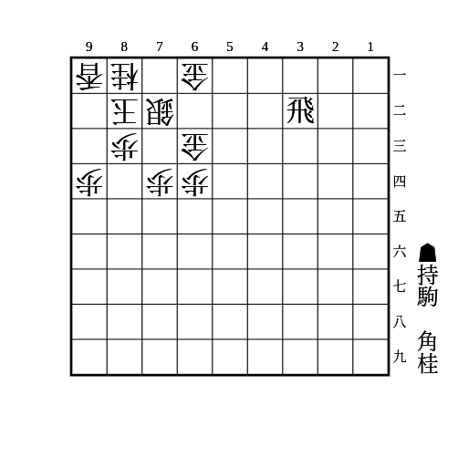

    
解答

    
▲41角〜▲86桂〜▲74桂

---

(17)

    
解答

    
▲94歩△同歩▲93歩

    
△同香は▲85桂〜▲93桂成△同桂▲94香△92歩▲95香△81桂▲98飛で突破できる ▲85桂に△84歩は▲93桂成△同桂▲84飛で良い

    
△同桂は▲94香△92歩▲93香成△同歩で攻めの香と守りの桂を交換できる 石田流の形で7筋の歩が切れている場合は△92歩のときに▲74歩△同歩▲55角の筋もある △73銀なら▲93香成△同歩▲85桂△64銀▲同角△同歩▲74飛 △82玉なら▲93香成△同歩▲73桂 △71玉なら▲91角成

    
4段目に相手の飛車がいると受かるので注意

    
石田流の形からでも同様の手順で良い

---

(18)

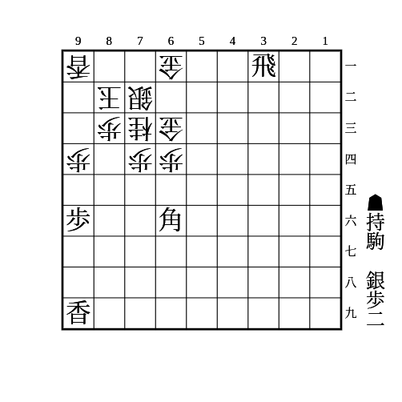

    
解答

    
▲95歩△同歩▲92歩△同香▲93歩△同香▲91銀

    
△同玉なら▲93角成で相手が金や飛で受けなければ▲61飛成からの詰みがある あっても△82金▲95香△92歩▲同馬△同金▲93歩で攻めはつながる

    
△92玉や△81玉なら▲61飛成

    
△71玉なら▲93角成

    
▲95歩△同歩に▲93歩は△84歩で受けられるので注意

---

(19)

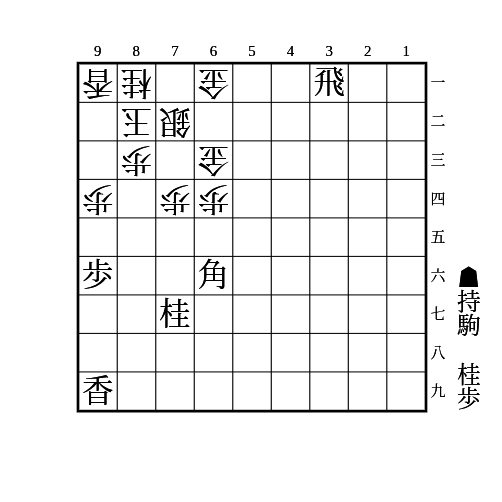

    
解答

    
▲95歩△同歩▲93歩△同香▲85桂△94香▲93桂

    
次に▲81桂成〜▲93角成

    
△同桂なら▲93角成

    
△94香に▲95香△同香▲94桂の攻め筋もある 9筋に逃げたら▲61飛成、71に逃げたら▲93桂成

---

(20)

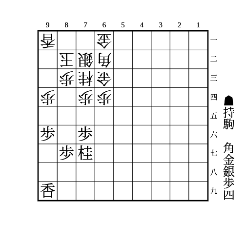

（相手の持ち駒に金と飛なし）

    
解答

    
▲95歩△同歩▲92歩△同香▲93歩△同香▲94歩△同香▲91角△同玉▲93銀

    
金や飛がないと▲92歩〜▲82金が受からない

    
▲92歩に△同玉は▲94歩〜▲93銀がある

    
▲93歩に△同玉は▲91角

    
▲91角に△92玉は▲82銀

    
▲91角に△93玉は▲82銀〜▲86歩

---

(21)

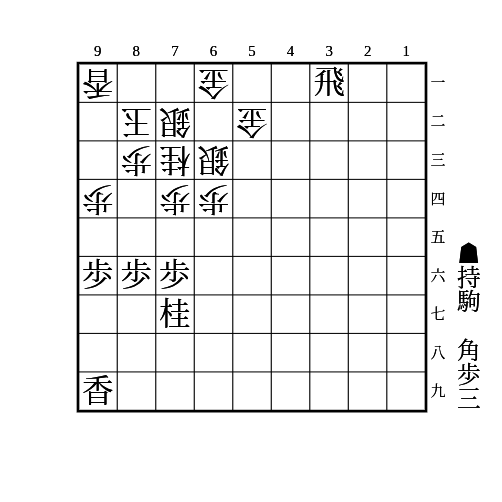

    
解答

    
▲95歩△同歩▲93歩△同香▲94歩△同香▲93歩

    
△同玉なら▲61飛成△同銀▲71角 △84玉は▲82角成が詰めろ 合駒は▲81金や▲95香△同香▲94歩△同玉▲82角成がある

    
△84歩は▲91角△83玉▲92歩成△同玉▲61飛成△同銀▲73角成

    
放置は▲91角で△同玉なら▲61飛成〜▲92金 △71玉は▲92歩成 △93玉は▲61飛成△同銀▲73角成

---

(22)

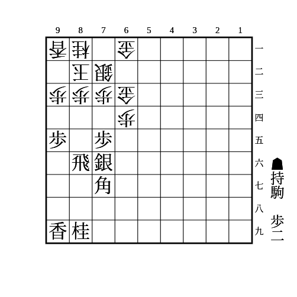

    
解答

    
▲94歩△同歩▲93歩△同香▲97桂〜▲85桂〜▲93桂成△同桂▲94香△92歩▲88香〜▲93香成△同歩▲95桂〜▲83桂成△同銀▲同飛成

    
持ち歩が1枚だけだと▲97桂に△95歩▲85桂△94香で受かる 2歩あれば▲85銀〜▲94歩がある

---

(23)

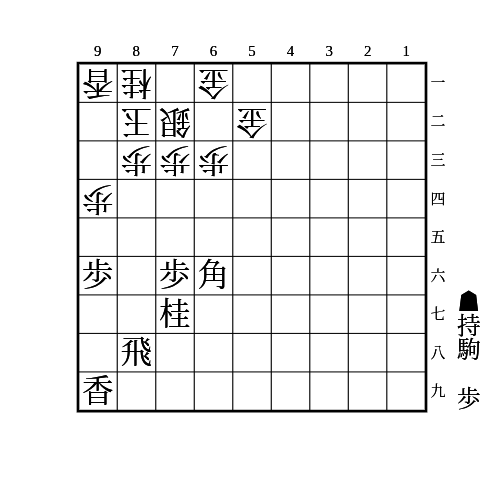

    
解答

    
▲97香〜▲98飛〜▲95歩△同歩▲93歩△同歩▲85桂△94香▲95香

    
4段目に相手の飛車がいると受かるので注意

---

(24)

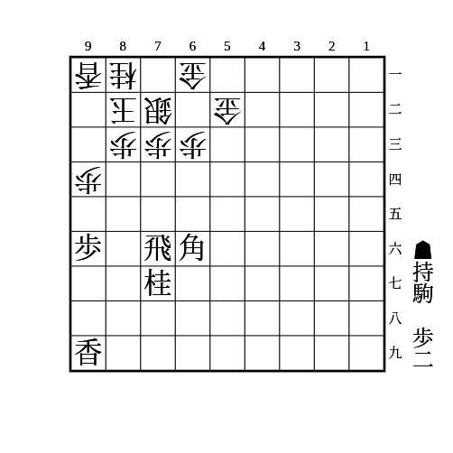

    
解答

    
▲95歩△同歩▲93歩

    
△同桂なら▲94歩

    
△同香なら▲85桂 放置したら▲93桂成△同桂▲94歩で、△84桂は▲93歩成△同玉▲75飛が▲95飛△82玉▲91飛成の詰めろな上に受けにくい △94香なら▲74歩△同歩▲55角で、△73銀なら▲同桂成△同桂▲74飛、それ以外なら▲74飛で73の地点と▲94飛が同時に受からない

---

(25)

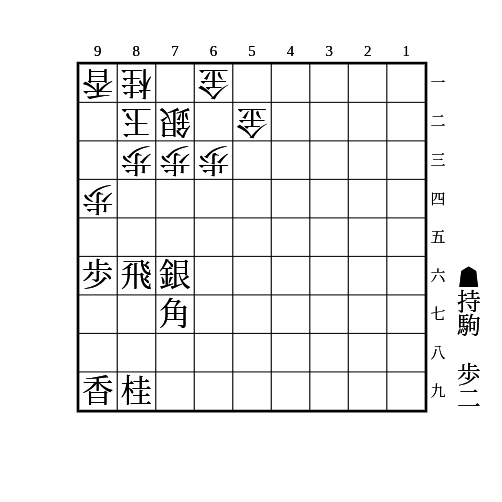

    
解答

    
▲95歩△同歩▲93歩

    
△同桂なら▲94歩

    
△同香なら▲94歩△同香▲85銀 △93玉としてきたら▲94銀△同玉▲95香△同玉▲96香で詰み

    
△同玉なら▲95香△94歩▲同香△同玉▲96飛△84玉▲91飛成

---

(26)

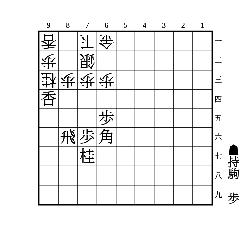

    
解答

    
▲75歩〜▲74歩△同歩▲73歩△同銀▲83飛成

    
▲75歩に△62金は▲74歩△同歩▲55角△81玉▲73歩

---

(27)

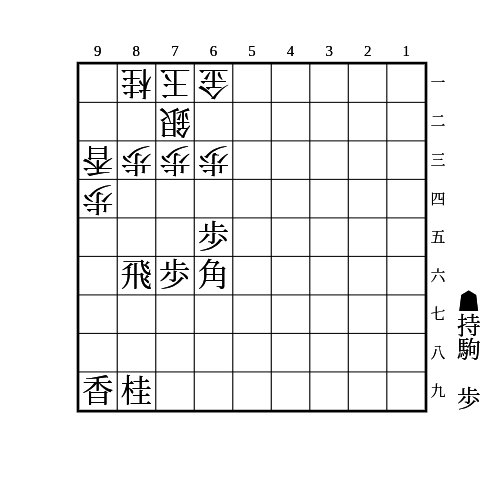

    
解答

    
▲92歩△82玉▲77桂△92玉▲85桂△82玉▲93桂成△同桂▲94香△92歩▲96飛△81桂▲95香

    
玉を危険地帯に誘いつつ手数を稼ぐ手筋

---

(28)

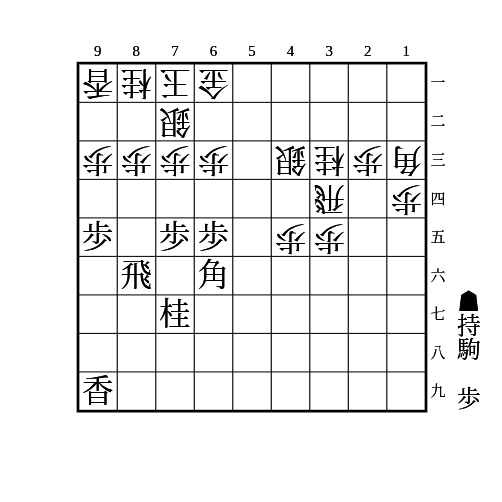

    
解答

    
▲74歩△同歩▲94歩△同歩▲73歩△同桂▲94香△同香▲93角成

    
▲74歩に△同飛は▲33角成

    
▲73歩に△同銀は▲83飛成

---

(29)

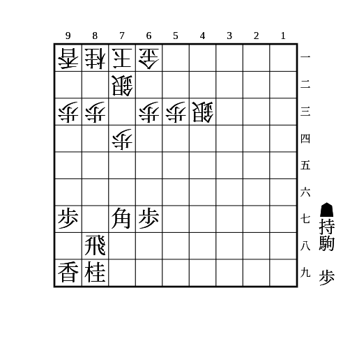

    
解答

    
▲55角△73桂▲84歩△同歩▲同飛△83歩▲74飛△62金▲76飛〜▲74歩

    
▲同飛に△54歩などで角を追うのは▲83歩で角を取ってくるのは▲82歩成で良く、△81歩と受けてくるのは角を逃げて8筋に大きい利かしができる

---

(30)

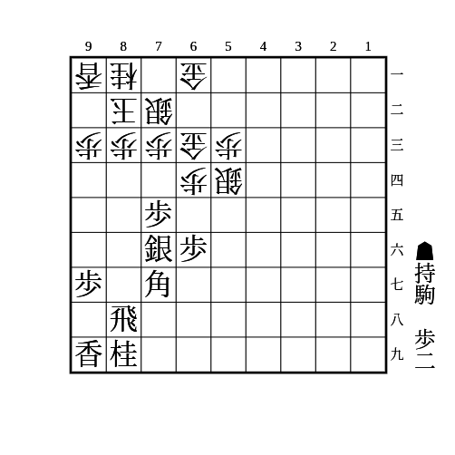

    
解答

    
▲65歩△同歩▲64歩

    
△同金なら▲84歩で△同歩なら▲同飛で十字飛車、それ以外は▲83歩成△同銀▲84歩△72銀で拠点ができる

    
△62金引なら拠点ができる

---

(31)

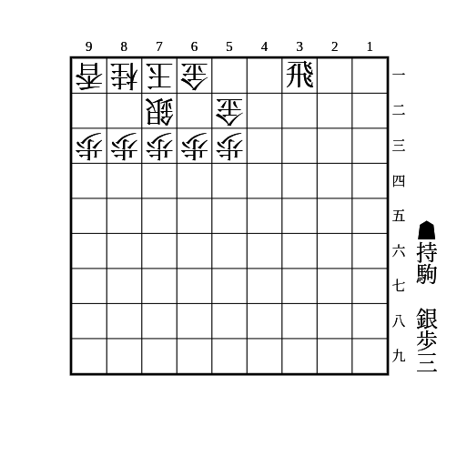

    
解答

    
▲84歩

    
放置なら▲83歩成△同銀▲82歩

    
△同歩なら▲83歩 △同銀なら▲82歩（歩が2枚のときは▲82銀） 放置なら▲82銀〜▲91銀不成など

    
受けるなら△62金寄や△82玉などだが、形を乱せる 飛車を打つ前に▲84歩△同歩を入れておくほうが取ってもらいやすい

---

(32)

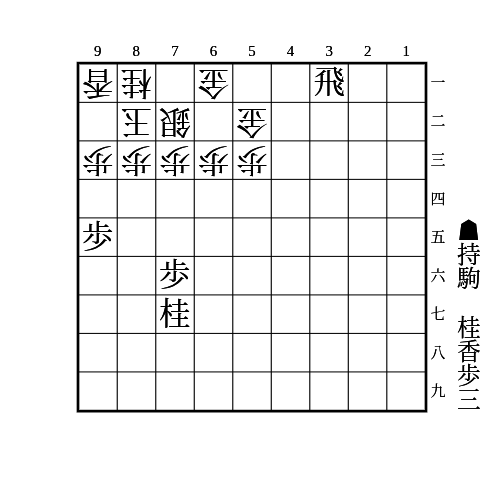

    
解答

    
▲84歩

    
放置なら▲83歩成△同玉▲84歩 △同玉なら▲85香 △74玉なら▲61飛成が▲75金までの詰めろ △82玉なら▲83香 △92玉なら▲85香△82歩▲61飛成や端攻めなど

    
△同歩なら▲83歩 △同玉なら▲75桂で、△82玉なら▲83香〜▲82歩、△92玉なら▲83歩で次に▲61飛成が▲82金までの詰めろ、△74玉なら▲61飛成が▲65金までの詰めろ

---

(33)

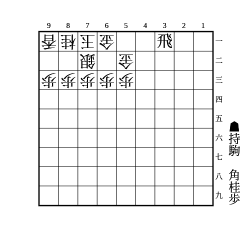

    
解答

    
▲84歩△同歩▲83桂

    
△同銀なら▲82角 △同玉なら▲61飛成 玉が避けるのは▲91角成

    
△82玉なら▲91桂成△同玉▲83角△82玉▲61飛成△83玉▲52竜

    
(31)と同様に▲84歩に△62金寄の受け方があるので、先に△84同歩とさせてから飛車を打つほうが取ってもらいやすい

