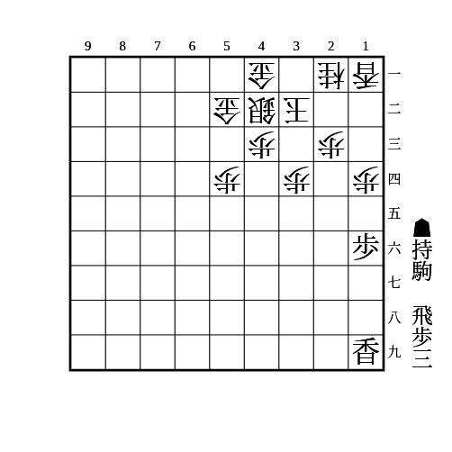
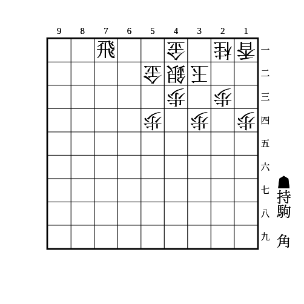

# 舟囲い

(1)

（相手の持ち駒に桂なし）

    
解答

    
▲15歩△同歩▲12歩△同香▲13歩

    
△同香なら▲14歩△同香▲12飛 相手が桂を持っていると△22桂で受かるので注意

    
△同桂なら▲14歩

    
相手の銀が31にいる場合、▲12歩の代わりに▲13歩は、△22銀▲15香△14歩▲同香△13桂の受けがあるので注意

---

(2)

    
解答

    
▲22角

    
△同玉なら▲41飛成

    
放置なら▲11角成〜▲21馬△同玉▲41飛成

    
相手が角を持っている場合は△33角で受けられる

    
角以外でも22に打ち込むのが有効

    
桂を持っている場合は▲24桂△同歩▲23角もある こちらは相手が角を持っていても使える

