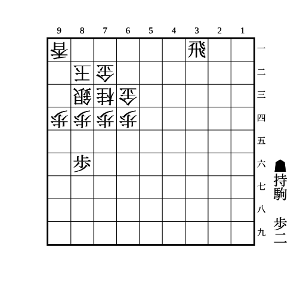
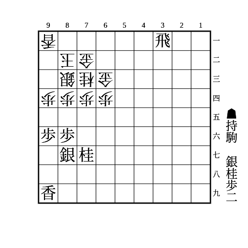
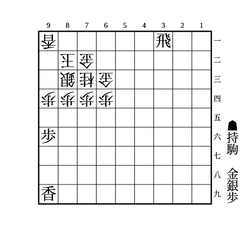
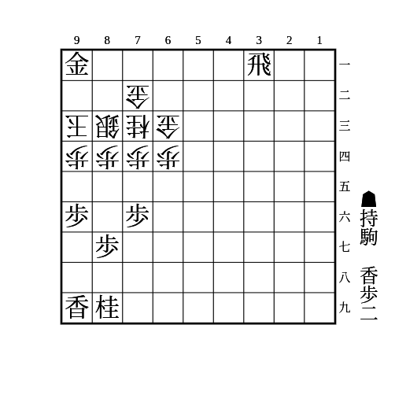
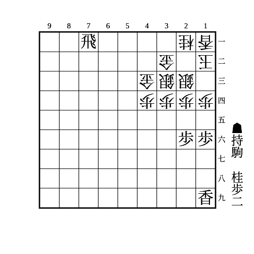

# 銀冠

(1)

    
解答

    <ul>
        <li>△同桂なら▲86歩</li>
        <li>
            △同歩や放置なら▲84歩
            <ul>
                <li>
                    △同銀なら▲83歩
                    <ul>
                        <li>△同玉なら▲91飛成</li>
                        <li>△同金なら持ち駒を裏から打ったり2段目に飛車を移動させたりするのが受けにくい</li>
                    </ul>
                </li>
                <li>△92銀なら83に持ち駒を打つのが厳しい</li>
            </ul>
        </li>
    </ul>

---

(2)

（相手は持ち駒に金や飛なし）

    
解答

    
▲95歩△同歩▲92歩

    
△同銀なら▲94桂〜▲91飛成

    
△同玉なら▲93銀△同玉▲91飛成△92合駒▲98香打が詰めろ 87の銀がいないときは上が詰めろにならないので▲94歩△同銀▲81銀△82玉▲72銀成△同玉▲91飛成もある

    
△同香なら▲91銀△93玉▲81飛成 次に▲94歩が厳しく、△同銀は▲72竜、△同玉は▲95香△同玉▲92竜〜▲96香で詰み 87の銀がいなければ▲87桂で▲95桂△94銀▲83桂成を狙う 桂の代わりに香のときは▲98香打がある

---

(3)

（相手は持ち駒に金や飛なし）

    
解答

    
▲93銀△同玉▲91飛成△92銀打▲95歩△同歩▲94歩

    
△同玉は▲98香打

    
△同銀は▲95香△同銀▲94歩△同玉▲92竜△93歩▲72竜

    
▲91飛成に△92銀は▲95歩で良い △83玉は▲93金△同銀▲94歩で必至 △85桂は▲73金で必至

    
相手が金を持っていると▲91飛成に△92金で受かるので注意

    
自陣が穴熊で相手が香を持っている場合、▲91飛成に△92香と受けて、▲95香に△83玉と受ける手があるので注意 銀を取っても△同香が王手になる

    
自玉が左美濃などで88にいて相手が桂を持っている場合、▲95香の瞬間に△96桂として形を決めてから△95銀と戻す手があるので注意 最後の▲72竜が詰めろになっていないのが大きい

---

(4)

    
解答

    
▲95歩△同歩▲81飛成

    <ul>
        <li>
            放置なら▲92金
            <ul>
                <li>△同銀なら▲94歩</li>
                <li>△94玉なら▲72竜△同銀▲95香△同玉▲96香△同玉▲86金で詰み</li>
            </ul>
        </li>
        <li>
            △85歩なら▲92金
            <ul>
                <li>△同銀なら▲94歩</li>
                <li>△84玉なら▲94歩△同玉▲82金△同金▲同竜△92金▲95香△同玉▲96歩△同玉▲97金△95玉▲92竜△同銀▲96香△84玉▲94金で詰み</li>
                <li>
                    △94香なら▲95香△同香▲92金
                    <ul>
                        <li>△同銀なら▲94歩</li>
                        <li>△94玉なら▲96歩△同香▲72竜△同銀▲95歩△同玉▲86金△94玉▲95香△83玉▲93金で詰み</li>
                    </ul>
                </li>
            </ul>
        </li>
        <li>
            △82金なら▲94歩
            <ul>
                <li>△同玉なら▲82竜で詰めろ</li>
                <li>
                    △同銀なら▲92金△同金▲95香
                    <ul>
                        <li>
                            △82金打なら▲94香△同玉▲95歩
                            <ul>
                                <li>△同玉なら▲92竜△同金▲96香△同玉▲86金で詰み</li>
                                <li>△85玉なら▲92竜で詰めろ</li>
                            </ul>
                        </li>
                        <li>
                            △同銀なら▲94歩△同玉▲96歩
                            <ul>
                                <li>△同銀なら▲92竜△93合駒▲95香△同玉▲93竜〜▲86金</li>
                                <li>
                                    △82金打なら▲95歩
                                    <ul>
                                        <li>△同玉なら▲92竜△同金▲96香△同玉▲86金で詰み</li>
                                        <li>△85玉なら▲92竜で詰めろ</li>
                                    </ul>
                                </li>
                            </ul>
                        </li>
                    </ul>
                </li>
            </ul>
        </li>
    </ul>
    
相手が金を持っていると▲81飛成に△82金打で受かるので注意

---

(5)

    
解答

    
▲15歩△同歩▲14歩

    
△同銀なら▲13歩で、△同桂なら▲27桂△23銀▲35歩〜▲34歩〜▲14歩△同銀▲15香、△22玉なら▲15香△同銀▲14桂

    
△22玉なら▲15香で、△14香なら▲同香△同銀で▲19香〜▲27桂〜▲35歩など、△12歩なら端が詰まったので横からの攻めに転換する

