# 一般

## 金のコビン

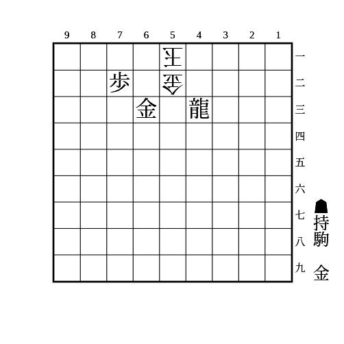

△42金のみ即詰みがないが、▲61金△同玉▲42竜で必至

---

(1)

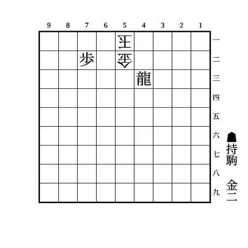

    
解答

    
▲63桂△同金直▲41銀△62金引▲52銀成△同金▲63金

    
▲63桂に△同金左は▲42銀△61玉▲71金で詰む

## 馬と腹銀

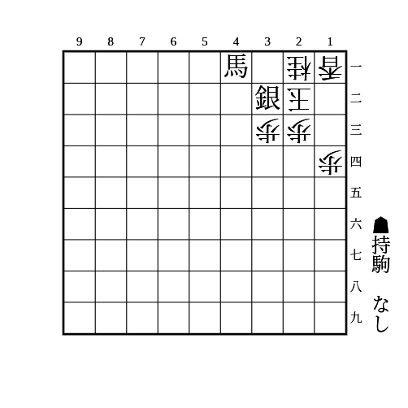

▲23銀成と▲31馬〜▲21馬が同時に受からない

## 竜と腹銀

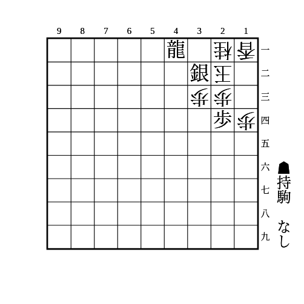

▲21竜から23の地点に3枚利かせられるので数で負けない

## 端玉に角と金

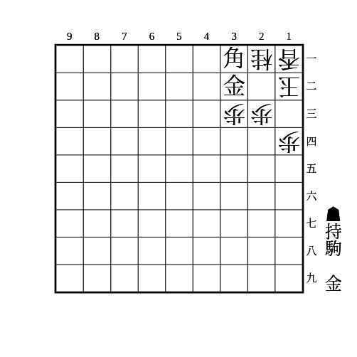

▲22角成を防ぐために△13銀などとすると▲22金打で詰む

角ではなく馬の場合は持ち駒の金も不要

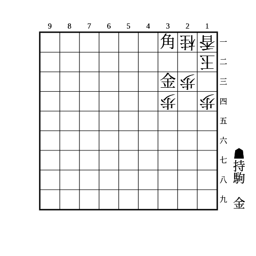

33が開いている場合、▲32金は△55角などで受かるので▲33金とする

## 左右挟撃

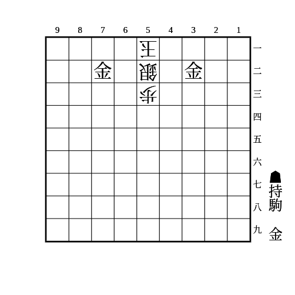

▲42金と▲62金が同時に受からない  
53の歩がないと△53銀で受かるので注意

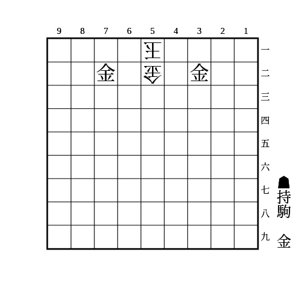

▲41金と▲61金が同時に受からない

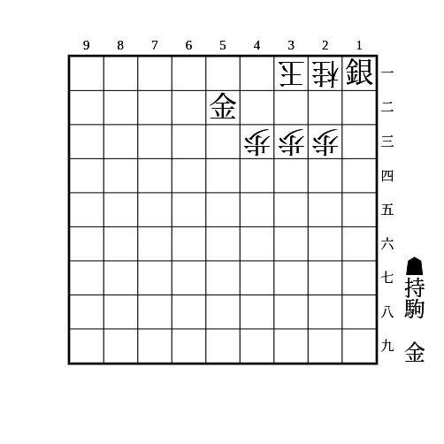

▲22金と▲41金（▲42金）が同時に受からない

---

(1)

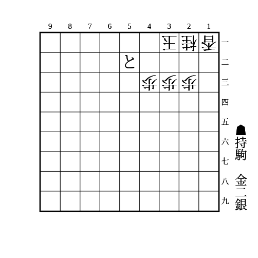

    
解答

    
▲12金△同香▲11銀

## 上下挟撃

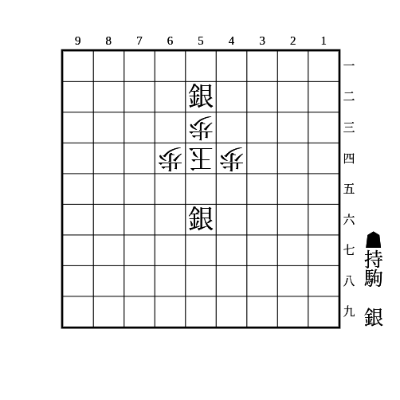

▲43銀、▲63銀、▲55銀が同時に受からない

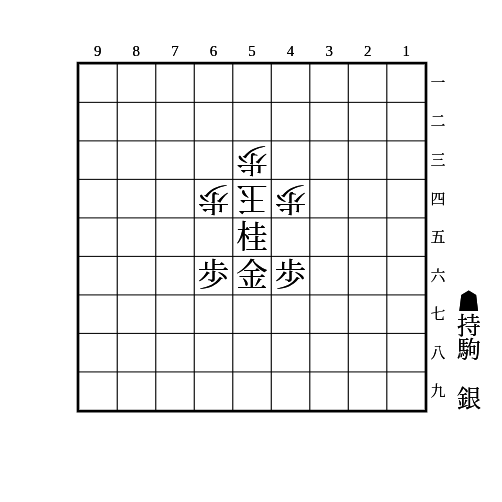

▲43銀、▲63銀、▲45銀、▲65銀が同時に受からない

## 端に押さえつけ

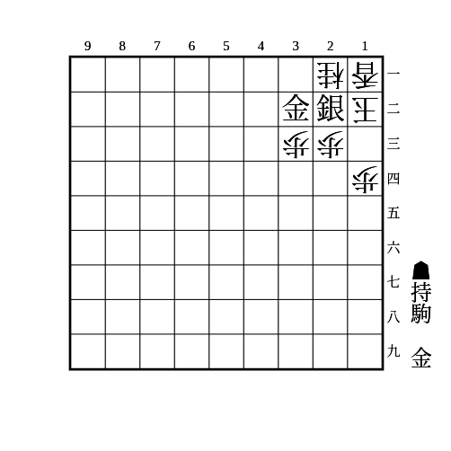

▲13金〜▲21銀不成が受からない

△24歩は▲33金で▲11銀成〜▲22金打や▲12金と▲21銀不成〜▲23金や▲22金が受からない  
△32金は▲13歩△同桂▲32金で必至が継続  
▲33金のときに歩切れだと▲13歩が打てず、△32金で受かるので注意

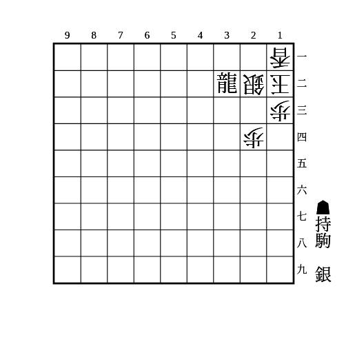

一間竜のパターン  
▲21銀と▲23銀が同時に受からない

## 下段に押さえつけ

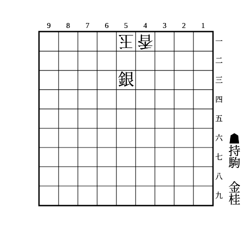

▲52金と▲63桂〜▲52金や▲71金が同時に受からない

## 角と尻銀

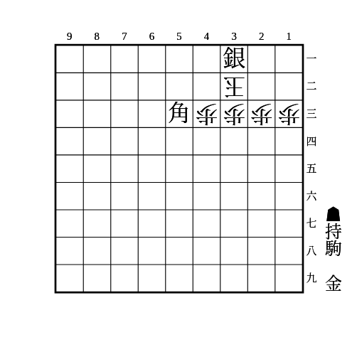

▲42角成と▲22金が同時に受からない

## 邪魔駒消去

消去しつつ退路を塞ぐのが重要

(1)

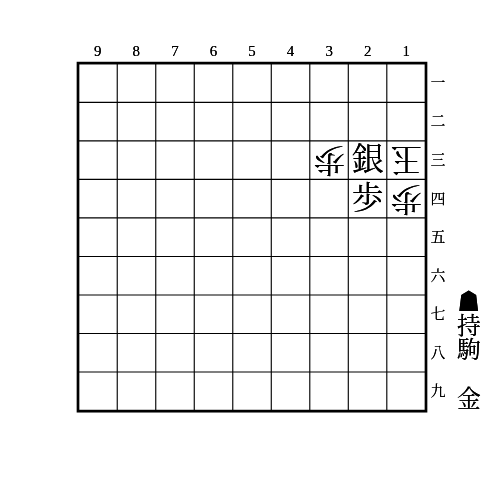

    
解答

    
▲34銀成

    
23に利いているのが2vs0なので数で負けず、退路も塞いでいる

---

(2)

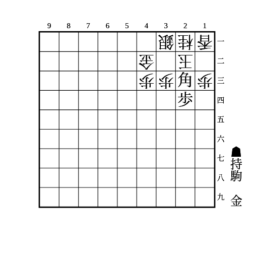

    
解答

    
▲41角成

    
23に利いているのが2vs0なので数で負けず、△32銀からの退路も塞いでいる

## スペースなし

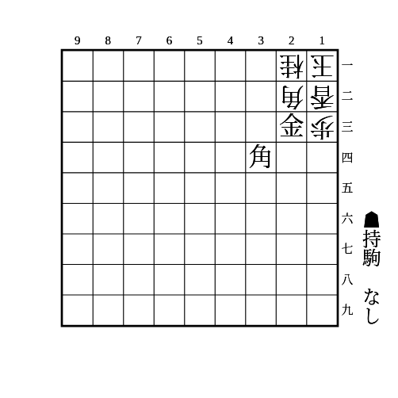

12を受ける駒を打つスペースがない

穴熊で起こりやすい

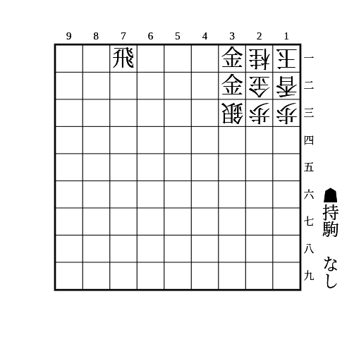

21を受ける駒を打つスペースがない

## 歩頭桂

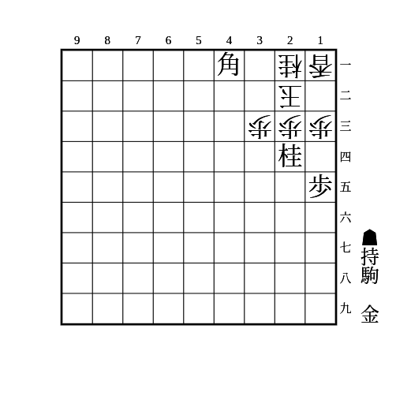

▲32角成を防ぐために駒を足しても▲32金で詰む

桂を取ったら▲23金△31玉▲32金

△14歩は▲同歩△同香▲12金△31玉▲32桂成

## 角桂金

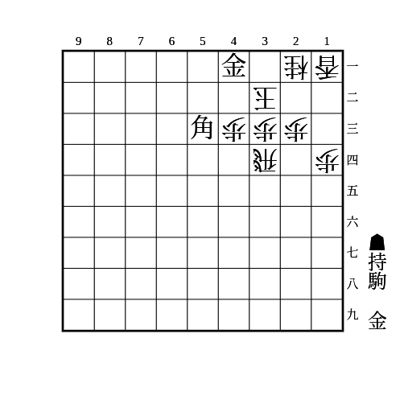

角から桂の位置に金

△22玉は▲31角成△12玉▲32金で「端玉に角と金」の必至

25に歩があれば△24歩に▲同歩とできるので34が埋まっていなくても良い  
その場合、△22玉は▲31角成△12玉▲22金△13玉▲32金△12玉▲22馬の即詰みになる

## 金頭桂

(1)

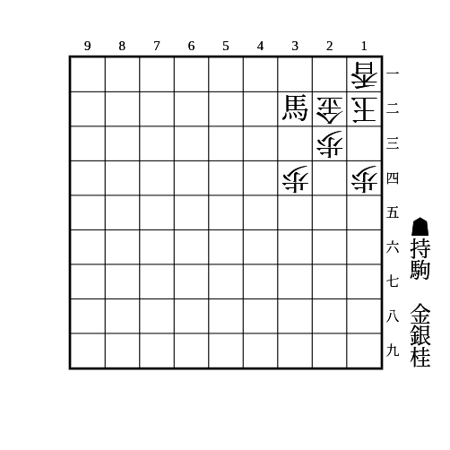

    
解答

    
▲25桂

    
△32金は▲13銀△21玉▲33桂不成△同金▲22金で詰み

    
相手が銀や角を持っているときは24に打たれると受かる

## 退路封鎖

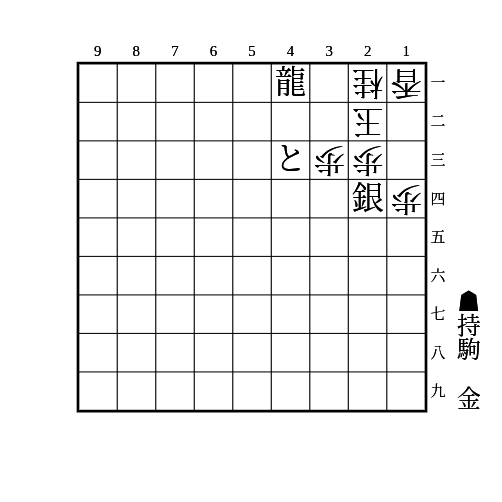

銀を取ったら▲32竜〜▲23金

▲32銀は△12銀で受かる

▲25銀や金は▲12金で受かる
