# 一般

## 金のコビン

(1)

    
解答

    
▲63金

    
△42金打のみ即詰みがないが、▲61金△同玉▲42竜で必至

---

(2)

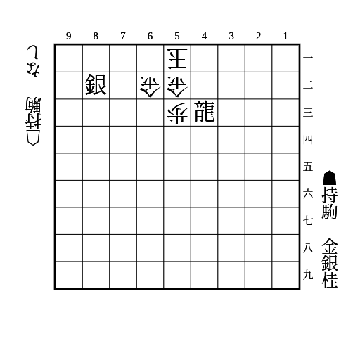

    
解答

    
▲63桂△同金直▲41銀△62金引▲52銀成△同金▲63金

    
▲63桂に△同金左は▲42銀△61玉▲71金で詰む

## 馬と腹銀

(1)

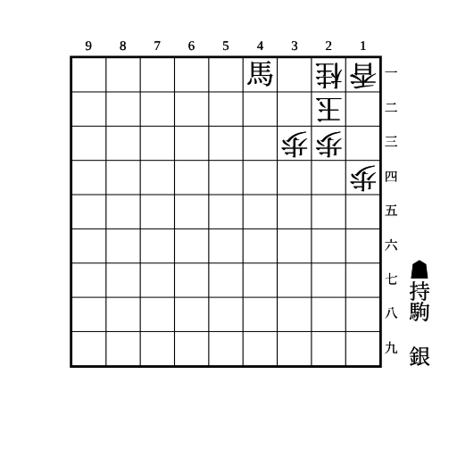

    
解答

    
▲32銀

    
▲23銀成と▲31馬〜▲21銀不成が同時に受からない

## 竜と腹銀

(1)

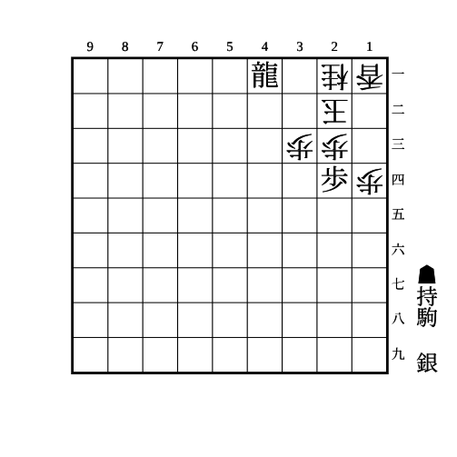

    
解答

    
▲32銀

    
▲21竜から23の地点に3枚利かせられるので数で負けない

## 端玉に角と金

(1)

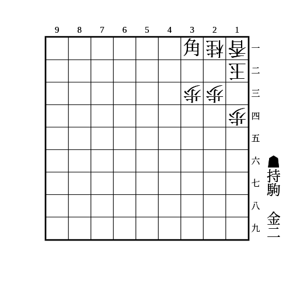

    
解答

    
▲32金

    
▲22角成を防ぐために△13銀などとすると▲22金打で詰む

    
角ではなく馬の場合は持ち駒の金も不要

---

(2)

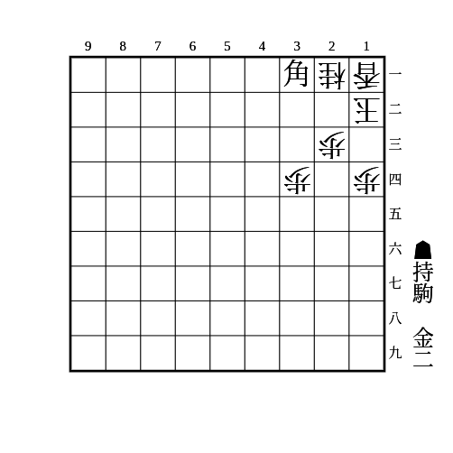

    
解答

    
▲33金

    
33が開いている場合、▲32金は△55角などで受かるので▲33金とする

## 左右挟撃

(1)

    
解答

    
▲32金

    
▲42金と▲62金が同時に受からない  

    
53の歩がないと△53銀で受かるので注意

---

(2)

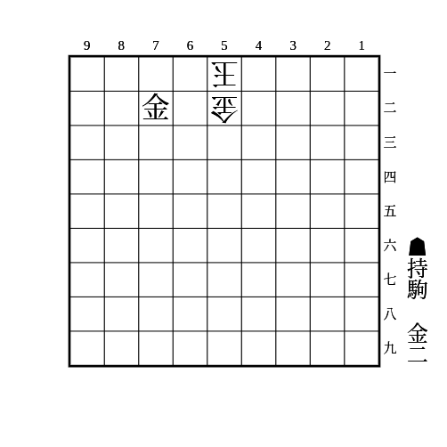

    
解答

    
▲32金

    
▲41金と▲61金が同時に受からない

    
52の金がないと玉が上がって受かるので注意

    
52が馬の場合も受かるので注意

---

(3)

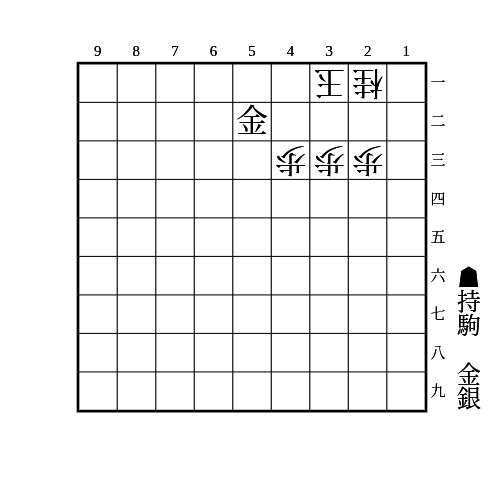

    
解答

    
▲11銀

    
▲22金と▲41金（▲42金）が同時に受からない

---

(4)

    
解答

    
▲12金△同香▲11銀

## 上下挟撃

(1)

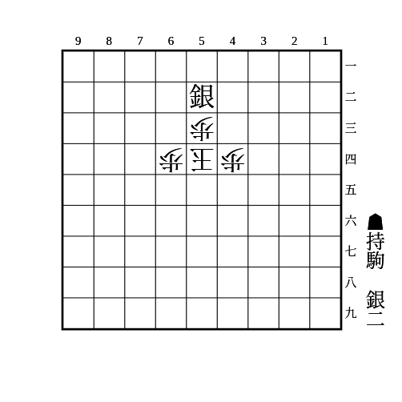

    
解答

    
▲56銀

    
▲43銀、▲63銀、▲55銀が同時に受からない

---

(2)

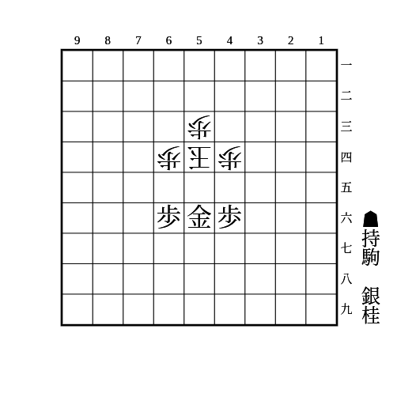

    
解答

    
▲55桂

    
▲43銀、▲63銀、▲45銀、▲65銀が同時に受からない

## 端に押さえつけ

(1)

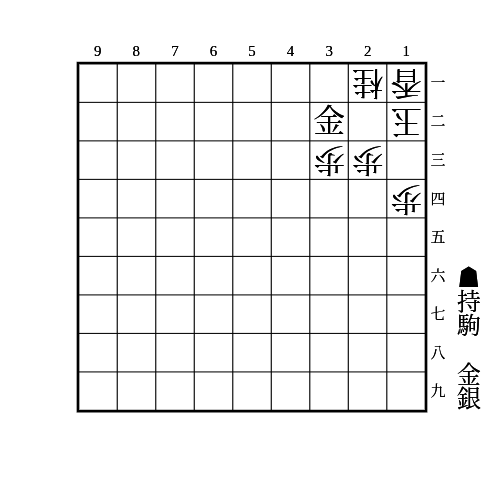

    
解答

    
▲22銀

    
▲13金〜▲21銀不成が受からない

    
△24歩は▲33金で▲11銀成〜▲22金打や▲12金と、▲21銀不成〜▲23金や▲22金が受からない △32金は▲13歩△同桂▲32金で必至が継続 ▲33金のときに歩切れだと▲13歩が打てず、△32金で受かるので注意

    
△31金は▲13金△同桂▲31銀不成で必至継続 13に駒が利いていると△25桂▲22銀不成▲31金で受けられるので注意

---

(2)

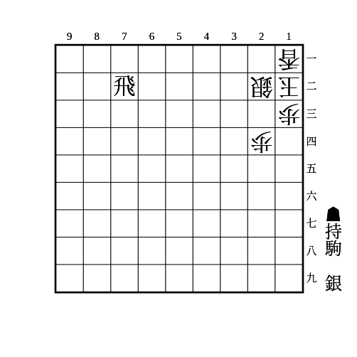

    
解答

    
▲32飛成

    
一間竜のパターン ▲21銀と▲23銀が同時に受からない

---

(3)

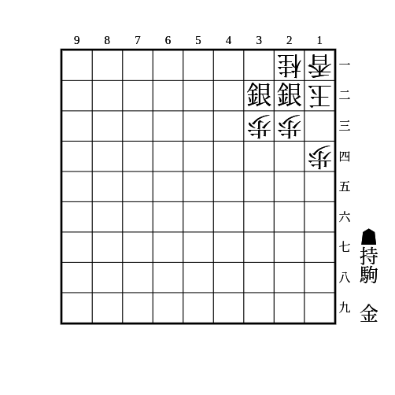

    
解答

    
▲21銀成

    
(1)の類似パターン

    
▲13金と▲13金〜▲11銀成が同時に受からない

---

(4)

    
解答

    
▲32銀

    
▲21銀成〜▲23桂が受からない

    
32の銀は金や角でも良い

    
持ち駒が金の場合、31の竜は金でも良い

---

(5)

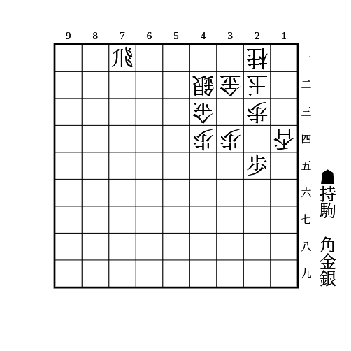

    
解答

    
▲13銀

    
△同玉なら▲21飛成で必至 放置なら▲12金、12に駒を埋めてきたら▲24角△同歩▲同竜、△22金などは▲12金△同金▲24角△同歩▲同竜、△11金などは▲24角△同歩▲同竜△12玉▲13金

    
△同桂なら▲11角△12玉▲33角成で必至 ▲11飛成と▲11金〜▲21飛成が同時に受からない

    
△33玉なら▲24角△同歩▲同銀成△22玉▲23金 △同金は▲同成銀△同玉▲21飛成〜▲24金で詰み △11玉は▲32金で必至

## 下段に押さえつけ

(1)

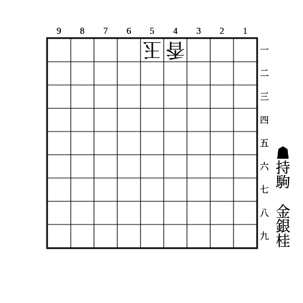

    
解答

    
▲53銀

    
▲52金と▲63桂〜▲71金が同時に受からない

---

(2)

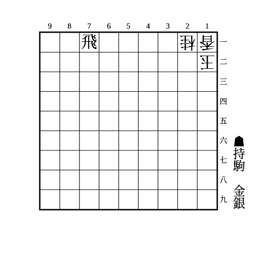

    
解答

    
▲21飛成△同玉▲23銀

## 角と尻銀

(1)

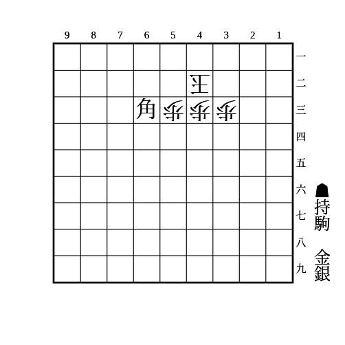

    
解答

    
▲41銀

    
▲52角成と▲32金が同時に受からない

## 邪魔駒消去

消去しつつ退路を塞ぐのが重要

(1)

    
解答

    
▲34銀成

    
23に利いているのが2vs0なので数で負けず、退路も塞いでいる

---

(2)

    
解答

    
▲41角成

    
23に利いているのが2vs0なので数で負けず、△32銀からの退路も塞いでいる

## スペースなし

(1)

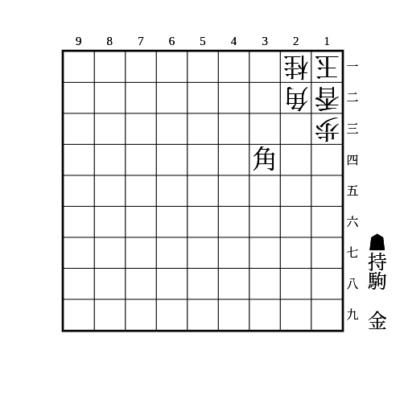

    
解答

    
▲23金

    
12を受ける駒を打つスペースがない

    
穴熊で起こりやすい

---

(2)

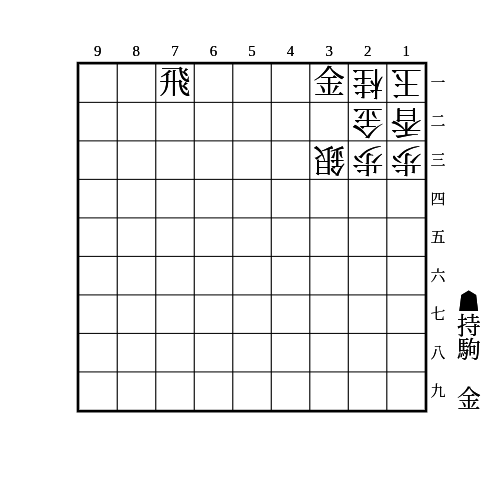

    
解答

    
▲32金

    
21を受ける駒を打つスペースがない

## 歩頭桂

(1)

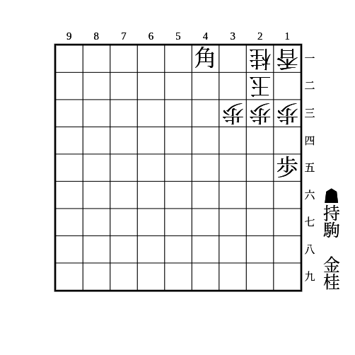

    
解答

    
▲24桂

    
▲32角成を防ぐために駒を足しても▲32金で詰む

    
桂を取ったら▲23金△31玉▲32金

    
△14歩は▲同歩△同香▲12金△31玉▲32桂成

## 角桂金

(1)

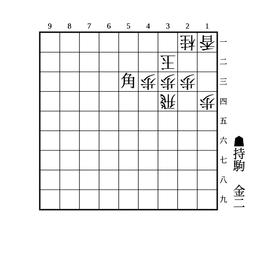

    
解答

    
▲41金

    
角から桂の位置に金

    
△22玉は▲31角成△12玉▲32金で「端玉に角と金」の必至

    
25に歩があれば△24歩に▲同歩とできるので34が埋まっていなくても良い

## 退路封鎖

(1)

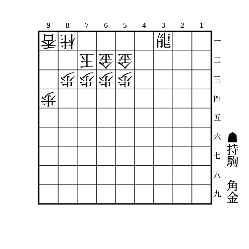

    
解答

    
▲24銀

    
銀を取ったら▲32竜〜▲23金

    
▲32銀は△12銀で受かる

    
▲25銀や金は▲12金で受かる

---

(2)

    
解答

    
▲93角

    
93の角を取っても取らなくても▲71金からの詰みが受からない

