# 端

(1)

    
解答

    
▲15歩△同歩▲同香△22角▲12歩△13歩▲11歩成△同角▲19香

    
4段目に相手の飛車がいると▲同香に△14歩とされるので注意

    
相手が歩を持っていると▲15歩△24角▲14歩△15歩で受けられるので注意

---

(2)

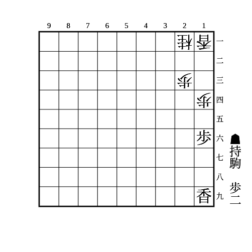

    
解答

    
▲15歩△同歩▲13歩△同香▲12歩〜▲11歩成

    
11の地点を受けられる場合は効かないので注意

    
▲13歩に△同桂は状況に応じてすぐに▲14歩とするか、▲12歩△同香▲15香△14歩▲同香でタイミングを見て▲13香成とする

    
▲13歩に放置は▲15香△14歩▲同香△13桂▲12歩△同香で上と似た展開になる

---

(3)

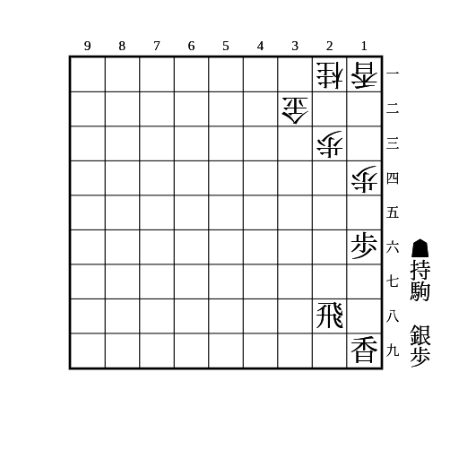

    
解答

    
▲15歩△同歩▲13歩△同香▲12銀

    
銀交換している場合▲13歩に△22銀と受ける手があるが、▲12銀△同香▲同歩成で良い ▲13歩に△24銀も▲12銀△同香▲同歩成△33桂▲27香で良い

---

(4)

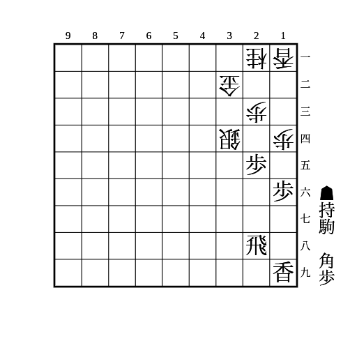

    
解答

    
▲15歩△同歩▲13歩△同香▲24歩△同歩▲12角

    
▲24歩に△33金は▲12角△24歩▲21角成

    
▲24歩に△22金は▲11角

---

(5)

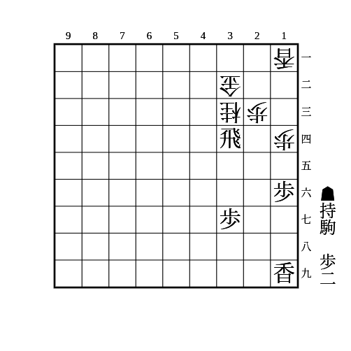

    
解答

    
▲15歩△同歩▲13歩△同香▲14歩

---

(6)

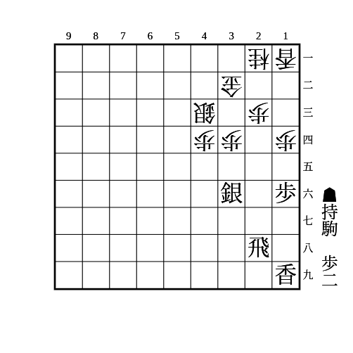

    
解答

    
▲15歩△同歩▲13歩△同香▲14歩△同香▲25銀

    
単に▲25銀からの棒銀は△33桂で続かない

---

(7)

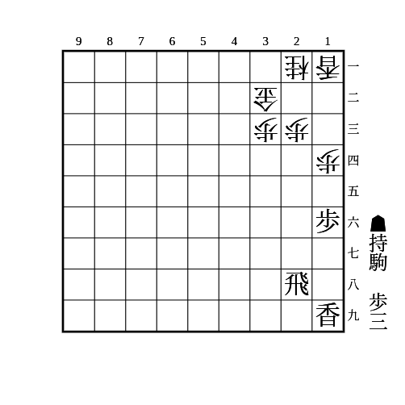

    
解答

    
▲15歩△同歩▲13歩△同香▲14歩△同香▲24歩△同歩▲同飛

    
▲13歩に放置して▲15香に△14歩▲同歩△13桂は▲12歩△同香▲18飛で良い

---

(8)

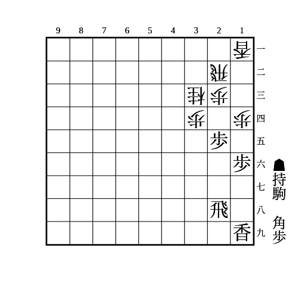

    
解答

    
▲15歩△同歩▲12歩

    
△同飛なら▲24歩

    
△同香なら▲11角△32飛▲24歩

---

(9)

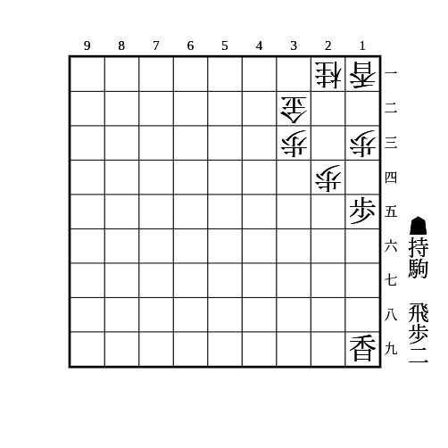

    
解答

    
▲14歩△同歩▲12歩△同香▲11飛

    
△22金なら▲23歩

    
歩がない場合は▲14歩△同歩▲同香△同香▲11飛もある

---

(10)

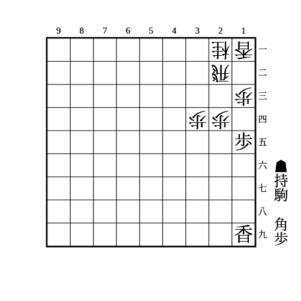

    
解答

    
▲14歩△同歩▲12歩

    
△同香なら▲11角

    
△同飛なら▲23角

---

(11)

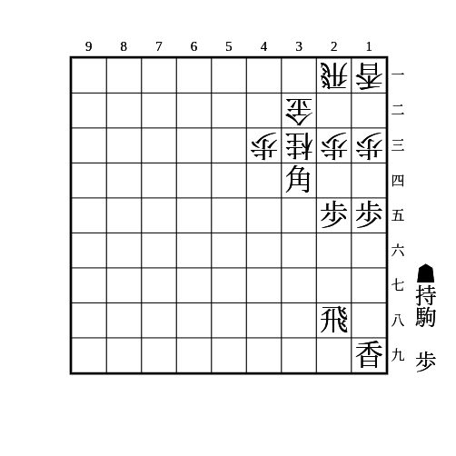

    
解答

    
▲14歩△同歩▲12歩△同香▲24歩

    
▲23歩成と▲12角成が同時に防げない

    
相手の飛車が22にいる場合は端を絡めずに▲24歩△同歩▲23歩 △同金は▲43角成 △21飛は▲24飛〜▲22歩成で△同金なら▲43角成、△同飛も▲同飛成△同金▲43角成

---

(12)

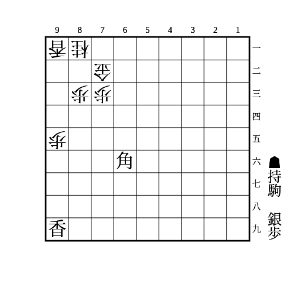

    
解答

    
▲93歩

    
△同香なら▲92銀△82金▲81銀成△同金▲93角成

    
△同桂なら▲95香

    
△82金なら▲95香〜▲92銀

---

(13)

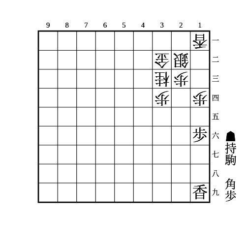

    
解答

    
▲15歩△同歩▲12歩△同香▲21角

