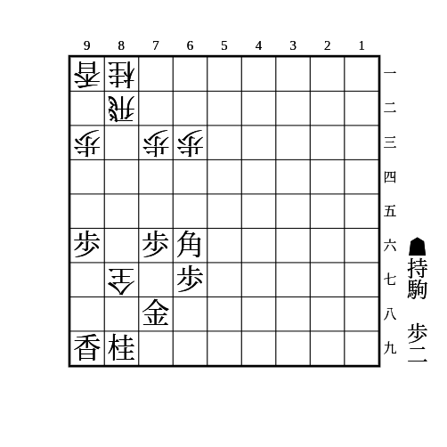

# 紐を外す

相手の駒の紐を外すことで取れるようにする。  
紐が1枚しかなく、その駒を攻めやすいときに狙うことが多い。

(1)

    
解答

    
▲83歩△同飛▲84歩△82飛▲87金

    
飛び道具の利きを止めるパターン

    
ただし相手は▲84歩を無視して、△78成銀▲83歩成△89成銀のように2手指して2枚替えする権利があるので注意

    
また、△78成銀が王手になる際は連打しても手番を取る意味しかないので注意

    
香車など紐を付けている飛び道具の価値が低い場合、△78成銀で取る駒が重要な場合、△78成銀に駒が残るのが重要な場合などは2枚替えにならなくても無視して△78成銀とすることがあるので注意

