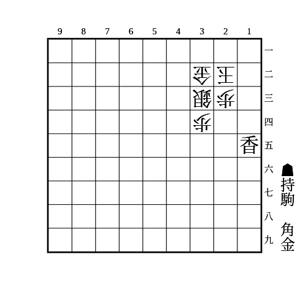
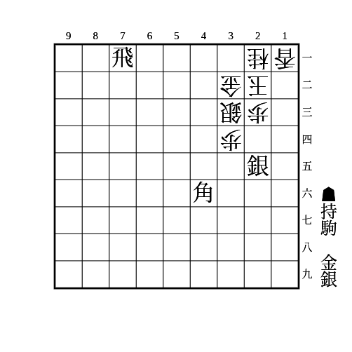
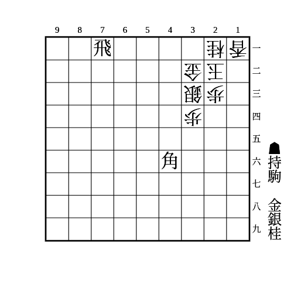
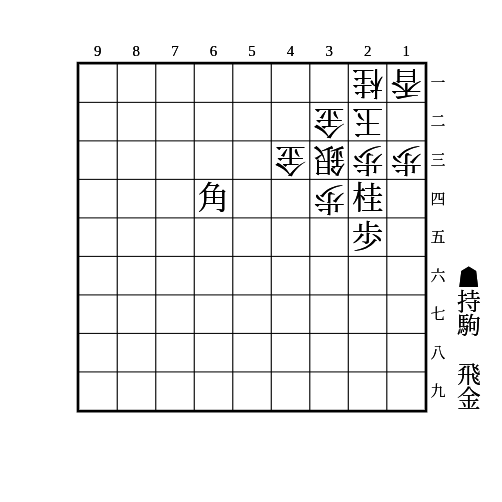
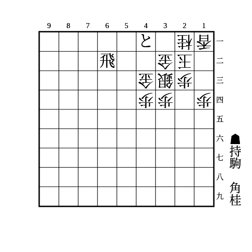
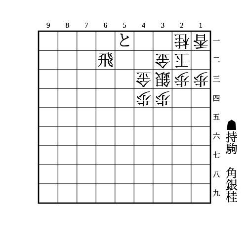
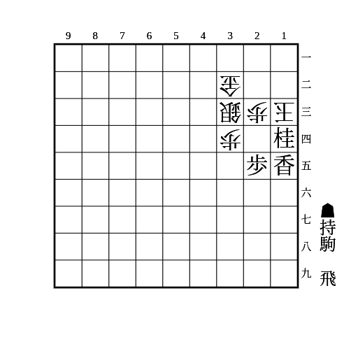
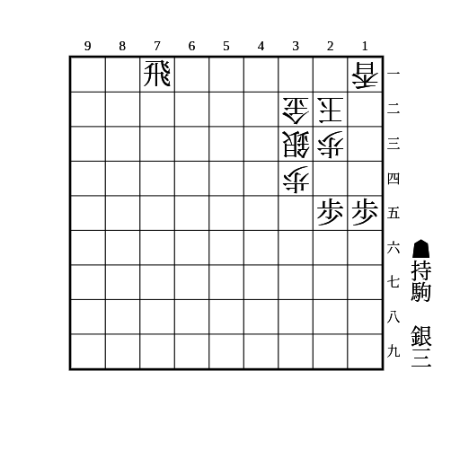
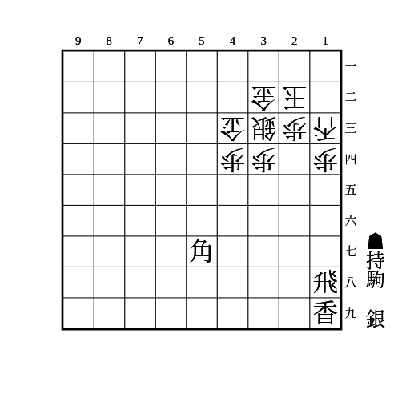

# 矢倉

(1)

    
解答

    
▲21金△同玉▲11飛△22玉▲12香成

---

(2)

    
解答

    
▲13角△21玉▲12金△同玉▲31角成

---

(3)

    
解答

    
▲13銀△同香▲同角成△同桂▲21金△12玉▲11金△22玉▲21飛成

---

(4)

    
解答

    
▲14桂△同香▲13銀△同桂▲21金△12玉▲11金△22玉▲21飛成

---

(5)

    
解答

    
▲31角成△12玉▲24桂△同歩▲23金△同玉▲32銀不成△12玉▲23金

---

(6)

    
解答

    
▲12飛△同香▲32桂成△同玉▲31金△22玉▲32金打△11玉▲21金寄

---

(7)

    
解答

    
▲13銀△同歩▲同歩成△同香▲同香成△同桂▲同角成△同玉▲11飛成△12歩▲14歩△同玉▲12竜△13歩▲16香△15香▲26桂

---

(8)

    
解答

    
▲31角△12玉▲24桂△同歩▲32飛成△22合駒▲23金

    
先に▲32飛成から▲24桂は△同銀があるので注意

---

(9)

    
解答

    
▲32飛成△同玉▲41角△22玉▲31銀△12玉▲24桂△同歩▲23金

---

(10)

    
解答

    
▲11飛△12合駒▲22桂成△同玉▲12香成

---

(11)

    
解答

    
▲13銀△同香▲11銀△12玉▲21銀△11玉▲32銀成△12玉▲21飛成

---

(12)

    
解答

    
▲13角成△同玉▲14飛△22玉▲11飛成

