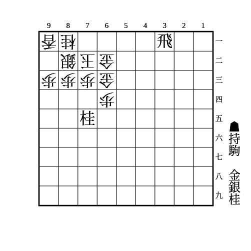
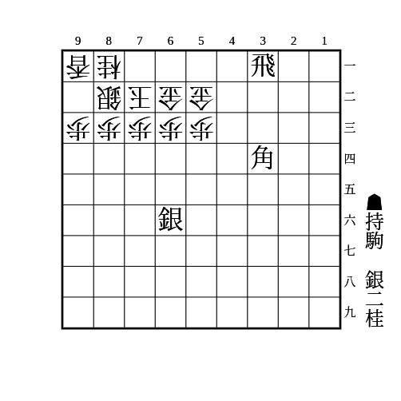
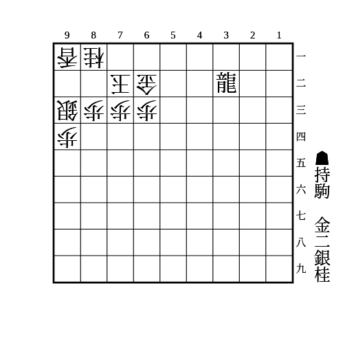
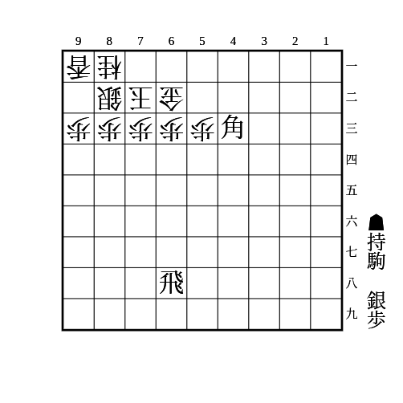

# 金無双

(1)

    
解答

    
▲84桂△同玉▲71金△同銀▲83銀

---

(2)

    
解答

    
▲61銀△同金▲64桂△同歩▲63銀△同玉▲61飛成△62金▲52角成△54玉▲55金

---

(3)

    
解答

    
▲61銀△同玉▲52金△同金▲72金△同玉▲52竜△62香▲64桂△同歩▲63金△82玉▲62竜

    
▲61銀△同玉▲52金△同金▲72金△51玉▲43桂△同金▲62金

    
▲61銀△同玉▲52金△72玉▲62金△82玉▲71金△同玉▲72金

---

(4)

    
解答

    
▲61銀△71玉▲72歩△同金▲同銀成△同玉▲61角成△同玉▲63飛成△62金▲52金△71玉▲62金

