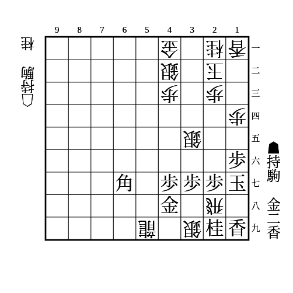
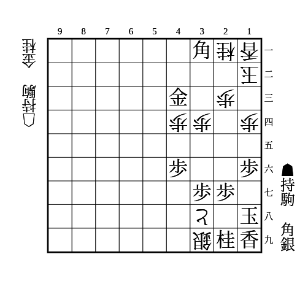

# 敵の打ちたいところに打て

(1)

    
解答

    
▲25香

    
△25桂を消しつつ、▲23香成からの詰めろ △31桂とされても▲34金で良い

    
▲25金は△48竜で負け

---

(2)

    
解答

    
▲35角

    
△35金を消しつつ、▲13銀からの詰めろ

    
△同歩ならこちらの詰めろが外れて▲32金の必至が間に合う

