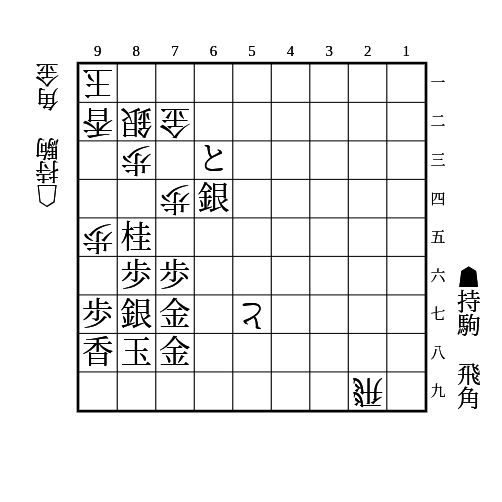
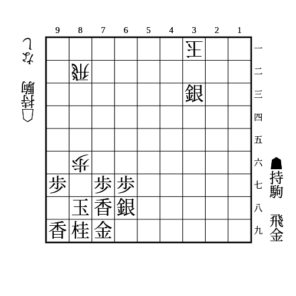
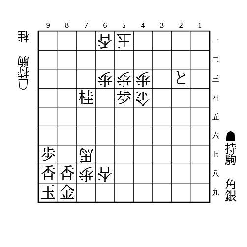

# 犠打

## 攻め駒を責める

相手玉と相手の攻め駒に利く駒を相手の攻め駒が利いている箇所に打つ。  
相手の攻め駒で取ったら犠打になり、自玉が安全になるか相手玉を詰ませられる。  
取らずに王手を防いだら相手の攻め駒を取って自玉が安全になる。

(1)

    
解答

    
▲21飛

    
△同飛成なら▲72とで速度勝ち

    
合駒も飛車を抜いて勝ち

---

(2)

    
解答

    
▲81飛

    
△同飛なら▲32金で詰み

    
合駒なら▲82飛成で勝ち

---

(3)

    
解答

    
▲95角

    
△同馬なら▲53歩成で速度勝ち

    
それ以外なら馬を抜いて勝ち

---

(4)

    
解答

    
▲86飛

    
△同金なら▲61竜で勝ち

    
△85金なら▲同飛で詰み

    
△74玉は▲87飛で勝勢

## 攻め駒をずらす

取れば相手の攻め駒の位置や利きをずらす。  
取らなければ攻め駒になる。  
中合いも含む。

(1)

    
解答

    
▲29香

    
△同飛成なら▲88玉で攻めが切れない

    
△13飛成なら▲27香で角が取れる

    
単に▲88玉は△13飛成で攻めが切れる

